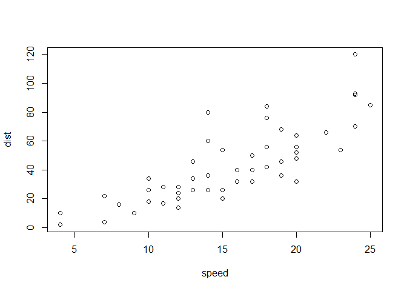
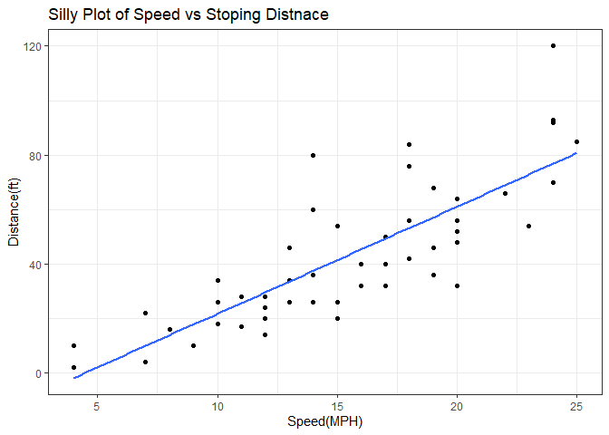
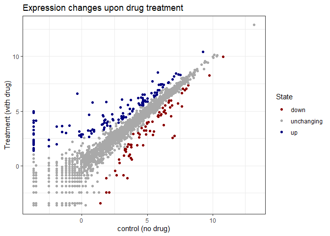
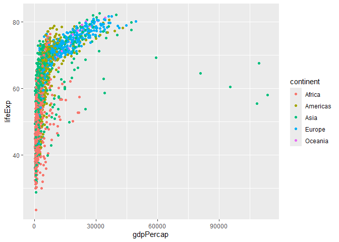
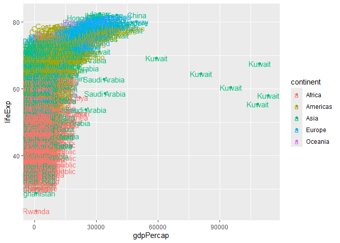
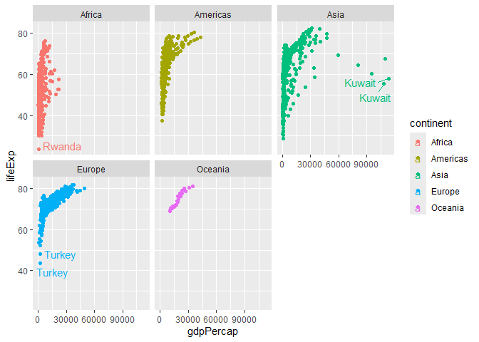

# Class 5: Data Viz With gglot
Shawn Xiao(PID: A18276668)

Today we are exploring the **ggplot** package and how to make nice
figures in R.

There are lots of ways to make figures and plots in R. These include:

- so called “base” R
- and add on packages like **ggplot**

Here is a simple “base” R plot.

``` r
head(cars)
```

      speed dist
    1     4    2
    2     4   10
    3     7    4
    4     7   22
    5     8   16
    6     9   10

We can simply pass this to the `plot()` function.

``` r
plot(cars)
```



> Key-point: Base R is quick but not so nice looking in some folks’ eyes

Let’s see how we can plot this with **ggplot**

1st I need to install this add-on package. For this we use the
`install.packages()` function - *WE DO THIS IN THE CONSOLE, NOT our
report*. This is a one time only deal.

2nd We need to load the package with the `library()` function every time
we want to use it.

``` r
library(ggplot2)
```

Every ggplot is composed of at least 3 layers:

- **data** (i.e. a data.frame with the things you want to plot)
- aesthetics **aes()** that map the columns of data to your plot
  features (i.e. aesthetics)
- geoms like **geom_point()** that srt how the plot appears.

``` r
ggplot(cars) +
  aes(x=speed, y=dist)+
  geom_point()
```


> Key-point: For simple “canned” graphs base R is quicker but as things
> get more custom and elaborate then ggplot wins out…

Let’s add more layers to out ggplot

Add a line showing the relationship between x and y Add title of the
graph Add titles for x and y axis Change theme

``` r
ggplot(cars) +
  aes(x=speed, y=dist)+
  geom_point()+
  geom_smooth(method="lm", se=FALSE)+
  labs(title="Silly Plot of Speed vs Stoping Distnace")+
  xlab("Speed(MPH)")+
  ylab("Distance(ft)")+
  theme_bw()
```

    `geom_smooth()` using formula = 'y ~ x'



## Going Further

Read gene expression data

``` r
url <- "https://bioboot.github.io/bimm143_S20/class-material/up_down_expression.txt"
genes <- read.delim(url)
head(genes)
```

            Gene Condition1 Condition2      State
    1      A4GNT -3.6808610 -3.4401355 unchanging
    2       AAAS  4.5479580  4.3864126 unchanging
    3      AASDH  3.7190695  3.4787276 unchanging
    4       AATF  5.0784720  5.0151916 unchanging
    5       AATK  0.4711421  0.5598642 unchanging
    6 AB015752.4 -3.6808610 -3.5921390 unchanging

> Q1. How many genes are in this dataset?

``` r
nrow(genes)
```

    [1] 5196

> Q2. How many “up” regulated genes are there?

``` r
sum(genes$State=="up")
```

    [1] 127

A useful function for counting up occurances of things in a vector is
the `table()` function

``` r
table(genes$State)
```


          down unchanging         up 
            72       4997        127 

``` r
p <- ggplot(genes)+
  aes(x=Condition1,y=Condition2)+
  geom_point()+
  aes(col=State)

p +
   scale_color_manual(values=c("darkred","darkgrey","navy"))+
  labs(title="Expression changes upon drug treatment",
       x="control (no drug)",
       y="Treatment (with drug)")+
  theme_bw()
```



``` r
url <- "https://raw.githubusercontent.com/jennybc/gapminder/master/inst/extdata/gapminder.tsv"

gapminder <- read.delim(url)
```

``` r
head(gapminder,3)
```

          country continent year lifeExp      pop gdpPercap
    1 Afghanistan      Asia 1952  28.801  8425333  779.4453
    2 Afghanistan      Asia 1957  30.332  9240934  820.8530
    3 Afghanistan      Asia 1962  31.997 10267083  853.1007

``` r
tail(gapminder,3)
```

          country continent year lifeExp      pop gdpPercap
    1702 Zimbabwe    Africa 1997  46.809 11404948  792.4500
    1703 Zimbabwe    Africa 2002  39.989 11926563  672.0386
    1704 Zimbabwe    Africa 2007  43.487 12311143  469.7093

> Q4. How many countries are in this data set?

``` r
length(table(gapminder$country))
```

    [1] 142

> Q4. How many continents are in this data set?

``` r
unique(gapminder$continent)
```

    [1] "Asia"     "Europe"   "Africa"   "Americas" "Oceania" 

``` r
length(table(gapminder$continent))
```

    [1] 5

``` r
ggplot(gapminder)+
  aes(x=gdpPercap, y=lifeExp,
      col=continent)+
  geom_point()
```



``` r
ggplot(gapminder)+
  aes(x=gdpPercap, y=lifeExp,
      col=continent,
      label=country)+
  geom_point()+
  geom_text()
```



I can you **ggrepel** package to make more sensible labels here.

``` r
library(ggrepel)
```

I want seperate pannel per continent

``` r
ggplot(gapminder)+
  aes(x=gdpPercap, y=lifeExp,
      col=continent,
      label=country)+
  geom_point()+
  geom_text_repel()+
  facet_wrap(~continent)
```

    Warning: ggrepel: 623 unlabeled data points (too many overlaps). Consider
    increasing max.overlaps

    Warning: ggrepel: 358 unlabeled data points (too many overlaps). Consider
    increasing max.overlaps

    Warning: ggrepel: 300 unlabeled data points (too many overlaps). Consider
    increasing max.overlaps

    Warning: ggrepel: 24 unlabeled data points (too many overlaps). Consider
    increasing max.overlaps

    Warning: ggrepel: 394 unlabeled data points (too many overlaps). Consider
    increasing max.overlaps



## Summary

ggplot2 makes it easier to create publication-quality, beautiful figures
and allows you to build plots layer by layer using a consistent grammar.
It is more concise for complex plots, offers sensible defaults, and
handles legends and layout automatically. Base R plots are faster for
simple, exploratory graphs but are harder to customize and refine for
polished results. ggplot2 is preferred for finalized, professional
visualizations, while base R is often used for quick, preliminary plots
[\[1\]](https://drive.google.com/file/d/1BYSWJLROqxA1YpuDhJkzUolhiZqiOOKg/view?usp=drivesdk),
[\[2\]](https://drive.google.com/file/d/1tFqKg9_nhVMmKYfiM1CQKDS2PmPwLh8n/view?usp=drivesdk),
[\[3\]](https://drive.google.com/file/d/1Clw2_EJ_hY3USNwObiPnxpIQIfirxfW0/view?usp=drivesdk),
[\[5\]](https://drive.google.com/file/d/15xXaaIcCWOc_x1gJLdySWOd_sfMXTiaw/view?usp=drivesdk),
[\[4\]](https://drive.google.com/file/d/1FDBbIi2Rlw2In9mClB7Mub8oUPgx6y8h/view?usp=drivesdk).
