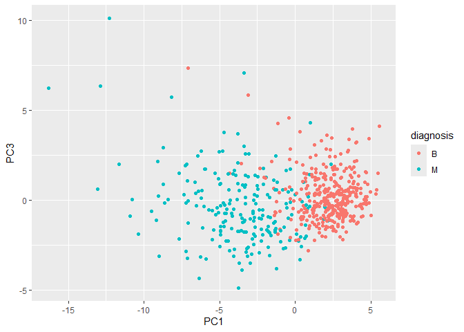
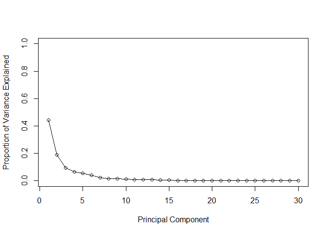
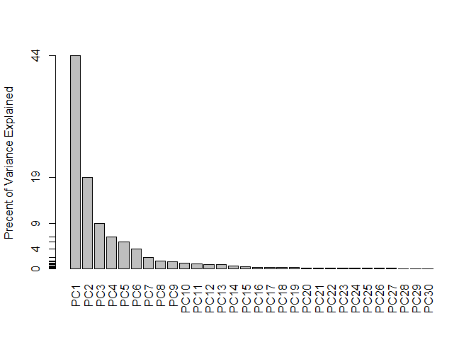
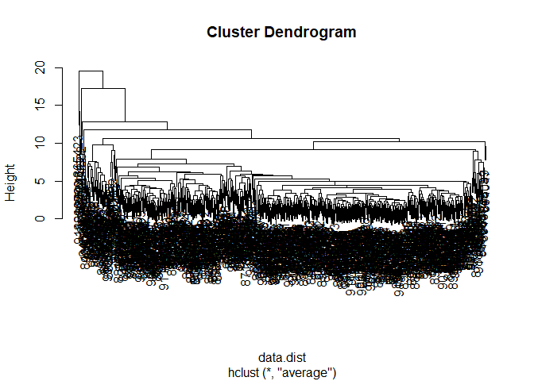
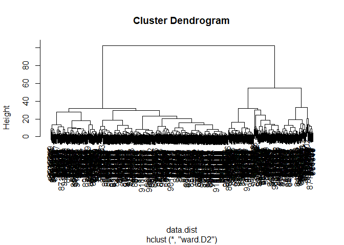
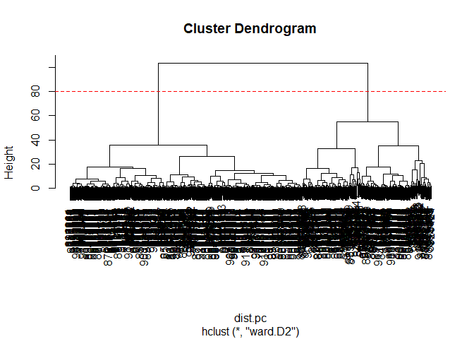
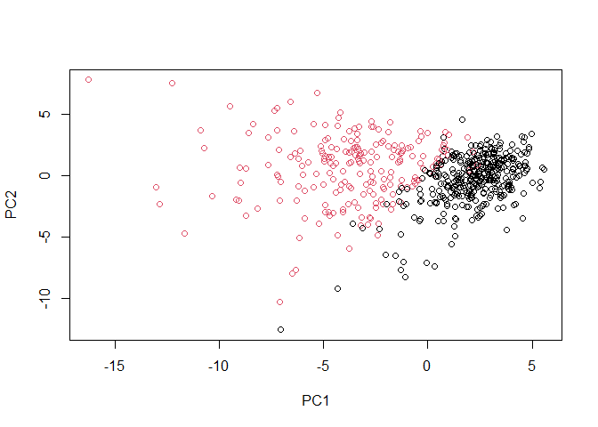
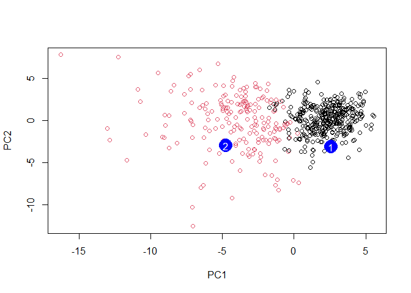

# Class 8: Mini Project
Shawn Xiao (PID:A18276668)

- [Background](#background)
- [Data Import](#data-import)
- [Principal Component Analysis
  (PCA)](#principal-component-analysis-pca)
  - [PCA score plot](#pca-score-plot)
  - [Communicating PCA results](#communicating-pca-results)
- [Hierarchical Plot](#hierarchical-plot)
  - [Results of hierarchical
    clustering](#results-of-hierarchical-clustering)
  - [Selecting number of clusters](#selecting-number-of-clusters)
- [Combining Method (PCA and
  Clustering)](#combining-method-pca-and-clustering)
- [Prediction](#prediction)

## Background

The goal of this mini-project is for you to explore a complete analysis
using the unsupervised learning techniques covered in class. You’ll
extend what you’ve learned by combining PCA as a preprocessing step to
clustering using data that consist of measurements of cell nuclei of
human breast masses. This expands on our RNA-Seq analysis from last day.

The data itself comes from the Wisconsin Breast Cancer Diagnostic Data
Set first reported by K. P. Benne and O. L. Mangasarian: “Robust Linear
Programming Discrimination of Two Linearly Inseparable Sets”.

Values in this data set describe characteristics of the cell nuclei
present in digitized images of a fine needle aspiration (FNA) of a
breast mass.

## Data Import

``` r
wisc.df <- read.csv("WisconsinCancer.csv", row.names=1)
head(wisc.df)
```

             diagnosis radius_mean texture_mean perimeter_mean area_mean
    842302           M       17.99        10.38         122.80    1001.0
    842517           M       20.57        17.77         132.90    1326.0
    84300903         M       19.69        21.25         130.00    1203.0
    84348301         M       11.42        20.38          77.58     386.1
    84358402         M       20.29        14.34         135.10    1297.0
    843786           M       12.45        15.70          82.57     477.1
             smoothness_mean compactness_mean concavity_mean concave.points_mean
    842302           0.11840          0.27760         0.3001             0.14710
    842517           0.08474          0.07864         0.0869             0.07017
    84300903         0.10960          0.15990         0.1974             0.12790
    84348301         0.14250          0.28390         0.2414             0.10520
    84358402         0.10030          0.13280         0.1980             0.10430
    843786           0.12780          0.17000         0.1578             0.08089
             symmetry_mean fractal_dimension_mean radius_se texture_se perimeter_se
    842302          0.2419                0.07871    1.0950     0.9053        8.589
    842517          0.1812                0.05667    0.5435     0.7339        3.398
    84300903        0.2069                0.05999    0.7456     0.7869        4.585
    84348301        0.2597                0.09744    0.4956     1.1560        3.445
    84358402        0.1809                0.05883    0.7572     0.7813        5.438
    843786          0.2087                0.07613    0.3345     0.8902        2.217
             area_se smoothness_se compactness_se concavity_se concave.points_se
    842302    153.40      0.006399        0.04904      0.05373           0.01587
    842517     74.08      0.005225        0.01308      0.01860           0.01340
    84300903   94.03      0.006150        0.04006      0.03832           0.02058
    84348301   27.23      0.009110        0.07458      0.05661           0.01867
    84358402   94.44      0.011490        0.02461      0.05688           0.01885
    843786     27.19      0.007510        0.03345      0.03672           0.01137
             symmetry_se fractal_dimension_se radius_worst texture_worst
    842302       0.03003             0.006193        25.38         17.33
    842517       0.01389             0.003532        24.99         23.41
    84300903     0.02250             0.004571        23.57         25.53
    84348301     0.05963             0.009208        14.91         26.50
    84358402     0.01756             0.005115        22.54         16.67
    843786       0.02165             0.005082        15.47         23.75
             perimeter_worst area_worst smoothness_worst compactness_worst
    842302            184.60     2019.0           0.1622            0.6656
    842517            158.80     1956.0           0.1238            0.1866
    84300903          152.50     1709.0           0.1444            0.4245
    84348301           98.87      567.7           0.2098            0.8663
    84358402          152.20     1575.0           0.1374            0.2050
    843786            103.40      741.6           0.1791            0.5249
             concavity_worst concave.points_worst symmetry_worst
    842302            0.7119               0.2654         0.4601
    842517            0.2416               0.1860         0.2750
    84300903          0.4504               0.2430         0.3613
    84348301          0.6869               0.2575         0.6638
    84358402          0.4000               0.1625         0.2364
    843786            0.5355               0.1741         0.3985
             fractal_dimension_worst
    842302                   0.11890
    842517                   0.08902
    84300903                 0.08758
    84348301                 0.17300
    84358402                 0.07678
    843786                   0.12440

Remove the Diagnosis column for subsequent analysis

``` r
wisc.data <- wisc.df[,-1]
```

``` r
diagnosis <- factor(wisc.df$diagnosis)
```

> Q1. How many observations are in this dataset?

``` r
nrow(wisc.data)
```

    [1] 569

There are 569 observations in the dataset.

> Q2. How many of the observations have a malignant diagnosis?

``` r
table(diagnosis)
```

    diagnosis
      B   M 
    357 212 

212 observations have a malignant diagnosis.

> Q3. How many variables/features in the data are suffixed with \_mean?

``` r
length(grep("_mean",colnames(wisc.data)))
```

    [1] 10

There are 10 variables in the data that are suffixed with “\_mean”.

## Principal Component Analysis (PCA)

The`prcomp()` function to do PCA has a `scale=F` default. In general
sclae=T should always be used since certain variables can have a high
mean and standard deviation that can skew the data.

``` r
colMeans(wisc.data)
```

                radius_mean            texture_mean          perimeter_mean 
               1.412729e+01            1.928965e+01            9.196903e+01 
                  area_mean         smoothness_mean        compactness_mean 
               6.548891e+02            9.636028e-02            1.043410e-01 
             concavity_mean     concave.points_mean           symmetry_mean 
               8.879932e-02            4.891915e-02            1.811619e-01 
     fractal_dimension_mean               radius_se              texture_se 
               6.279761e-02            4.051721e-01            1.216853e+00 
               perimeter_se                 area_se           smoothness_se 
               2.866059e+00            4.033708e+01            7.040979e-03 
             compactness_se            concavity_se       concave.points_se 
               2.547814e-02            3.189372e-02            1.179614e-02 
                symmetry_se    fractal_dimension_se            radius_worst 
               2.054230e-02            3.794904e-03            1.626919e+01 
              texture_worst         perimeter_worst              area_worst 
               2.567722e+01            1.072612e+02            8.805831e+02 
           smoothness_worst       compactness_worst         concavity_worst 
               1.323686e-01            2.542650e-01            2.721885e-01 
       concave.points_worst          symmetry_worst fractal_dimension_worst 
               1.146062e-01            2.900756e-01            8.394582e-02 

``` r
apply(wisc.data,2,sd)
```

                radius_mean            texture_mean          perimeter_mean 
               3.524049e+00            4.301036e+00            2.429898e+01 
                  area_mean         smoothness_mean        compactness_mean 
               3.519141e+02            1.406413e-02            5.281276e-02 
             concavity_mean     concave.points_mean           symmetry_mean 
               7.971981e-02            3.880284e-02            2.741428e-02 
     fractal_dimension_mean               radius_se              texture_se 
               7.060363e-03            2.773127e-01            5.516484e-01 
               perimeter_se                 area_se           smoothness_se 
               2.021855e+00            4.549101e+01            3.002518e-03 
             compactness_se            concavity_se       concave.points_se 
               1.790818e-02            3.018606e-02            6.170285e-03 
                symmetry_se    fractal_dimension_se            radius_worst 
               8.266372e-03            2.646071e-03            4.833242e+00 
              texture_worst         perimeter_worst              area_worst 
               6.146258e+00            3.360254e+01            5.693570e+02 
           smoothness_worst       compactness_worst         concavity_worst 
               2.283243e-02            1.573365e-01            2.086243e-01 
       concave.points_worst          symmetry_worst fractal_dimension_worst 
               6.573234e-02            6.186747e-02            1.806127e-02 

``` r
wisc.pr <- prcomp(wisc.data,scale=T)
summary(wisc.pr)
```

    Importance of components:
                              PC1    PC2     PC3     PC4     PC5     PC6     PC7
    Standard deviation     3.6444 2.3857 1.67867 1.40735 1.28403 1.09880 0.82172
    Proportion of Variance 0.4427 0.1897 0.09393 0.06602 0.05496 0.04025 0.02251
    Cumulative Proportion  0.4427 0.6324 0.72636 0.79239 0.84734 0.88759 0.91010
                               PC8    PC9    PC10   PC11    PC12    PC13    PC14
    Standard deviation     0.69037 0.6457 0.59219 0.5421 0.51104 0.49128 0.39624
    Proportion of Variance 0.01589 0.0139 0.01169 0.0098 0.00871 0.00805 0.00523
    Cumulative Proportion  0.92598 0.9399 0.95157 0.9614 0.97007 0.97812 0.98335
                              PC15    PC16    PC17    PC18    PC19    PC20   PC21
    Standard deviation     0.30681 0.28260 0.24372 0.22939 0.22244 0.17652 0.1731
    Proportion of Variance 0.00314 0.00266 0.00198 0.00175 0.00165 0.00104 0.0010
    Cumulative Proportion  0.98649 0.98915 0.99113 0.99288 0.99453 0.99557 0.9966
                              PC22    PC23   PC24    PC25    PC26    PC27    PC28
    Standard deviation     0.16565 0.15602 0.1344 0.12442 0.09043 0.08307 0.03987
    Proportion of Variance 0.00091 0.00081 0.0006 0.00052 0.00027 0.00023 0.00005
    Cumulative Proportion  0.99749 0.99830 0.9989 0.99942 0.99969 0.99992 0.99997
                              PC29    PC30
    Standard deviation     0.02736 0.01153
    Proportion of Variance 0.00002 0.00000
    Cumulative Proportion  1.00000 1.00000

> Q4. From your results, what proportion of the original variance is
> captured by the first principal components (PC1)?

44.27% of the original variance is captured by PC1.

> Q5. How many principal components (PCs) are required to describe at
> least 70% of the original variance in the data?

3 principal components are required to describe at least 70% of the
original variance.

> Q6. How many principal components (PCs) are required to describe at
> least 90% of the original variance in the data?

7 principal components are required to describe at least 90% of the
original variance.

### PCA score plot

The main plot created by the PCA scores is scatter plot.

``` r
library(ggplot2)

ggplot(wisc.pr$x)+
  aes(PC1,PC2, col=diagnosis)+
  geom_point()
```


``` r
biplot(wisc.pr)
```


> Q7. What stands out to you about this plot? Is it easy or difficult to
> understand? Why?

The plot has four axis and is very hard to understand because every
variable is labeled and the pattern of the graph is blocked.

``` r
plot(wisc.pr$x , col = diagnosis , 
     xlab = "PC1", ylab = "PC2")
```


> Q8. Generate a similar plot for principal components 1 and 3. What do
> you notice about these plots?

``` r
ggplot(wisc.pr$x)+
  aes(PC1,PC3, col=diagnosis)+
  geom_point()
```



``` r
pr.var <- wisc.pr$sdev^2
head(pr.var)
```

    [1] 13.281608  5.691355  2.817949  1.980640  1.648731  1.207357

``` r
pve <- pr.var/sum(pr.var)
plot(pve, xlab = "Principal Component", 
     ylab = "Proportion of Variance Explained", 
     ylim = c(0, 1), type = "o")
```



``` r
barplot(pve, ylab = "Precent of Variance Explained",
     names.arg=paste0("PC",1:length(pve)), las=2, axes = FALSE)
axis(2, at=pve, labels=round(pve,2)*100 )
```



### Communicating PCA results

> Q9. For the first principal component, what is the component of the
> loading vector (i.e. wisc.pr\$rotation\[,1\]) for the feature
> concave.points_mean?

``` r
wisc.pr$rotation["concave.points_mean",1]
```

    [1] -0.2608538

The loading factor for concave.points_mean is -0.2608538.

> Q10. What is the minimum number of principal components required to
> explain 80% of the variance of the data?

The minimum number of principal components required to explain 80% of th
variance is 5.

## Hierarchical Plot

``` r
data.scaled <- scale(wisc.data)
data.dist <- dist(data.scaled)
wisc.hclust <- hclust(data.dist,method="complete")
```

### Results of hierarchical clustering

> Q11. Using the plot() and abline() functions, what is the height at
> which the clustering model has 4 clusters?

``` r
plot(wisc.hclust)
abline(h=19, col="red", lty=2)
```


### Selecting number of clusters

``` r
wisc.hclust.clusters <- cutree(wisc.hclust,k=4)

table(wisc.hclust.clusters, diagnosis)
```

                        diagnosis
    wisc.hclust.clusters   B   M
                       1  12 165
                       2   2   5
                       3 343  40
                       4   0   2

> Q12. Can you find a better cluster vs diagnoses match by cutting into
> a different number of clusters between 2 and 10?

No

> Q13. Which method gives your favorite results for the same data.dist
> dataset? Explain your reasoning.

``` r
wisc.hclust.single<- hclust(data.dist,method="single")
wisc.hclust.average <- hclust(data.dist,method="average")
wisc.hclust.ward.D2 <- hclust(data.dist,method="ward.D2")
plot(wisc.hclust.single)
```


``` r
plot(wisc.hclust.average)
```



``` r
plot(wisc.hclust.ward.D2)
```



I like `"ward.D2"` the best because it gives a plot with the clearest
branches.

## Combining Method (PCA and Clustering)

Clustering the original data was not very productive. The PCA results
looked promising. Here we combine these methods by clustering from our
PCA results. Using PCA results to create clustering.

``` r
## take the first three PCs
dist.pc <- dist(wisc.pr$x[,1:3])
wisc.pr.hclust <- hclust(dist.pc,method="ward.D2")
```

View the tree

``` r
plot(wisc.pr.hclust)
abline(h=80, col="red", lty=2)
```



To get our clustering membership vector (i.e. our main clustering
result) we “cut” the tree at a desired height.

``` r
grps <- cutree(wisc.pr.hclust, k=2)
table(grps)
```

    grps
      1   2 
    203 366 

> Q15. How well does the newly created model with four clusters separate
> out the two diagnoses?

``` r
table(grps, diagnosis)
```

        diagnosis
    grps   B   M
       1  24 179
       2 333  33

The new model can correctly separate patients by diagnosis and by two
groups from the cluster diagram, which indicates the patients’ actual
tumor type.

> Q15. Q16. How well do the k-means and hierarchical clustering models
> you created in previous sections (i.e. before PCA) do in terms of
> separating the diagnoses? Again, use the table() function to compare
> the output of each model (wisc.km\$cluster and wisc.hclust.clusters)
> with the vector containing the actual diagnoses.

``` r
wisc.km <- kmeans(wisc.data, centers= 2)
table(wisc.km$cluster, diagnosis)
```

       diagnosis
          B   M
      1 356  82
      2   1 130

``` r
table(wisc.hclust.clusters, diagnosis)
```

                        diagnosis
    wisc.hclust.clusters   B   M
                       1  12 165
                       2   2   5
                       3 343  40
                       4   0   2

The `kmeans()` and `hclust` functions cannot separate the actual
diagnosis as well as the PCA because they put data as discrete variables
and sort them merely by distance whereas PCA views data as a continuous
variable and is less sensitive to noises for large dimension data.

Scatter plot

``` r
## colored by grps
plot(wisc.pr$x[,1:2], col=grps)
```


``` r
## Colored by diagnosis
plot(wisc.pr$x[,1:2], col=diagnosis)
```



> Q17. Which of your analysis procedures resulted in a clustering model
> with the best specificity? How about sensitivity?

Sensitivity: TP/(TP+FN) Specificity: TN/(TN+FN)

``` r
179/(179+33)
```

    [1] 0.8443396

``` r
333/(333+33)
```

    [1] 0.9098361

The PCA method resulted in the best specificity and sensitivity.

## Prediction

We can use our PCA model to predict

``` r
url <- "https://tinyurl.com/new-samples-CSV"
new <- read.csv(url)
npc <- predict(wisc.pr, newdata=new)
npc
```

               PC1       PC2        PC3        PC4       PC5        PC6        PC7
    [1,]  2.576616 -3.135913  1.3990492 -0.7631950  2.781648 -0.8150185 -0.3959098
    [2,] -4.754928 -3.009033 -0.1660946 -0.6052952 -1.140698 -1.2189945  0.8193031
                PC8       PC9       PC10      PC11      PC12      PC13     PC14
    [1,] -0.2307350 0.1029569 -0.9272861 0.3411457  0.375921 0.1610764 1.187882
    [2,] -0.3307423 0.5281896 -0.4855301 0.7173233 -1.185917 0.5893856 0.303029
              PC15       PC16        PC17        PC18        PC19       PC20
    [1,] 0.3216974 -0.1743616 -0.07875393 -0.11207028 -0.08802955 -0.2495216
    [2,] 0.1299153  0.1448061 -0.40509706  0.06565549  0.25591230 -0.4289500
               PC21       PC22       PC23       PC24        PC25         PC26
    [1,]  0.1228233 0.09358453 0.08347651  0.1223396  0.02124121  0.078884581
    [2,] -0.1224776 0.01732146 0.06316631 -0.2338618 -0.20755948 -0.009833238
                 PC27        PC28         PC29         PC30
    [1,]  0.220199544 -0.02946023 -0.015620933  0.005269029
    [2,] -0.001134152  0.09638361  0.002795349 -0.019015820

``` r
g <- as.factor(grps)
levels(g)
```

    [1] "1" "2"

``` r
g <- relevel(g,2)
levels(g)
```

    [1] "2" "1"

``` r
plot(wisc.pr$x[,1:2], col=g)
```


``` r
plot(wisc.pr$x[,1:2], col=g)
points(npc[,1], npc[,2], col="blue", pch=16, cex=3)
text(npc[,1], npc[,2], c(1,2), col="white")
```



> Q18. Which of these new patients should we prioritize for follow up
> based on your results?

Patient 2
