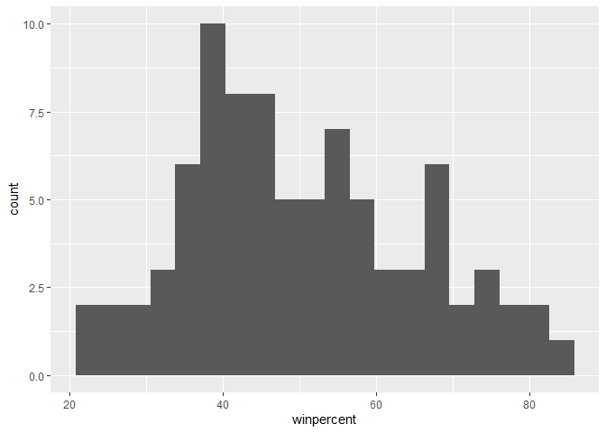
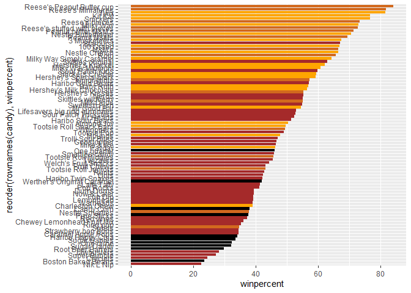
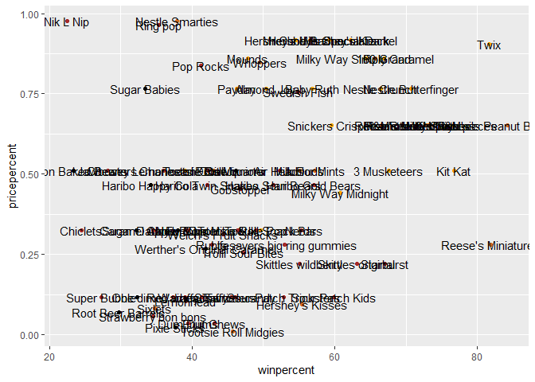
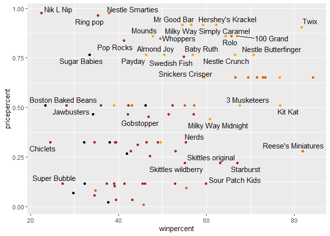
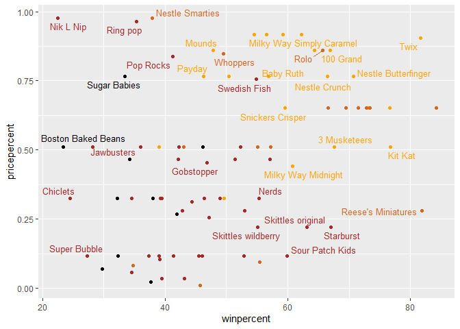
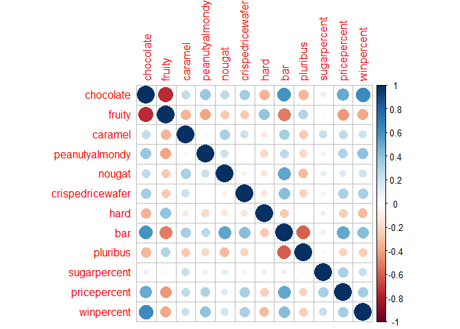
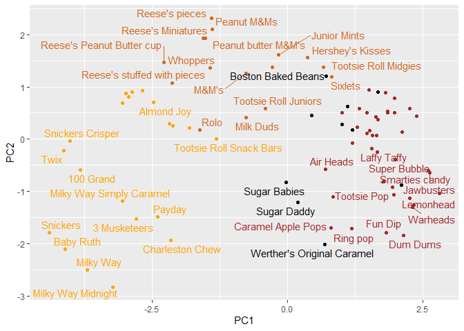
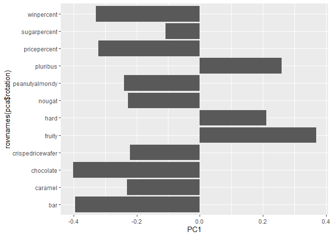
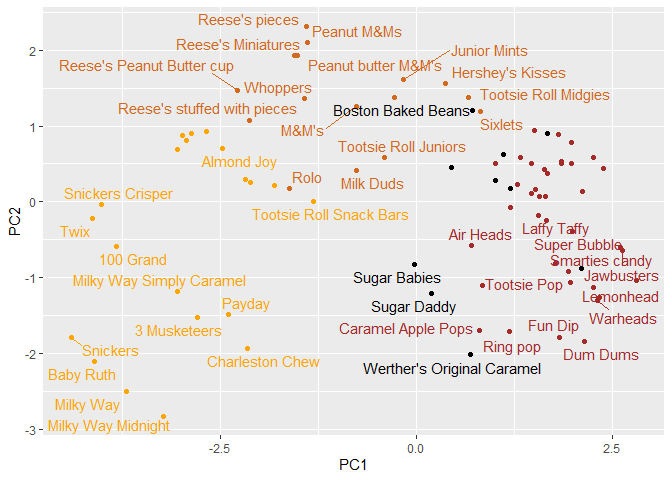
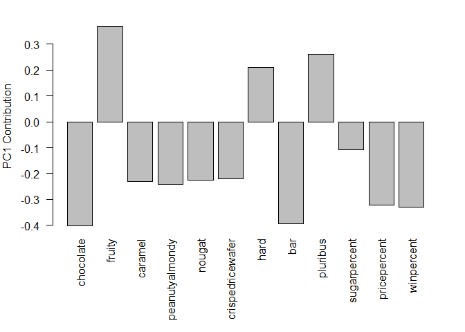

# Class 10: Halloween Mini-Project
Shawn Xiao (A18276668)

- [Background](#background)
- [Data Import](#data-import)
- [Quick Overview of Data](#quick-overview-of-data)
- [Overall Candy Rankings](#overall-candy-rankings)
- [Winpercent and Pricepercent](#winpercent-and-pricepercent)
- [Taking a look at pricepercent](#taking-a-look-at-pricepercent)
- [Exploring the correlation
  structure](#exploring-the-correlation-structure)
- [Principal Component Analysis](#principal-component-analysis)

## Background

As it is nearly Halloween and the half way point in the quarter, let’s
do a mini project that help us figure out the best candy!

Our data come drom the 538 website and is available as a CSV file.

## Data Import

``` r
candy <- read.csv(file="candy-data.txt",row.names=1)
flextable::flextable(head(candy,10))
```

    systemfonts and textshaping have been compiled with different versions of Freetype. Because of this, textshaping will not use the font cache provided by systemfonts


> Q1. How many different candy types are in this dataset?

``` r
nrow(candy)
```

    [1] 85

There are 85 candy types in this dataset.

> Q2. How many fruity candy types are in the dataset?

``` r
library(tidyverse)
sum(candy$fruity)
```

    [1] 38

There are 38 fruity candy types in the dataset.

> Q3. What is your favorite candy in the dataset and what is it’s
> winpercent value?

``` r
candy%>%
  filter(rownames(candy)=="Kit Kat")%>%
  select(winpercent)
```

            winpercent
    Kit Kat    76.7686

My favorate candy is Kit Kat and its win rate is 76.77%.

> Q4. What is the winpercent value for “Kit Kat”?

``` r
candy["Kit Kat",]$winpercent
```

    [1] 76.7686

The winpercent value for Kit Kat is 76.77%

> Q5. What is the winpercent value for “Tootsie Roll Snack Bars”?

``` r
candy%>%
  filter(rownames(candy)=="Tootsie Roll Snack Bars")%>%
  select(winpercent)
```

                            winpercent
    Tootsie Roll Snack Bars    49.6535

The winpercent for Toosie Roll Snack Bars is 49.65%.

## Quick Overview of Data

``` r
skimr::skim(candy)
```

|                                                  |       |
|:-------------------------------------------------|:------|
| Name                                             | candy |
| Number of rows                                   | 85    |
| Number of columns                                | 12    |
| \_\_\_\_\_\_\_\_\_\_\_\_\_\_\_\_\_\_\_\_\_\_\_   |       |
| Column type frequency:                           |       |
| numeric                                          | 12    |
| \_\_\_\_\_\_\_\_\_\_\_\_\_\_\_\_\_\_\_\_\_\_\_\_ |       |
| Group variables                                  | None  |

Data summary

**Variable type: numeric**

| skim_variable | n_missing | complete_rate | mean | sd | p0 | p25 | p50 | p75 | p100 | hist |
|:---|---:|---:|---:|---:|---:|---:|---:|---:|---:|:---|
| chocolate | 0 | 1 | 0.44 | 0.50 | 0.00 | 0.00 | 0.00 | 1.00 | 1.00 | ▇▁▁▁▆ |
| fruity | 0 | 1 | 0.45 | 0.50 | 0.00 | 0.00 | 0.00 | 1.00 | 1.00 | ▇▁▁▁▆ |
| caramel | 0 | 1 | 0.16 | 0.37 | 0.00 | 0.00 | 0.00 | 0.00 | 1.00 | ▇▁▁▁▂ |
| peanutyalmondy | 0 | 1 | 0.16 | 0.37 | 0.00 | 0.00 | 0.00 | 0.00 | 1.00 | ▇▁▁▁▂ |
| nougat | 0 | 1 | 0.08 | 0.28 | 0.00 | 0.00 | 0.00 | 0.00 | 1.00 | ▇▁▁▁▁ |
| crispedricewafer | 0 | 1 | 0.08 | 0.28 | 0.00 | 0.00 | 0.00 | 0.00 | 1.00 | ▇▁▁▁▁ |
| hard | 0 | 1 | 0.18 | 0.38 | 0.00 | 0.00 | 0.00 | 0.00 | 1.00 | ▇▁▁▁▂ |
| bar | 0 | 1 | 0.25 | 0.43 | 0.00 | 0.00 | 0.00 | 0.00 | 1.00 | ▇▁▁▁▂ |
| pluribus | 0 | 1 | 0.52 | 0.50 | 0.00 | 0.00 | 1.00 | 1.00 | 1.00 | ▇▁▁▁▇ |
| sugarpercent | 0 | 1 | 0.48 | 0.28 | 0.01 | 0.22 | 0.47 | 0.73 | 0.99 | ▇▇▇▇▆ |
| pricepercent | 0 | 1 | 0.47 | 0.29 | 0.01 | 0.26 | 0.47 | 0.65 | 0.98 | ▇▇▇▇▆ |
| winpercent | 0 | 1 | 50.32 | 14.71 | 22.45 | 39.14 | 47.83 | 59.86 | 84.18 | ▃▇▆▅▂ |

> Q6. Is there any variable/column that looks to be on a different scale
> to the majority of the other columns in the dataset?

The winpercent is on a 0-100 scale and the rest are on 0-1 scale

> Q7. What do you think a zero and one represent for the
> candy\$chocolate column?

The candy does not contain chocolate.

> Q8. Plot a histogram of winpercent values

``` r
ggplot(candy)+ 
  aes(winpercent)+
  geom_histogram(bins=20)
```



> Q9. Is the distribution of winpercent values symmetrical?

``` r
ggplot(candy)+ 
  aes(winpercent)+
  geom_density()
```


The distribution is not symmetrical.

> Q10. Is the center of the distribution above or below 50%?

``` r
summary(candy$winpercent)
```

       Min. 1st Qu.  Median    Mean 3rd Qu.    Max. 
      22.45   39.14   47.83   50.32   59.86   84.18 

The center od the distribution is below 50%.

> Q11. On average is chocolate candy higher or lower ranked than fruit
> candy?

``` r
# 1. Find all chocolate candy 
# 2. Find their winpercent 
# 3. Calculate the mean
# 4-6 Repeat with fruit candy

choc.win <- candy%>%
  filter(chocolate==1)%>%
  select(winpercent)

choc.mean <- mean(choc.win$winpercent)

friut.win <- candy%>%
  filter(fruity==1)%>%
  select(winpercent)

fruit.mean <- mean(friut.win$winpercent)
```

> Q12. Is this difference statistically significant?

``` r
t.test(choc.win,friut.win)
```


        Welch Two Sample t-test

    data:  choc.win and friut.win
    t = 6.2582, df = 68.882, p-value = 2.871e-08
    alternative hypothesis: true difference in means is not equal to 0
    95 percent confidence interval:
     11.44563 22.15795
    sample estimates:
    mean of x mean of y 
     60.92153  44.11974 

## Overall Candy Rankings

> Q13. What are the five least liked candy types in this set?

``` r
candy |>
  arrange(winpercent)|>
  head(5)
```

                       chocolate fruity caramel peanutyalmondy nougat
    Nik L Nip                  0      1       0              0      0
    Boston Baked Beans         0      0       0              1      0
    Chiclets                   0      1       0              0      0
    Super Bubble               0      1       0              0      0
    Jawbusters                 0      1       0              0      0
                       crispedricewafer hard bar pluribus sugarpercent pricepercent
    Nik L Nip                         0    0   0        1        0.197        0.976
    Boston Baked Beans                0    0   0        1        0.313        0.511
    Chiclets                          0    0   0        1        0.046        0.325
    Super Bubble                      0    0   0        0        0.162        0.116
    Jawbusters                        0    1   0        1        0.093        0.511
                       winpercent
    Nik L Nip            22.44534
    Boston Baked Beans   23.41782
    Chiclets             24.52499
    Super Bubble         27.30386
    Jawbusters           28.12744

The five least liked candy types are Nik L Nip, Boston Baked Beans,
Chiclets, Super Bubble, and Jawbusters.

> Q14. What are the top 5 all time favorite candy types out of this set?

``` r
candy|>
  arrange(-winpercent)|>
  head(5)
```

                              chocolate fruity caramel peanutyalmondy nougat
    Reese's Peanut Butter cup         1      0       0              1      0
    Reese's Miniatures                1      0       0              1      0
    Twix                              1      0       1              0      0
    Kit Kat                           1      0       0              0      0
    Snickers                          1      0       1              1      1
                              crispedricewafer hard bar pluribus sugarpercent
    Reese's Peanut Butter cup                0    0   0        0        0.720
    Reese's Miniatures                       0    0   0        0        0.034
    Twix                                     1    0   1        0        0.546
    Kit Kat                                  1    0   1        0        0.313
    Snickers                                 0    0   1        0        0.546
                              pricepercent winpercent
    Reese's Peanut Butter cup        0.651   84.18029
    Reese's Miniatures               0.279   81.86626
    Twix                             0.906   81.64291
    Kit Kat                          0.511   76.76860
    Snickers                         0.651   76.67378

The top five most popular candies are Reese’s Peanut Butter Cup, Resse’s
Miniatures, Twix, Kit Kat, and Snickers.

> Q15. Make a first barplot of candy ranking based on winpercent values.

``` r
ggplot(candy)+
  aes(winpercent,rownames(candy))+
  geom_col()
```


> Q16. This is quite ugly, use the reorder() function to get the bars
> sorted by winpercent?

``` r
ggplot(candy)+
  aes(x=winpercent,
      y=reorder(rownames(candy),winpercent))+
  geom_col()
```


Add some color based on the “type of candy”

``` r
my_cols <- rep("black", nrow(candy))
my_cols[as.logical(candy$chocolate)] <-  "chocolate"
my_cols[as.logical(candy$bar)] <-  "orange"
my_cols[as.logical(candy$fruity)] <-  "brown"

ggplot(candy) + 
  aes(winpercent, reorder(rownames(candy),winpercent)) +
  geom_col(fill=my_cols) 
```



## Winpercent and Pricepercent

A plot with both variables/columns winpercent and pricepercent

``` r
my_cols[as.logical(candy$fruity)] <-  "brown"

ggplot(candy)+
  aes(winpercent,pricepercent,
      label=rownames(candy))+
  geom_point(col=my_cols)+
  geom_text()
```



``` r
library(ggrepel)

ggplot(candy)+
  aes(winpercent,pricepercent,
      label=rownames(candy))+
  geom_point(col=my_cols)+
  geom_text_repel(max.overlaps = 6)
```

    Warning: ggrepel: 51 unlabeled data points (too many overlaps). Consider
    increasing max.overlaps



> Q17. What is the worst ranked chocolate candy?

The worst ranked chocolate candy is sixlets.

> Q18. What is the best ranked fruity candy?

The best ranked fruity candy is starbust.

## Taking a look at pricepercent

``` r
ggplot(candy) +
  aes(winpercent, pricepercent, label=rownames(candy)) +
  geom_point(col=my_cols) + 
  geom_text_repel(col=my_cols, size=3.3, max.overlaps = 5)
```

    Warning: ggrepel: 54 unlabeled data points (too many overlaps). Consider
    increasing max.overlaps



> Q19. Which candy type is the highest ranked in terms of winpercent for
> the least money - i.e. offers the most bang for your buck?

Reese’s Miniatures is ranked highest for winpercent and lowest for
pricepercent.

> Q20. What are the top 5 most expensive candy types in the dataset and
> of these which is the least popular?

``` r
ord <- order(candy$pricepercent, decreasing = TRUE)
head( candy[ord,c(11,12)], n=5 )
```

                             pricepercent winpercent
    Nik L Nip                       0.976   22.44534
    Nestle Smarties                 0.976   37.88719
    Ring pop                        0.965   35.29076
    Hershey's Krackel               0.918   62.28448
    Hershey's Milk Chocolate        0.918   56.49050

The top 5 most expensive candy that are least popular are Nik L Nip,
Nestle Smarties, Ring pop, Hershey’s Krackel, and Hershey’s Milk
Chocolate.

## Exploring the correlation structure

Now that we’ve explored the dataset a little, we’ll see how the
variables interact with one another. We’ll use correlation and view the
results with the corrplot package to plot a correlation matrix.

``` r
library(corrplot)
cij <- cor(candy)
corrplot(cij)
```



> Q22. Examining this plot what two variables are anti-correlated
> (i.e. have minus values)?

Fruity and Chocolate are anti-correlated.

> Q23. Similarly, what two variables are most positively correlated?

Choloclate and Bar are most positively correlated.

## Principal Component Analysis

The function to use is called `prcomp()` with an optional `scale=T/F`
argument.

``` r
pca <- prcomp(candy,scale=T)
summary(pca)
```

    Importance of components:
                              PC1    PC2    PC3     PC4    PC5     PC6     PC7
    Standard deviation     2.0788 1.1378 1.1092 1.07533 0.9518 0.81923 0.81530
    Proportion of Variance 0.3601 0.1079 0.1025 0.09636 0.0755 0.05593 0.05539
    Cumulative Proportion  0.3601 0.4680 0.5705 0.66688 0.7424 0.79830 0.85369
                               PC8     PC9    PC10    PC11    PC12
    Standard deviation     0.74530 0.67824 0.62349 0.43974 0.39760
    Proportion of Variance 0.04629 0.03833 0.03239 0.01611 0.01317
    Cumulative Proportion  0.89998 0.93832 0.97071 0.98683 1.00000

Our main PCA result figure

``` r
ggplot(pca$x)+
  aes(PC1,PC2,
      label=rownames(pca$x))+
  geom_point(col=my_cols)+
  geom_text_repel(col=my_cols, max.overlaps = 7)
```

    Warning: ggrepel: 41 unlabeled data points (too many overlaps). Consider
    increasing max.overlaps



We should also examine the “variable loading” or contributions of the
original variables to the new PCs.

``` r
ggplot(pca$rotation)+
  aes(PC1,rownames(pca$rotation))+
  geom_col()
```



``` r
p <- ggplot(pca$x)+
  aes(PC1,PC2,
      label=rownames(pca$x))+
  geom_point(col=my_cols)+
  geom_text_repel(col=my_cols, max.overlaps = 7)
p
```

    Warning: ggrepel: 41 unlabeled data points (too many overlaps). Consider
    increasing max.overlaps



Interactive plots that can be zoomed in and “brushed” over can be made
with he **plotly** package. Its output is interactive and will not
render to PDF.

``` r
library(plotly)
```


    Attaching package: 'plotly'

    The following object is masked from 'package:ggplot2':

        last_plot

    The following object is masked from 'package:stats':

        filter

    The following object is masked from 'package:graphics':

        layout

``` r
#ggplotly(p)
```

``` r
par(mar=c(8,4,2,2))
barplot(pca$rotation[,1], las=2, ylab="PC1 Contribution")
```



> Q24. What original variables are picked up strongly by PC1 in the
> positive direction? Do these make sense to you?

Fruity, hard, pluribus are picked up strongly by PC1 in the positive
direction. This makes sense because candies with these three
characteristics tend to correlate less with candies of other
characteristics.
