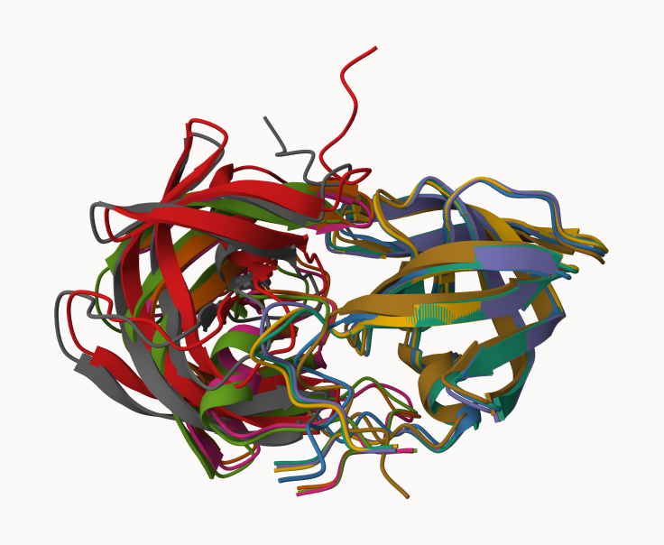
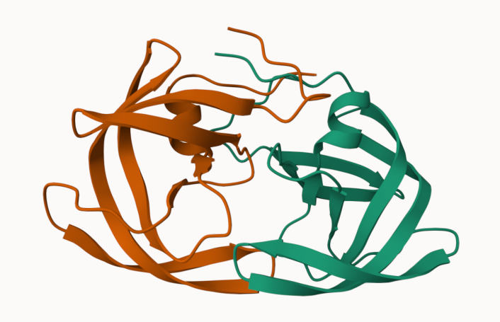
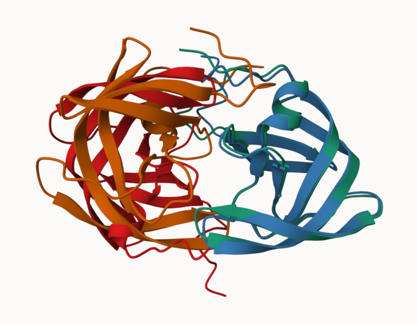
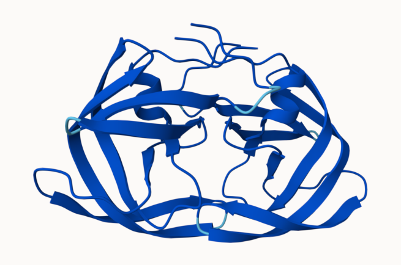
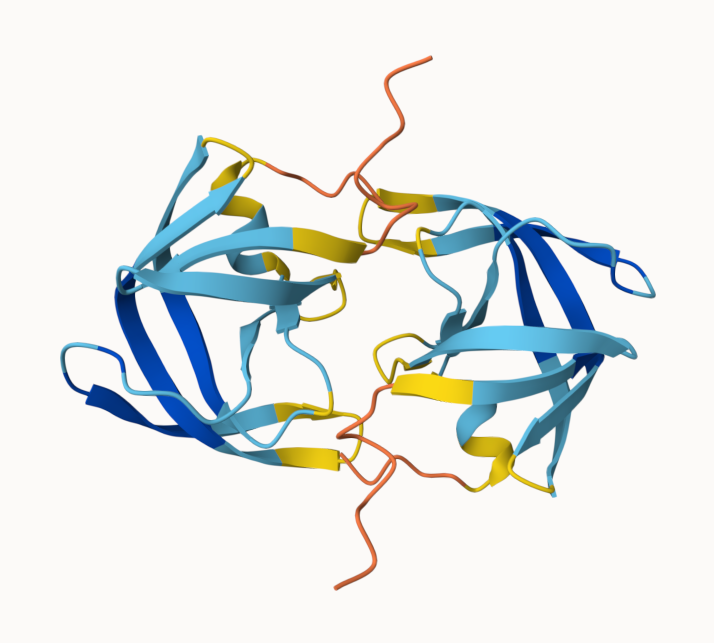

## AlphaFold Data Base (AFDB)

The EBI maintains the largest database of AlphaFold structure prediciton models at: https://alphafold.ebi.ac.uk/

From last class (beofre halloween) we saw that the PDB had 244,290 (Oct 2025). 

The total number of protein sequence in UniProtKB is 199,579,901

> Key point: This is a tiny fraction of sequence space that has structural coverage (0.12%).  

```{r}
244290/199579901 * 100
```
AFDB is attempting to address this gap...

There are two "Quality Scores" from AlphaFOld one for residues (i.e. each amino acid) called **pLDDT** score. The other **PAE** score measures the confidence in the relative position of two residues (i.e. score for every pair of residues). 

## Generating your own structure predictions

Figure of 5 generated HIV-PR models



Figure of the top model



Figure of the top model and the last model



pLDDT score for top model



pLDDT score for the bottom model




## Custom analysis of resulting models in R

Read key result files into R. The first thing I need to know is what my results directory/folder is called (i.e. its name is different for every AlphaFold run/job)

```{r}
results_dir <- "HIVPR_dimer_23119/"
```

```{r}
# File names for all PDB models
pdb_files <- list.files(path=results_dir,
                        pattern="*.pdb",
                        full.names = TRUE)

# Print our PDB file names
basename(pdb_files)
```

```{r}
library(bio3d)


# Read all data from Models 
#  and superpose/fit coords
pdbs <- pdbaln(pdb_files, fit=TRUE, exefile="msa")
```

RMSD is a standard measure of structural distance between coordinate sets. We can use the `rmsd()` function to calculate the RMSD between all pairs models.

```{r, message=FALSE}
rd <- rmsd(pdbs, fit=T)

range(rd)
```
Draw a heat map

```{r}
library(pheatmap)

colnames(rd) <- paste0("m",1:5)
rownames(rd) <- paste0("m",1:5)
pheatmap(rd)
```

```{r}
pdb <- read.pdb("1hsg")
```

We can improve the superposition/fitting of our models by finding the most consistent “rigid core” common across all the models. For this we will use the `core.find()` function:

```{r}
core <- core.find(pdbs)

core.inds <- print(core, vol=0.5)

xyz <- pdbfit(pdbs, core.inds, outpath="corefit_structures")
```

Now we can examine the RMSF between positions of the structure. RMSF is an often used measure of conformational variance along the structure:

```{r}
rf <- rmsf(xyz)

plotb3(rf, sse=pdb)
abline(v=100, col="gray", ylab="RMSF")
```


## Residue conservation from alignment file

Find the large AlphaFold alignment file

```{r}
aln_file <- list.files(path=results_dir,
                       pattern=".a3m$",
                        full.names = TRUE)
aln_file
```

```{r}
aln <- read.fasta(aln_file[1], to.upper = TRUE)
```

```{r}
dim(aln$ali)
```

```{r}
sim <- conserv(aln)
```

```{r}
plotb3(sim[1:99], sse=trim.pdb(pdb, chain="A"),
       ylab="Conservation Score")
```

```{r}
con <- consensus(aln, cutoff = 0.9)
con$seq
```

