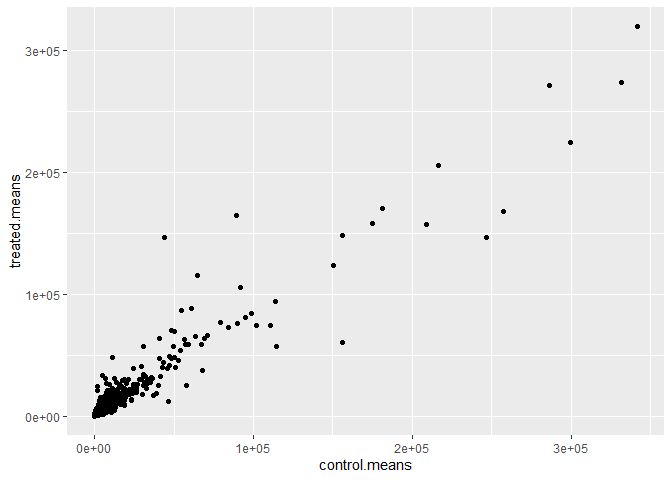
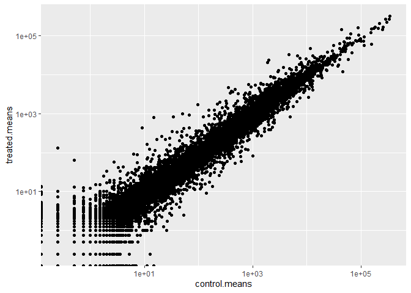
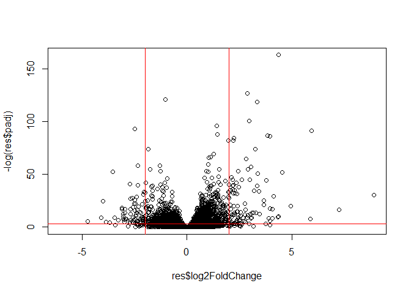

# Class 12: Transcriptomics and the analysis of RNASeq data
Shawn Xiao (PID: A18276668)

- [Background](#background)
- [Data Import](#data-import)
- [Toy differential gene expression](#toy-differential-gene-expression)
- [DESeq2 Analysis](#deseq2-analysis)
- [Volcano Plot](#volcano-plot)
- [Save our results](#save-our-results)
- [Add gene annotation](#add-gene-annotation)
- [Passway Analysis](#passway-analysis)
- [Save our main results](#save-our-main-results)

## Background

Today we will analyze some RNASeq data from Himes et al. on the effects
of a common steroid (dexamethasone) on airway smooth muscle cells (ASM
cells).

Our starting point is the “counts” data and “metadata” that contains the
count values for each gene in their different experiment (i.e. cell
lines with or without the drug).

## Data Import

``` r
counts <- read.csv("airway_scaledcounts.csv", row.names=1)
metadata <-  read.csv("airway_metadata.csv")
head(counts)
```

                    SRR1039508 SRR1039509 SRR1039512 SRR1039513 SRR1039516
    ENSG00000000003        723        486        904        445       1170
    ENSG00000000005          0          0          0          0          0
    ENSG00000000419        467        523        616        371        582
    ENSG00000000457        347        258        364        237        318
    ENSG00000000460         96         81         73         66        118
    ENSG00000000938          0          0          1          0          2
                    SRR1039517 SRR1039520 SRR1039521
    ENSG00000000003       1097        806        604
    ENSG00000000005          0          0          0
    ENSG00000000419        781        417        509
    ENSG00000000457        447        330        324
    ENSG00000000460         94        102         74
    ENSG00000000938          0          0          0

``` r
head(metadata)
```

              id     dex celltype     geo_id
    1 SRR1039508 control   N61311 GSM1275862
    2 SRR1039509 treated   N61311 GSM1275863
    3 SRR1039512 control  N052611 GSM1275866
    4 SRR1039513 treated  N052611 GSM1275867
    5 SRR1039516 control  N080611 GSM1275870
    6 SRR1039517 treated  N080611 GSM1275871

> Q1. How many genes are in this dataset?

``` r
nrow(counts)
```

    [1] 38694

There are 38694 genes in this dataset.

> How many different experiments (col in counts or rows in metadata) are
> there?

``` r
ncol(counts)
```

    [1] 8

There are 8 experiments.

> Q2. How many ‘control’ cell lines do we have?

``` r
sum(metadata$dex == "control")
```

    [1] 4

There are 4 control cell lines.

## Toy differential gene expression

To start our analysis let’s first calculate the mean for all control
experiments:

1.  Extract all “control”
2.  Calculate the mean 3-4. Repeat for “treated”
3.  Compare these `control.mean`

``` r
control <- metadata[metadata[,"dex"]=="control",]
control.counts <- counts[ ,control$id]
control.mean <- rowSums( control.counts )/4 
head(control.mean)
```

    ENSG00000000003 ENSG00000000005 ENSG00000000419 ENSG00000000457 ENSG00000000460 
             900.75            0.00          520.50          339.75           97.25 
    ENSG00000000938 
               0.75 

``` r
library(dplyr)
control <- metadata %>% filter(dex=="control")
control.counts <- counts %>% select(control$id) 
control.mean <- rowSums(control.counts)/4
head(control.mean)
```

    ENSG00000000003 ENSG00000000005 ENSG00000000419 ENSG00000000457 ENSG00000000460 
             900.75            0.00          520.50          339.75           97.25 
    ENSG00000000938 
               0.75 

> Q3 How would you make the above code in either approach more robust?
> Is there a function that could help here?

Using the base R functions to perform the 3 steps for both control and
treated.

Control:

``` r
control.inds <- metadata$dex == "control"
control.counts <- counts[ , control.inds]

control.means <- rowMeans(control.counts)
```

> Q4. Follow the same procedure for the treated samples (i.e. calculate
> the mean per gene across drug treated samples and assign to a labeled
> vector called treated.mean)

Treated:

``` r
treated.inds <- metadata$dex == "treated"
treated.counts <- counts[ , treated.inds]

treated.means <- rowMeans(treated.counts)
```

Store these together for bookkeeping as `meancounts`

``` r
meancounts <- data.frame(control.means, treated.means)
head(meancounts)
```

                    control.means treated.means
    ENSG00000000003        900.75        658.00
    ENSG00000000005          0.00          0.00
    ENSG00000000419        520.50        546.00
    ENSG00000000457        339.75        316.50
    ENSG00000000460         97.25         78.75
    ENSG00000000938          0.75          0.00

Plot the data

> Q5 (a). Create a scatter plot showing the mean of the treated samples
> against the mean of the control samples. Your plot should look
> something like the following. Q5 (b).You could also use the ggplot2
> package to make this figure producing the plot below. What geom\_?()
> function would you use for this plot?

The `geom_point()` function

``` r
library(ggplot2)
ggplot(meancounts) +
aes(control.means, treated.means) +
geom_point()
```



> Q6. Try plotting both axes on a log scale. What is the argument to
> plot() that allows you to do this?

`log` function allows me to do this.

If all data lies on the diagonal line, that means all control and
treatments are equal. Since the points are very skewed, let’s look at
the log of the data:

``` r
ggplot(meancounts) +
aes(control.means, treated.means) +
geom_point() +
scale_x_log10() +
scale_y_log10()
```

    Warning in scale_x_log10(): log-10 transformation introduced infinite values.

    Warning in scale_y_log10(): log-10 transformation introduced infinite values.



We often talk about matrices like “log2 fold-change”

``` r
#treated/control

#log2() is very easy to understand
#log2(10/10)=0
#log2(10/20)=-1
#log2(10/40)=-2
#log2(40/10)=2
```

Calculate our log2 fold-change for treated/control

``` r
meancounts["log2fc"] <- log2(meancounts$treated.means / meancounts$control.means)
head(meancounts)
```

                    control.means treated.means      log2fc
    ENSG00000000003        900.75        658.00 -0.45303916
    ENSG00000000005          0.00          0.00         NaN
    ENSG00000000419        520.50        546.00  0.06900279
    ENSG00000000457        339.75        316.50 -0.10226805
    ENSG00000000460         97.25         78.75 -0.30441833
    ENSG00000000938          0.75          0.00        -Inf

``` r
zero.vals <- which(meancounts[,1:2]==0, arr.ind=TRUE)

to.rm <- unique(zero.vals[,1])
mycounts <- meancounts[-to.rm,]
head(mycounts)
```

                    control.means treated.means      log2fc
    ENSG00000000003        900.75        658.00 -0.45303916
    ENSG00000000419        520.50        546.00  0.06900279
    ENSG00000000457        339.75        316.50 -0.10226805
    ENSG00000000460         97.25         78.75 -0.30441833
    ENSG00000000971       5219.00       6687.50  0.35769358
    ENSG00000001036       2327.00       1785.75 -0.38194109

> Q7. What is the purpose of the arr.ind argument in the which()
> function call above? Why would we then take the first column of the
> output and need to call the unique() function?

The `arr.ind` argument causes which() to return both row and column
values if they are TRUE. `unique()` function ensures that the same row
is not counted twice.

A common “rule of thumb” is a log2 fold change cutoff of +2 and -2 to
call genes “up regulated” or “down regulated”.

> Q8 Using the up.ind vector above can you determine how many up
> regulated genes we have at the greater than 2 fc level?

Number of “up” genes:

``` r
sum(meancounts$log2fc >= +2, na.rm=T)
```

    [1] 1910

There are 1910 “up” genes.

> Q9. Using the down.ind vector above can you determine how many down
> regulated genes we have at the greater than 2 fc level?

Number of “down” genes:

``` r
sum(meancounts$log2fc <= -2, na.rm=T)
```

    [1] 2330

There are 2330 “down” genes.

> Q10. Do you trust these results? Why or why not?

No because we do not know about the p-value and the statistical
significance of our fold change.

## DESeq2 Analysis

Lets do this analysis properly – are the differences we see between drug
and no drug significant given the replicate experiments.

``` r
library(BiocManager)
library(DESeq2)
```

For DESeq analysis, we need three things:

1.  count values(`countData`)
2.  metadata telling us about the columns in `countData` (`colData`)
3.  Design of the experiment

Our first function from DESeq2 will setup the input required for
analysis by storing all these 3 things together.

``` r
dds <- DESeqDataSetFromMatrix(countData = counts,
                              colData = metadata,
                              design = ~dex)
```

    converting counts to integer mode

    Warning in DESeqDataSet(se, design = design, ignoreRank): some variables in
    design formula are characters, converting to factors

Use `DESeq` function to run analysis

``` r
dds <- DESeq(dds)
```

    estimating size factors

    estimating dispersions

    gene-wise dispersion estimates

    mean-dispersion relationship

    final dispersion estimates

    fitting model and testing

``` r
res <- results(dds)
head(res)
```

    log2 fold change (MLE): dex treated vs control 
    Wald test p-value: dex treated vs control 
    DataFrame with 6 rows and 6 columns
                      baseMean log2FoldChange     lfcSE      stat    pvalue
                     <numeric>      <numeric> <numeric> <numeric> <numeric>
    ENSG00000000003 747.194195     -0.3507030  0.168246 -2.084470 0.0371175
    ENSG00000000005   0.000000             NA        NA        NA        NA
    ENSG00000000419 520.134160      0.2061078  0.101059  2.039475 0.0414026
    ENSG00000000457 322.664844      0.0245269  0.145145  0.168982 0.8658106
    ENSG00000000460  87.682625     -0.1471420  0.257007 -0.572521 0.5669691
    ENSG00000000938   0.319167     -1.7322890  3.493601 -0.495846 0.6200029
                         padj
                    <numeric>
    ENSG00000000003  0.163035
    ENSG00000000005        NA
    ENSG00000000419  0.176032
    ENSG00000000457  0.961694
    ENSG00000000460  0.815849
    ENSG00000000938        NA

## Volcano Plot

This summary figures are frequently used to highlight the proportion of
genes that are both significantly regulated and display a high fold
change.

``` r
plot( res$log2FoldChange,  -log(res$padj))
abline(v=c(-2,2),col="red")
abline(h=-log(0.04),col="red")
```



## Save our results

``` r
write.csv(res, file="my_results.csv")
```

## Add gene annotation

To help make sense of our results and communicate them to other folks we
need to add some more annotation to our main `res` object.

We will use two bioconductor packages to first map IDs to different
formats including the classic gene “symbol” gene name.

`BiocManager::install("AnnotationDbi")`
`BiocManager::install("org.Hs.eg.db")`

``` r
library(AnnotationDbi)
```


    Attaching package: 'AnnotationDbi'

    The following object is masked from 'package:dplyr':

        select

``` r
library(org.Hs.eg.db)
```

Let’s see what is in `org.Hs.eg.db` with the `column()` function

``` r
columns(org.Hs.eg.db)
```

     [1] "ACCNUM"       "ALIAS"        "ENSEMBL"      "ENSEMBLPROT"  "ENSEMBLTRANS"
     [6] "ENTREZID"     "ENZYME"       "EVIDENCE"     "EVIDENCEALL"  "GENENAME"    
    [11] "GENETYPE"     "GO"           "GOALL"        "IPI"          "MAP"         
    [16] "OMIM"         "ONTOLOGY"     "ONTOLOGYALL"  "PATH"         "PFAM"        
    [21] "PMID"         "PROSITE"      "REFSEQ"       "SYMBOL"       "UCSCKG"      
    [26] "UNIPROT"     

We can translate or “map” IDs between any of these 26 databases using
the `mapIDs()` function.

``` r
res$symbol <- mapIds(keys = row.names(res), #our current IDs
                     keytype = "ENSEMBL",   #the format of our IDs
                     x = org.Hs.eg.db, #where to get the mappings from
                     column = "SYMBOL"      #the format/DB to map to
                      )
```

    'select()' returned 1:many mapping between keys and columns

``` r
head(res)
```

    log2 fold change (MLE): dex treated vs control 
    Wald test p-value: dex treated vs control 
    DataFrame with 6 rows and 7 columns
                      baseMean log2FoldChange     lfcSE      stat    pvalue
                     <numeric>      <numeric> <numeric> <numeric> <numeric>
    ENSG00000000003 747.194195     -0.3507030  0.168246 -2.084470 0.0371175
    ENSG00000000005   0.000000             NA        NA        NA        NA
    ENSG00000000419 520.134160      0.2061078  0.101059  2.039475 0.0414026
    ENSG00000000457 322.664844      0.0245269  0.145145  0.168982 0.8658106
    ENSG00000000460  87.682625     -0.1471420  0.257007 -0.572521 0.5669691
    ENSG00000000938   0.319167     -1.7322890  3.493601 -0.495846 0.6200029
                         padj      symbol
                    <numeric> <character>
    ENSG00000000003  0.163035      TSPAN6
    ENSG00000000005        NA        TNMD
    ENSG00000000419  0.176032        DPM1
    ENSG00000000457  0.961694       SCYL3
    ENSG00000000460  0.815849       FIRRM
    ENSG00000000938        NA         FGR

Add the mappings for “GENENAME” and “ENTREZID” and store as
`res$genename` and `res$entrez`

``` r
res$genename <- mapIds(keys = row.names(res), 
                       keytype = "ENSEMBL",   
                       x = org.Hs.eg.db,      
                       column = "GENENAME"      
                       )
```

    'select()' returned 1:many mapping between keys and columns

``` r
res$entrez <- mapIds(keys = row.names(res), 
                       keytype = "ENSEMBL",   
                       x = org.Hs.eg.db,      
                       column = "ENTREZID"      
                       )
```

    'select()' returned 1:many mapping between keys and columns

``` r
head(res)
```

    log2 fold change (MLE): dex treated vs control 
    Wald test p-value: dex treated vs control 
    DataFrame with 6 rows and 9 columns
                      baseMean log2FoldChange     lfcSE      stat    pvalue
                     <numeric>      <numeric> <numeric> <numeric> <numeric>
    ENSG00000000003 747.194195     -0.3507030  0.168246 -2.084470 0.0371175
    ENSG00000000005   0.000000             NA        NA        NA        NA
    ENSG00000000419 520.134160      0.2061078  0.101059  2.039475 0.0414026
    ENSG00000000457 322.664844      0.0245269  0.145145  0.168982 0.8658106
    ENSG00000000460  87.682625     -0.1471420  0.257007 -0.572521 0.5669691
    ENSG00000000938   0.319167     -1.7322890  3.493601 -0.495846 0.6200029
                         padj      symbol               genename      entrez
                    <numeric> <character>            <character> <character>
    ENSG00000000003  0.163035      TSPAN6          tetraspanin 6        7105
    ENSG00000000005        NA        TNMD            tenomodulin       64102
    ENSG00000000419  0.176032        DPM1 dolichyl-phosphate m..        8813
    ENSG00000000457  0.961694       SCYL3 SCY1 like pseudokina..       57147
    ENSG00000000460  0.815849       FIRRM FIGNL1 interacting r..       55732
    ENSG00000000938        NA         FGR FGR proto-oncogene, ..        2268

## Passway Analysis

There are lots of bioconductor packages to do this type of analysis. For
now let’s just try one called **gage** again we need to install this if
we don’t have it already

``` r
library(gage)
library(gageData)
library(pathview)
```

To use **gage** I need two things

- a named vector of fold-change DEGs (our geneset of interest)
- a set of pathways or genesets to use for annotation.

``` r
foldchanges <- res$log2FoldChange
names(foldchanges) <- res$entrez
```

``` r
data(kegg.sets.hs)

keggres = gage(foldchanges, gsets=kegg.sets.hs)
```

In our results object we have:

``` r
attributes(keggres)
```

    $names
    [1] "greater" "less"    "stats"  

``` r
head(keggres$less,5)
```

                                                             p.geomean stat.mean
    hsa05332 Graft-versus-host disease                    0.0004250461 -3.473346
    hsa04940 Type I diabetes mellitus                     0.0017820293 -3.002352
    hsa05310 Asthma                                       0.0020045888 -3.009050
    hsa04672 Intestinal immune network for IgA production 0.0060434515 -2.560547
    hsa05330 Allograft rejection                          0.0073678825 -2.501419
                                                                 p.val      q.val
    hsa05332 Graft-versus-host disease                    0.0004250461 0.09053483
    hsa04940 Type I diabetes mellitus                     0.0017820293 0.14232581
    hsa05310 Asthma                                       0.0020045888 0.14232581
    hsa04672 Intestinal immune network for IgA production 0.0060434515 0.31387180
    hsa05330 Allograft rejection                          0.0073678825 0.31387180
                                                          set.size         exp1
    hsa05332 Graft-versus-host disease                          40 0.0004250461
    hsa04940 Type I diabetes mellitus                           42 0.0017820293
    hsa05310 Asthma                                             29 0.0020045888
    hsa04672 Intestinal immune network for IgA production       47 0.0060434515
    hsa05330 Allograft rejection                                36 0.0073678825

Let’s looks at one of these pathways (hsa05310 Asthma) with our genes
colored up so we cn see the overlap

``` r
pathview(pathway.id = "hsa05310", gene.data = foldchanges)
```

    'select()' returned 1:1 mapping between keys and columns

    Info: Working in directory C:/Users/xiaos/OneDrive/桌面/BIMM143/bimm143_github/Class12

    Info: Writing image file hsa05310.pathview.png

Add this pathway figure to our report


## Save our main results

``` r
write.csv(res, file = "myresults_annotated.csv")
```
