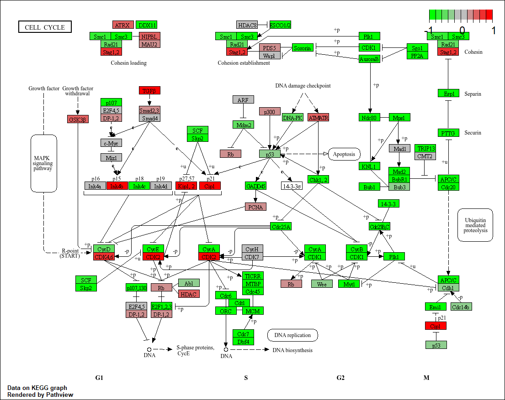
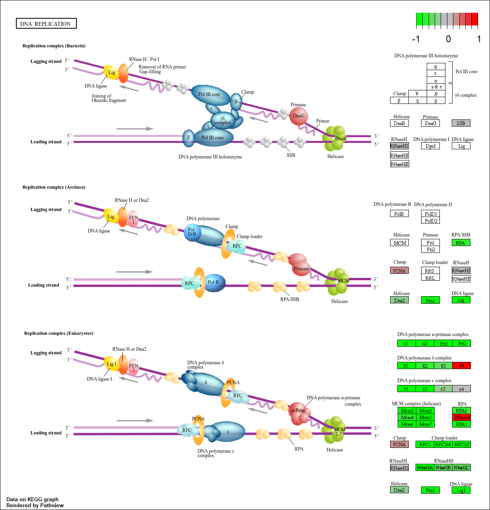

## Background

Here we work through a complete RNASeq analysis project. The input data comes from a knock-down experiment of a HOX gene. 

## Data Import

### Reading the `counts` and `metadata()` CSV files

```{r}
counts <- read.csv(file = "GSE37704_featurecounts.csv", row.names = 1)
metadata <- read.csv(file = "GSE37704_metadata.csv")
head(counts)
head(metadata)
nrow(metadata)
ncol(counts)
```

### Check on data structure

Some book-keeping is required as there looks to be a mis-match between metadata rows and counts columns. 

Looks like we need to get rid of the first "length" column of our `counts` object

```{r}
cleancounts <- counts[,-1]
```

```{r}
all(colnames(cleancounts) ==metadata$id)
```

### Remove zero count genes

There are lots if genes with zero counts. We can remove these from further analysis. 

```{r}
to.keep.ids <- rowSums(cleancounts)>0
nonzero_counts <- cleancounts[to.keep.ids,]
```


## DESeq analysis

### load package

```{r,message=FALSE}
library(DESeq2)
```

### setup DESeq object

```{r}
dds <- DESeqDataSetFromMatrix(countData = nonzero_counts,
                              colData = metadata,
                              design = ~condition)
```

Run DESeq

```{r}
dds <- DESeq(dds)
```

get results

```{r}
res <- results(dds)
head(res)
```


## Data Visualization

Volcano plot

```{r}
library(ggplot2)

ggplot(res)+
  aes(log2FoldChange, 
      -log(padj))+
  geom_point()+
  theme_bw()
```

Add threshold lines for fold-change and P-value and color our subset of genes that make these threshold cut-offs in the plot. 

```{r}
mycols <- rep("grey",nrow(res))
mycols[abs(res$log2FoldChange)>2] <- "blue"
mycols[res$pvalue>0.05] <- "grey"

ggplot(res)+
  aes(log2FoldChange, 
      -log(padj))+
  geom_point(col=mycols)+
  theme_bw()+
  geom_vline(xintercept=c(-2,2), col="red")+
  geom_hline(yintercept = -log(0.05),col = "red")
```


## Add Annotation

Add gene symbols and entrez ids

```{r}
library(AnnotationDbi)
library(org.Hs.eg.db)
```

```{r}
res$symbol <- mapIds(x=org.Hs.eg.db,
                     keys = row.names(res),
                     keytype = "ENSEMBL",
                     column = "SYMBOL")

res$genename <- mapIds(x=org.Hs.eg.db,
                     keys = row.names(res),
                     keytype = "ENSEMBL",
                     column = "GENENAME")

res$entrez <- mapIds(x=org.Hs.eg.db,
                     keys = row.names(res),
                     keytype = "ENSEMBL",
                     column = "ENTREZID")
```


## Pathway Analysis

### KEGG Pathway

Run gagw analysis

```{r,message=FALSE}
library(gage)
library(gageData)
library(pathview)
```

We need a named vector for fold-change gage

```{r}
data(kegg.sets.hs)
data(sigmet.idx.hs)
kegg.sets.hs = kegg.sets.hs[sigmet.idx.hs]

foldchanges = res$log2FoldChange
names(foldchanges) = res$entrez
head(foldchanges)

keggres = gage(foldchanges, gsets=kegg.sets.hs)
```

```{r}
head(keggres$less)
```

Pathway view

```{r}
pathview(pathway.id = "hsa04110", gene.data = foldchanges)
```



```{r}
pathview(pathway.id = "hsa03030", gene.data = foldchanges)
```



### GO term

Same analysis but using GO genesets rather than KEGG

```{r}
data(go.sets.hs)
data(go.subs.hs)

# Focus on Biological Process subset of GO
gobpsets = go.sets.hs[go.subs.hs$BP]

gobpres = gage(foldchanges, gsets=gobpsets, same.dir=TRUE)

lapply(gobpres, head)
```

```{r}
head(gobpres$less,4)
```

### Reactome

Lots of folks like the reactome web interface. You can also run this as an R function but let's look at the web fist <https://reactome.org/>

The website wants a text file with one gene symbol per line of the genes you want to map to pathways

```{r}
sig_genes <- res[res$padj <= 0.05 & !is.na(res$padj), ]$symbol

write.table(sig_genes, file="significant_genes.txt", row.names=FALSE, col.names=FALSE, quote=FALSE)
```


## Save our Results

```{r}
write.csv(res,file="myresults.csv")
```


