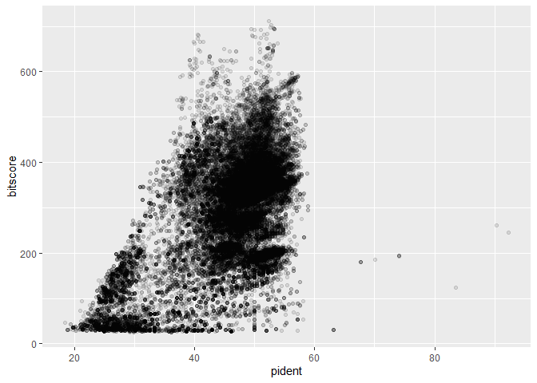
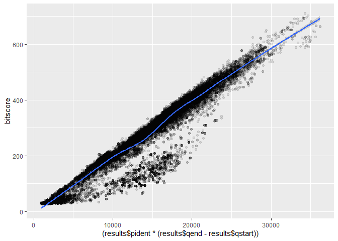

# Class 16 Graph
Shawn Xiao (A18276668)

``` r
library(ggplot2)
```

``` r
results <- read.table("my_results_1.tsv",
                      sep="\t",
                      header = F,
                      stringsAsFactors = F)

colnames(results) <- c("qseqid", "sseqid", "pident", "length", "mismatch", "gapopen", "qstart", "qend", "sstart", "send", "evalue", "bitscore")
```

``` r
ggplot(results)+
         aes(pident, bitscore) + 
  geom_point(alpha=0.1)
```



``` r
ggplot(results)+
  aes((results$pident * (results$qend - results$qstart)), 
      bitscore) + 
  geom_point(alpha=0.1) + 
  geom_smooth()
```

    Warning: Use of `results$pident` is discouraged.
    ℹ Use `pident` instead.

    Warning: Use of `results$qend` is discouraged.
    ℹ Use `qend` instead.

    Warning: Use of `results$qstart` is discouraged.
    ℹ Use `qstart` instead.

    Warning: Use of `results$pident` is discouraged.
    ℹ Use `pident` instead.

    Warning: Use of `results$qend` is discouraged.
    ℹ Use `qend` instead.

    Warning: Use of `results$qstart` is discouraged.
    ℹ Use `qstart` instead.

    `geom_smooth()` using method = 'gam' and formula = 'y ~ s(x, bs = "cs")'


