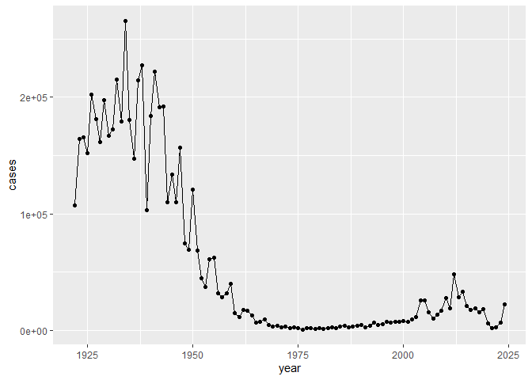
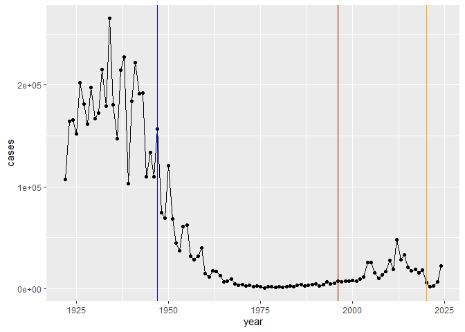
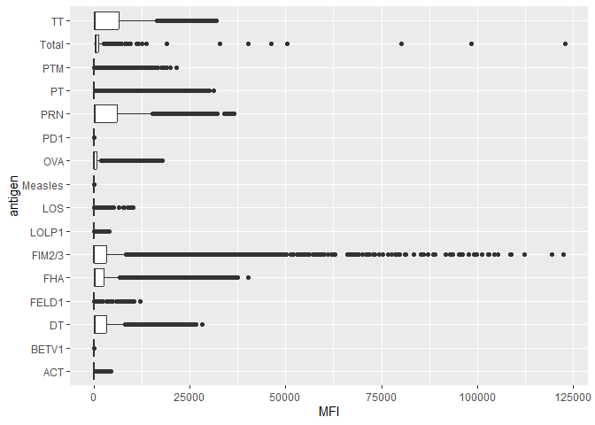
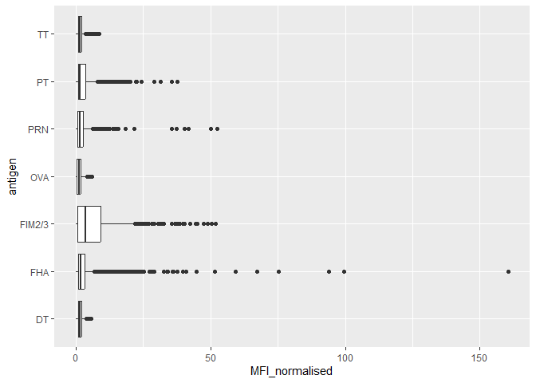
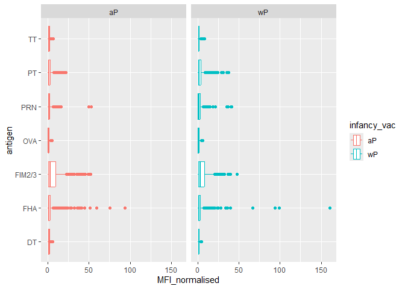
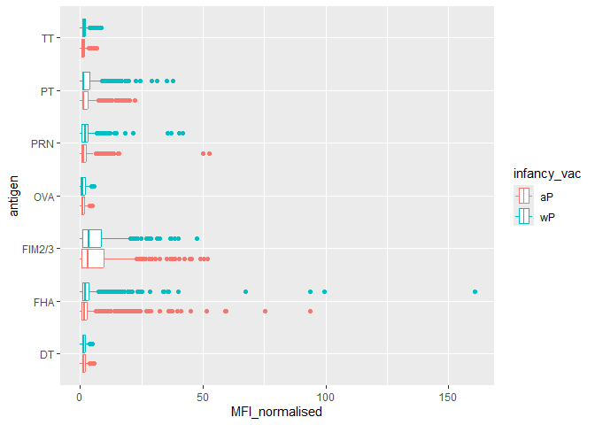
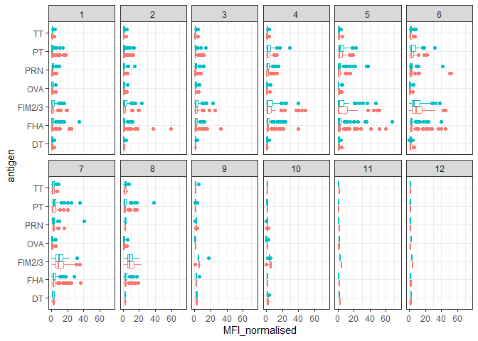
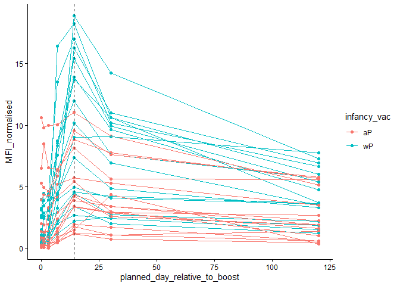

# Class 19: Pertussis Mini Project
Shawn Xiao (PID: A18276668)

- [Background](#background)
- [The CMI-PB Project](#the-cmi-pb-project)
- [Examine IgG Ab titer levels](#examine-igg-ab-titer-levels)

## Background

Pertussis is a bacterial lung infection also known as whooping cough.
Let’s begin by examining CDC reported case numbers in the US.

``` r
cdc <- data.frame(
                                 year = c(1922L,1923L,1924L,1925L,
                                          1926L,1927L,1928L,1929L,1930L,1931L,
                                          1932L,1933L,1934L,1935L,1936L,
                                          1937L,1938L,1939L,1940L,1941L,1942L,
                                          1943L,1944L,1945L,1946L,1947L,
                                          1948L,1949L,1950L,1951L,1952L,
                                          1953L,1954L,1955L,1956L,1957L,1958L,
                                          1959L,1960L,1961L,1962L,1963L,
                                          1964L,1965L,1966L,1967L,1968L,1969L,
                                          1970L,1971L,1972L,1973L,1974L,
                                          1975L,1976L,1977L,1978L,1979L,1980L,
                                          1981L,1982L,1983L,1984L,1985L,
                                          1986L,1987L,1988L,1989L,1990L,
                                          1991L,1992L,1993L,1994L,1995L,1996L,
                                          1997L,1998L,1999L,2000L,2001L,
                                          2002L,2003L,2004L,2005L,2006L,2007L,
                                          2008L,2009L,2010L,2011L,2012L,
                                          2013L,2014L,2015L,2016L,2017L,2018L,
                                          2019L,2020L,2021L,2022L,2023L,2024L),
         cases = c(107473,164191,165418,152003,
                                          202210,181411,161799,197371,
                                          166914,172559,215343,179135,265269,
                                          180518,147237,214652,227319,103188,
                                          183866,222202,191383,191890,109873,
                                          133792,109860,156517,74715,69479,
                                          120718,68687,45030,37129,60886,
                                          62786,31732,28295,32148,40005,
                                          14809,11468,17749,17135,13005,6799,
                                          7717,9718,4810,3285,4249,3036,
                                          3287,1759,2402,1738,1010,2177,2063,
                                          1623,1730,1248,1895,2463,2276,
                                          3589,4195,2823,3450,4157,4570,
                                          2719,4083,6586,4617,5137,7796,6564,
                                          7405,7298,7867,7580,9771,11647,
                                          25827,25616,15632,10454,13278,
                                          16858,27550,18719,48277,28639,32971,
                                          20762,17972,18975,15609,18617,
                                          6124,2116,3044,7063,22538)
       )
```

Plor of cases per year for pertussis in the US

``` r
library(ggplot2)
```

``` r
ggplot(cdc)+
  aes(year,
      cases)+
  geom_line()+
  geom_point()
```



Add some major milestone timeplints to our plot:

``` r
ggplot(cdc)+
  aes(year,
      cases)+
  geom_line()+
  geom_point()+
  geom_vline(xintercept = 1947, col = "blue")+
  geom_vline(xintercept = 1996, col = "darkred")+
  geom_vline(xintercept = 2020, col = "orange")
```



The full introduction of mandatory wP (whole-cell) Pertussis imunization
in the 1940s lead to a dramatic reduction in case numbers(from over
200,000 to 100s).

The switch to the aP (nwer acellular) formalization lead to a slight
increase in case numbers because of the anti-vaccine movement and the
effectiveness of vaccine.

The COVID pendanmic in 2020 lead to a decrease in case numbers since
people have more public health awearness.

## The CMI-PB Project

The CMI-PB project aims to provide the scientific community with a
comprehensive, high-quality and freely accessible resource of Pertussis
booster vaccination.

They make their data available via JSON format API endpoints- basically
the database tables in a key: value type format like “infancy_vac”:“wP”.
To read this we can use the `read_json()` function from the **jsonlite**
package.

``` r
library(jsonlite)

subject <- read_json(path="https://www.cmi-pb.org/api/v5_1/subject",
                     simplifyVector = T)
head(subject)
```

      subject_id infancy_vac biological_sex              ethnicity  race
    1          1          wP         Female Not Hispanic or Latino White
    2          2          wP         Female Not Hispanic or Latino White
    3          3          wP         Female                Unknown White
    4          4          wP           Male Not Hispanic or Latino Asian
    5          5          wP           Male Not Hispanic or Latino Asian
    6          6          wP         Female Not Hispanic or Latino White
      year_of_birth date_of_boost      dataset
    1    1986-01-01    2016-09-12 2020_dataset
    2    1968-01-01    2019-01-28 2020_dataset
    3    1983-01-01    2016-10-10 2020_dataset
    4    1988-01-01    2016-08-29 2020_dataset
    5    1991-01-01    2016-08-29 2020_dataset
    6    1988-01-01    2016-10-10 2020_dataset

> Q. How many subject/individuals are in this dataset?

``` r
nrow(subject)
```

    [1] 172

There are 172 subject/individuals in this dataset.

> Q. How many wP and aP subjects are there

``` r
table(subject$infancy_vac)
```


    aP wP 
    87 85 

There are 87 aP subjects.

> Q. What is the breakdown by “biologicak_sex” and “race”?

``` r
table(subject$biological_sex)
```


    Female   Male 
       112     60 

``` r
table(subject$race)
```


                American Indian/Alaska Native 
                                            1 
                                        Asian 
                                           44 
                    Black or African American 
                                            5 
                           More Than One Race 
                                           19 
    Native Hawaiian or Other Pacific Islander 
                                            2 
                      Unknown or Not Reported 
                                           21 
                                        White 
                                           80 

``` r
table(subject$race, subject$biological_sex)
```

                                               
                                                Female Male
      American Indian/Alaska Native                  0    1
      Asian                                         32   12
      Black or African American                      2    3
      More Than One Race                            15    4
      Native Hawaiian or Other Pacific Islander      1    1
      Unknown or Not Reported                       14    7
      White                                         48   32

This breakdown is not particularly representative of the US population -
this is a serious cavet for this study. However, it is still the largest
sample of its type every assembled.

``` r
specimen <- read_json("http://cmi-pb.org/api/v5_1/specimen",simplifyVector = T)
ab_titer <- read_json("http://cmi-pb.org/api/v5_1/plasma_ab_titer",simplifyVector = T)
```

``` r
head(specimen)
```

      specimen_id subject_id actual_day_relative_to_boost
    1           1          1                           -3
    2           2          1                            1
    3           3          1                            3
    4           4          1                            7
    5           5          1                           11
    6           6          1                           32
      planned_day_relative_to_boost specimen_type visit
    1                             0         Blood     1
    2                             1         Blood     2
    3                             3         Blood     3
    4                             7         Blood     4
    5                            14         Blood     5
    6                            30         Blood     6

We need to “join” or link these tables with the `subject` table so we
can begin to analyze this data and know who a given Ab sample was
collected for and when.

``` r
library(dplyr)

meta <- inner_join(subject,specimen)
head(meta)
```

      subject_id infancy_vac biological_sex              ethnicity  race
    1          1          wP         Female Not Hispanic or Latino White
    2          1          wP         Female Not Hispanic or Latino White
    3          1          wP         Female Not Hispanic or Latino White
    4          1          wP         Female Not Hispanic or Latino White
    5          1          wP         Female Not Hispanic or Latino White
    6          1          wP         Female Not Hispanic or Latino White
      year_of_birth date_of_boost      dataset specimen_id
    1    1986-01-01    2016-09-12 2020_dataset           1
    2    1986-01-01    2016-09-12 2020_dataset           2
    3    1986-01-01    2016-09-12 2020_dataset           3
    4    1986-01-01    2016-09-12 2020_dataset           4
    5    1986-01-01    2016-09-12 2020_dataset           5
    6    1986-01-01    2016-09-12 2020_dataset           6
      actual_day_relative_to_boost planned_day_relative_to_boost specimen_type
    1                           -3                             0         Blood
    2                            1                             1         Blood
    3                            3                             3         Blood
    4                            7                             7         Blood
    5                           11                            14         Blood
    6                           32                            30         Blood
      visit
    1     1
    2     2
    3     3
    4     4
    5     5
    6     6

Now let’s join the `ab_titer` table with our \`meta table so we have all
information about a given measurement.

``` r
ab_data <- inner_join(ab_titer,meta)
```

    Joining with `by = join_by(specimen_id)`

``` r
head(ab_data)
```

      specimen_id isotype is_antigen_specific antigen        MFI MFI_normalised
    1           1     IgE               FALSE   Total 1110.21154       2.493425
    2           1     IgE               FALSE   Total 2708.91616       2.493425
    3           1     IgG                TRUE      PT   68.56614       3.736992
    4           1     IgG                TRUE     PRN  332.12718       2.602350
    5           1     IgG                TRUE     FHA 1887.12263      34.050956
    6           1     IgE                TRUE     ACT    0.10000       1.000000
       unit lower_limit_of_detection subject_id infancy_vac biological_sex
    1 UG/ML                 2.096133          1          wP         Female
    2 IU/ML                29.170000          1          wP         Female
    3 IU/ML                 0.530000          1          wP         Female
    4 IU/ML                 6.205949          1          wP         Female
    5 IU/ML                 4.679535          1          wP         Female
    6 IU/ML                 2.816431          1          wP         Female
                   ethnicity  race year_of_birth date_of_boost      dataset
    1 Not Hispanic or Latino White    1986-01-01    2016-09-12 2020_dataset
    2 Not Hispanic or Latino White    1986-01-01    2016-09-12 2020_dataset
    3 Not Hispanic or Latino White    1986-01-01    2016-09-12 2020_dataset
    4 Not Hispanic or Latino White    1986-01-01    2016-09-12 2020_dataset
    5 Not Hispanic or Latino White    1986-01-01    2016-09-12 2020_dataset
    6 Not Hispanic or Latino White    1986-01-01    2016-09-12 2020_dataset
      actual_day_relative_to_boost planned_day_relative_to_boost specimen_type
    1                           -3                             0         Blood
    2                           -3                             0         Blood
    3                           -3                             0         Blood
    4                           -3                             0         Blood
    5                           -3                             0         Blood
    6                           -3                             0         Blood
      visit
    1     1
    2     1
    3     1
    4     1
    5     1
    6     1

> Q. how many Ab measurements do we have

We have 61956 measurements.

> Q. How many different isotypes (types of Ab) are in the dataset

``` r
unique(ab_data$isotype)
```

    [1] "IgE"  "IgG"  "IgG1" "IgG2" "IgG3" "IgG4"

> Q How many antigens are there

``` r
unique(ab_data$antigen)
```

     [1] "Total"   "PT"      "PRN"     "FHA"     "ACT"     "LOS"     "FELD1"  
     [8] "BETV1"   "LOLP1"   "Measles" "PTM"     "FIM2/3"  "TT"      "DT"     
    [15] "OVA"     "PD1"    

``` r
ggplot(ab_data)+
  aes(MFI,antigen)+
  geom_boxplot()
```

    Warning: Removed 1 row containing non-finite outside the scale range
    (`stat_boxplot()`).



## Examine IgG Ab titer levels

IgG is crucial for long-term imunity and responding to bacterial and
viral infections.

``` r
igg <- ab_data|>
  filter(isotype=="IgG")
```

``` r
ggplot(igg)+
  aes(MFI_normalised,antigen)+
  geom_boxplot()
```



We can “facet” our plot by wP vs. aP

``` r
ggplot(igg)+
  aes(MFI_normalised,antigen, col=infancy_vac)+
  geom_boxplot()+
  facet_wrap(~infancy_vac)
```



``` r
ggplot(igg)+
  aes(MFI_normalised,antigen, col=infancy_vac)+
  geom_boxplot()
```



``` r
ggplot(igg) +
  aes(MFI_normalised, antigen, col=infancy_vac ) +
  geom_boxplot(show.legend = FALSE) + 
  facet_wrap(vars(visit), nrow=2) +
  xlim(0,75) +
  theme_bw()
```

    Warning: Removed 5 rows containing non-finite outside the scale range
    (`stat_boxplot()`).



More advanced analysis digging into individual antigen responses over
time:

``` r
filter(igg, antigen=="PT",dataset == "2021_dataset") |>
  ggplot() +
  aes(x=planned_day_relative_to_boost,
        y=MFI_normalised,
        col=infancy_vac,
        group=subject_id) +
    geom_point()+
  geom_line()+
  geom_vline(xintercept=14, linetype="dashed")+
  theme_classic()
```



The plot shows the time course of Pertussis toxin (PT) antibody
responses for a large set of wP (teal) and aP (red) individuals. Levels
peak at day 14 and are larger in magnitude for wP than aP individuals.

There are lots of cool things to explore in this dataset and we need
coding and biology knowledge to do it effectively.
