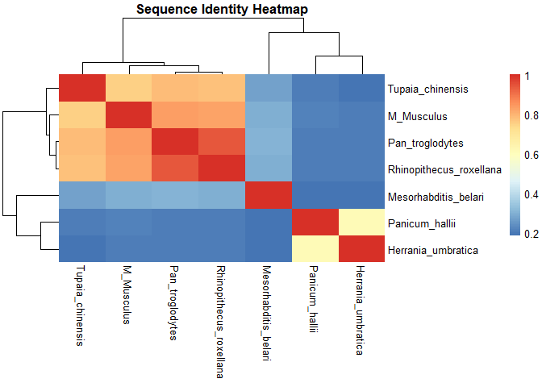
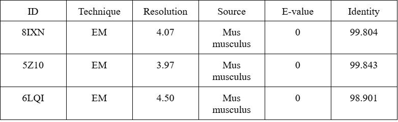
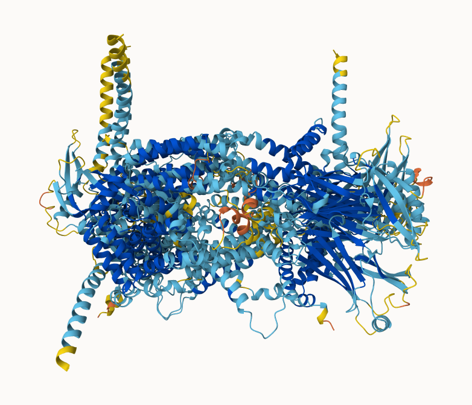
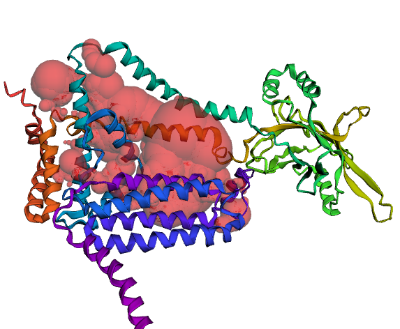

# Find A Gene Project
Shawn Xiao

- [Protein of Interest](#protein-of-interest)
- [BLAST Search](#blast-search)
- [Chosen Protein Sequence](#chosen-protein-sequence)
- [Novel Protein Identification](#novel-protein-identification)
- [Multiple Sequence Alignment](#multiple-sequence-alignment)
- [Alignment Visualization](#alignment-visualization)
- [Heat Map](#heat-map)
- [Related Protein Information](#related-protein-information)
- [Structural Analysis](#structural-analysis)
- [Conclusion](#conclusion)

## Protein of Interest

Name: PIEZO 1 Accession: KAI4056483.1 Species: Homo Sapiens Known
function: PIEZO 1 protein is a mechanosensitive ion channel protein that
allows calcium ions to transfer for muscle contraction in hearts.

## BLAST Search

Method: TBLASTN search against nt Database: Nucleotide collection (nt)
Organism: Mus musculus (taxid:10090)  

Chosen match: Accession NM_001037298.1, a 8216 base pair Mus musculus
mRNA. See below for more alignment details.

This alignment has an e-value of 0.0, 100% coverage, and 70.48%
identity.


``` text
>Mus musculus piezo-type mechanosensitive ion channel component 1 (Piezo1), transcript variant 2, mRNA
Sequence ID: NM_001037298.1 Length: 8216
Range 1: 292 to 7929

Score:3488 bits(9044), Expect:0.0, 
Method:Compositional matrix adjust., 
Identities:2054/2564(80%), Positives:2215/2564(86%), Gaps:61/2564(2%)

Query  1     MEPHVLGAVLYWlllpcallaacllRFSGlslvyllfllllPWFPGPTRCGLQGHTGRll  60
             MEPHVLGA LYWLLLPC LLAA LLRF+ LSLVYLLFLLLLPW PGP+R  + GHTGRLL
Sbjct  292   MEPHVLGAGLYWLLLPCTLLAASLLRFNALSLVYLLFLLLLPWLPGPSRHSIPGHTGRLL  471

Query  61    rallglsllflvahlalQICLHTVPRLDQLLGPSCSRWETLSRHIGVTRLDLKDIPNAIR  120
             RALL LSLLFLVAHLA QICLHTVP LDQ LG + S W  +S+HIGVTRLDLKDI N  R
Sbjct  472   RALLCLSLLFLVAHLAFQICLHTVPHLDQFLGQNGSLWVKVSQHIGVTRLDLKDIFNTTR  651

Query  121   LVAPDLGILVVSSVCLGICGRLARNTRQSPHPRELDDDERDVD------ASPTAGLQEAA  174
             LVAPDLG+L+ SS+CLG+CGRL R  RQS   +ELDDD+ D D      A+P  GL+ A 
Sbjct  652   LVAPDLGVLLASSLCLGLCGRLTRKARQSRRTQELDDDDDDDDDDEDIDAAPAVGLKGAP  831

Query  175   TLAPTRRSRLAARFRVTAHWLLVAAGRVLAVTLLALAGIAHPsalssvylllflalCTWW  234
              LA  RR  LA+RFRVTAHWLL+ +GR L + LLALAGIAHPSA SSVYL++FLA+CTWW
Sbjct  832   ALATKRRLWLASRFRVTAHWLLMTSGRTLVIVLLALAGIAHPSAFSSVYLVVFLAICTWW  1011

Query  235   ACHFPISTRGFSRLCAAVGCFGAGHLICLYCYQMPLAQALLPPAGIWARVLGLKDFVGPT  294
             +CHFP+S  GF+ LC  V CFGAGHLICLYCYQ P  Q +LPP  IWAR+ GLK+FV   
Sbjct  1012  SCHFPLSPLGFNTLCVMVSCFGAGHLICLYCYQTPFIQDMLPPGNIWARLFGLKNFVDLP  1191

Query  295   NCSSPHALVLNTGLDWPVYASPGVLLLLCYATASLRKLRAYRPSGQRKEAAKGYEARELE  354
             N SSP+ALVLNT   WP+Y SPG+LLLL Y   SL KL    PS  RKE  +  E  ELE
Sbjct  1192  NYSSPNALVLNTKHAWPIYVSPGILLLLYYTATSLLKLHKSCPSELRKETPREDEEHELE  1371

Query  355   LAELDQWPQERESDQHVVPTAPDTEADNCIVHELTGQSSLLRRPVRPKRAEPGEASPLHS  414
             L  L+  PQ R++ Q  +P   + + DNC VH LT QS + +RPVRP+ AE  E SPLH 
Sbjct  1372  LDHLEPEPQARDATQGEMPMTTEPDLDNCTVHVLTSQSPVRQRPVRPRLAELKEMSPLHG  1551

Query  415   LGHLIMDQSYVCALIAMMVWSITYHSWLTFVLLLWACLIWTVRSRHQLAMLCSPCILLYG  474
             LGHLIMDQSYVCALIAMMVWSI YHSWLTFVLLLWACLIWTVRSRHQLAMLCSPCILLYG
Sbjct  1552  LGHLIMDQSYVCALIAMMVWSIMYHSWLTFVLLLWACLIWTVRSRHQLAMLCSPCILLYG  1731

Query  475   MTLCCLRYVWAMDLRPELPTTLGPVSLRQLGLEHTRYPCLDLGAMllytltfwlllRQFV  534
             +TLCCLRYVWAM+L PELPTTLGPVSL QLGLEHTRYPCLDLGAMLLY LTFWLLLRQFV
Sbjct  1732  LTLCCLRYVWAMEL-PELPTTLGPVSLHQLGLEHTRYPCLDLGAMLLYLLTFWLLLRQFV  1908

Query  535   KEKLLKWAESPAALTEVTVADTEPTRTQTLLQSLGELVKGVYAKYWIYVCAGMFIVVSFA  594
             KEKLLK  + PAAL EVTVADTEPT+TQTLL+SLGELV G+Y KYWIYVCAGMFIVVSFA
Sbjct  1909  KEKLLKKQKVPAALLEVTVADTEPTQTQTLLRSLGELVTGIYVKYWIYVCAGMFIVVSFA  2088

Query  595   GRLVVYKIVYMFLFLLCLTLFQVYYSLWRKLLKAFWWLVVAYTMLVLIAVYTFQFQDFPA  654
             GRLVVYKIVYMFLFLLCLTLFQVYY+LWRKLL+ FWWLVVAYTMLVLIAVYTFQFQDFP 
Sbjct  2089  GRLVVYKIVYMFLFLLCLTLFQVYYTLWRKLLRVFWWLVVAYTMLVLIAVYTFQFQDFPT  2268

Query  655   YWRNLTGFTDEQLGDLGLEQFSVSELFSSILVPGFFLLACILQLHYFHRPFMQLTDMEHV  714
             YWRNLTGFTDEQLGDLGLEQFSVSELFSSIL+PGFFLLACILQLHYFHRPFMQLTD+EHV
Sbjct  2269  YWRNLTGFTDEQLGDLGLEQFSVSELFSSILIPGFFLLACILQLHYFHRPFMQLTDLEHV  2448

Query  715   SLPGTRLPRWAHRQDAVSGTPLLReeqqehqqqqqeeeeeeeDSRDEGLGVATPHQATQV  774
               PGTR PRWAHRQDAVS  PLL  +++E               R++G  +  PHQATQV
Sbjct  2449  PPPGTRHPRWAHRQDAVSEAPLLEHQEEEEVF------------REDGQSMDGPHQATQV  2592

Query  775   PEG-AAKWGLVAERLLELAAGFSDVLSRVQVFLRRLLELHVFKLVALYTVWVALKEVSVM  833
             PEG A+KWGLVA+RLL+LAA FS VL+R+QVF+RRLLELHVFKLVALYTVWVALKEVSVM
Sbjct  2593  PEGTASKWGLVADRLLDLAASFSAVLTRIQVFVRRLLELHVFKLVALYTVWVALKEVSVM  2772

Query  834   NLLLVVLWAFALPYPRFRPMASCLSTVWTCVIIVCKMLYQLKVVNPQEYSSNCTEPFPNS  893
             NLLLVVLWAFALPYPRFRPMASCLSTVWTC+IIVCKMLYQLK+VNP EYSSNCTEPFPN+
Sbjct  2773  NLLLVVLWAFALPYPRFRPMASCLSTVWTCIIIVCKMLYQLKIVNPHEYSSNCTEPFPNN  2952

Query  894   TNLLPTEISQSLLYRGPVDPANWFGVRKGFPNLGYIQNHLQVLLLLVFEAIVyrrqehyr  953
             TNL P EI+QSLLYRGPVDPANWFGVRKG+PNLGYIQNHLQ+LLLLVFEA+VYRRQEHYR
Sbjct  2953  TNLQPLEINQSLLYRGPVDPANWFGVRKGYPNLGYIQNHLQILLLLVFEAVVYRRQEHYR  3132

Query  954   rqhqLAPLPAQAVFASGTRQQLDQDLLGCLKYFINFFFYKFGLEICFLMAVNVIGQRMNF  1013
             RQHQ APLPAQAV A GTRQ+LDQDLL CLKYFINFFFYKFGLEICFLMAVNVIGQRMNF
Sbjct  3133  RQHQQAPLPAQAVCADGTRQRLDQDLLSCLKYFINFFFYKFGLEICFLMAVNVIGQRMNF  3312

Query  1014  LVTLHGCWLVAILTRRHRQAIARLWPNyclflalfllyqyllclGMPPALCIDYPWRWSR  1073
             +V LHGCWLVAILTRR R+AIARLWPNYCLFL LFLLYQYLLCLGMPPALCIDYPWRWS+
Sbjct  3313  MVILHGCWLVAILTRRRREAIARLWPNYCLFLTLFLLYQYLLCLGMPPALCIDYPWRWSK  3492

Query  1074  AVPMNSALIKWLYLPDFFRAPNSTNLISDFLLLLCASQQWQVFSAERTEEWQRMAGVNTD  1133
             A+PMNSALIKWLYLPDFFRAPNSTNLISDFLLLLCASQQWQVFSAERTEEWQRMAG+NTD
Sbjct  3493  AIPMNSALIKWLYLPDFFRAPNSTNLISDFLLLLCASQQWQVFSAERTEEWQRMAGINTD  3672

Query  1134  RLEPLRGEPNPVPNFIHCRSYLDMLKVAvfrylfwlvlvvvfvTGATRISIfglgyllac  1193
              LEPLRGEPNP+PNFIHCRSYLDMLKVAVFRYLFWLVLVVVFV GATRISIFGLGYLLAC
Sbjct  3673  HLEPLRGEPNPIPNFIHCRSYLDMLKVAVFRYLFWLVLVVVFVAGATRISIFGLGYLLAC  3852

Query  1194  fylllfgTALLQRDTRARLVLWDCLILYNVTVIISKNMLSLLACVFVEQMQTGFCWVIQL  1253
             FYLLLFGT LLQ+DTRA+LVLWDCLILYNVTVIISKNMLSLL+CVFVEQMQ+ FCWVIQL
Sbjct  3853  FYLLLFGTTLLQKDTRAQLVLWDCLILYNVTVIISKNMLSLLSCVFVEQMQSNFCWVIQL  4032

Query  1254  FSLVCTVKGYYDPKEMMDRDQDCLLPVEEAGIIWDSVCffflllqrrvflSHYYLHVRAD  1313
             FSLVCTVKGYYDPKEMM RD+DCLLPVEEAGIIWDS+CFFFLLLQRR+FLSHY+LHV AD
Sbjct  4033  FSLVCTVKGYYDPKEMMTRDRDCLLPVEEAGIIWDSICFFFLLLQRRIFLSHYFLHVSAD  4212

Query  1314  LQATALLASRGFALYNAANLKSIDFHRRIEEKSLAQLKRQMERIRAKQEKHRQGRVDRSR  1373
             L+ATAL ASRGFALYNAANLKSI+FHR+IEEKSLAQLKRQM+RIRAKQEK+RQ +  R +
Sbjct  4213  LKATALQASRGFALYNAANLKSINFHRQIEEKSLAQLKRQMKRIRAKQEKYRQSQASRGQ  4392

Query  1374  PQDTLGPKDpglepgpdspggssppRRQWWRPWLDHATVIHSGDYFLFesdseeeeeavp  1433
              Q    P+DP  EPGPDSPGGSSPPRRQWWRPWLDHATVIHSGDYFLFESDSEEEEEA+P
Sbjct  4393  LQSK-DPQDPSQEPGPDSPGGSSPPRRQWWRPWLDHATVIHSGDYFLFESDSEEEEEALP  4569

Query  1434  edpRPSAQSAFQLAYQAWVTNaqavlrrrqqeqeqarqeqagqLPTGGGPSQEVepaegp  1493
             EDPRP+AQSAFQ+AYQAWVTN        +Q +E+ARQE+A QL +GG  + +VEP + P
Sbjct  4570  EDPRPAAQSAFQMAYQAWVTN---AQTVLRQRRERARQERAEQLASGGDLNPDVEPVDVP  4740

Query  1494  eeaaagRSHVVQRVLSTAQFLWMLGQALVDELTRWLQEFTRHHGTMSDVLRAERYLLTQE  1553
             E+  AGRSH++QRVLST QFLW+LGQA VD LTRWL+ FT+HH TMSDVL AERYLLTQE
Sbjct  4741  EDEMAGRSHMMQRVLSTMQFLWVLGQATVDGLTRWLRAFTKHHRTMSDVLCAERYLLTQE  4920

Query  1554  LLQGGEVHRGVLDQLYTSQAEATLPGPTEAPNAPSTVSSGLGAEEPLSSMTDDMGSPLST  1613
             LL+ GEV RGVLDQLY  + EATL GP E  + PST SSGLGAEEPLSSMTDD  SPLST
Sbjct  4921  LLRVGEVRRGVLDQLYVGEDEATLSGPMETRDGPSTASSGLGAEEPLSSMTDDTSSPLST  5100

Query  1614  GYHTRSGSEEAVTDPGEREAGASLY---------QGLMRTASELLLDRRLRIPELEEAEL  1664
             GY+TRSGSEE VTD G+ +AG SL+         +  MRTASELLLDRRL IPELEEAE 
Sbjct  5101  GYNTRSGSEEIVTDAGDLQAGTSLHGSQELLANARTRMRTASELLLDRRLHIPELEEAER  5280

Query  1665  FAEGQGRALRLLRAVYQCVAAHSELLCYFIIILNHMVTASAGSLVLPVLVFLWAMLSIPR  1724
             F   QGR LRLLRA YQCVAAHSELLCYFIIILNHMVTASA SLVLPVLVFLWAML+IPR
Sbjct  5281  FEAQQGRTLRLLRAGYQCVAAHSELLCYFIIILNHMVTASAASLVLPVLVFLWAMLTIPR  5460

Query  1725  PSKRFWMTAIVFTEIAVVVKYLFQFGFFPWNSHVVLRRYENKPYFPPRILGLEKTDGYIK  1784
             PSKRFWMTAIVFTE+ VV KYLFQFGFFPWNS+VVLRRYENKPYFPPRILGLEKTD YIK
Sbjct  5461  PSKRFWMTAIVFTEVMVVTKYLFQFGFFPWNSYVVLRRYENKPYFPPRILGLEKTDSYIK  5640

Query  1785  YDLVQLMALFFHRSQLLCYGLWDHEEDSPSKEHDKSgeeeqgaee---------------  1829
             YDLVQLMALFFHRSQLLCYGLWDHEED   K+H +S  +++ A+E               
Sbjct  5641  YDLVQLMALFFHRSQLLCYGLWDHEEDRYPKDHCRSSVKDREAKEEPEAKLESQSETGTG  5820

Query  1830  --gpgVPAATTEDHIQVEARVGPTDGTPEPQVELRPrdtrrislrfrrrKKEGPARKGaa  1887
                  V A T  DHIQ +  +   D   +P  +L+P    R      RR+KE P  KG A
Sbjct  5821  HPKEPVLAGTPRDHIQGKGSIRSKDVIQDPPEDLKP-RHTRHISIRFRRRKETPGPKGTA  5997

Query  1888  aieaedreeeegeeekeaPTGREKrpsrsggrvraagrrLQGFCLSLAQGTYRPLRRFFH  1947
              +E E  E E  E  +       +  S+   R++AAGRRLQ FC+SLAQ  Y+PL+RFFH
Sbjct  5998  VMETEHEEGEGKETTERKRPRHTQEKSKFRERMKAAGRRLQSFCVSLAQSFYQPLQRFFH  6177

Query  1948  DILHTKYRAATDVYALMFLAdvvdfiiiifgfwafgKHSAATDITSSLSDDQVPEAFLVM  2007
             DILHTKYRAATDVYALMFLAD+VD IIIIFGFWAFGKHSAATDI SSLSDDQVP+AFL M
Sbjct  6178  DILHTKYRAATDVYALMFLADIVDIIIIIFGFWAFGKHSAATDIASSLSDDQVPQAFLFM  6357

Query  2008  LLIQFSTMVVDRALYLRKTVLGKLAFQVALVLAIHLWMFFILPAVTERMFNQNVVAQLWY  2067
             LL+QF TMV+DRALYLRKTVLGKLAFQV LV+AIH+WMFFILPAVTERMF+QN VAQLWY
Sbjct  6358  LLVQFGTMVIDRALYLRKTVLGKLAFQVVLVVAIHIWMFFILPAVTERMFSQNAVAQLWY  6537

Query  2068  FVKCIYFALSAYQIRCGYPTRILGNFLTKKYNHLNLFLFQGFRLVPFLVELRAVMDWVWT  2127
             FVKCIYFALSAYQIRCGYPTRILGNFLTKKYNHLNLFLFQGFRLVPFLVELRAVMDWVWT
Sbjct  6538  FVKCIYFALSAYQIRCGYPTRILGNFLTKKYNHLNLFLFQGFRLVPFLVELRAVMDWVWT  6717

Query  2128  DTTLSLSSWMCVEDIYANIFIIKCSRETEkkypqpkgqkkkkivkygMGGliilfliaii  2187
             DTTLSLS+WMCVEDIYANIFIIKCSRETEKKYPQPKGQKKKKIVKYGMGGLIILFLIAII
Sbjct  6718  DTTLSLSNWMCVEDIYANIFIIKCSRETEKKYPQPKGQKKKKIVKYGMGGLIILFLIAII  6897

Query  2188  wfpllfMSLVRSVVGVVNQPIDVTVTLKLGGYEPLFTMSAQQPSIIPFTAQAYEELSRQF  2247
             WFPLLFMSL+RSVVGVVNQPIDVTVTLKLGGYEPLFTMSAQQPSI+PFT QAYEELS+QF
Sbjct  6898  WFPLLFMSLIRSVVGVVNQPIDVTVTLKLGGYEPLFTMSAQQPSIVPFTPQAYEELSQQF  7077

Query  2248  DPQPLAMQFISQYSPEDIVTAQIEGSSGALWRISPPSRAQMKRELYNGTADITLRFTWNF  2307
             DP PLAMQFISQYSPEDIVTAQIEGSSGALWRISPPSRAQMK+ELYNGTADITLRFTWNF
Sbjct  7078  DPYPLAMQFISQYSPEDIVTAQIEGSSGALWRISPPSRAQMKQELYNGTADITLRFTWNF  7257

Query  2308  QRDLAKGGTVEYANEKHMLALAPNSTARRQLASLLEGTSDQSVVIPNLFPKYIRAPNGPE  2367
             QRDLAKGGTVEY NEKH L LAPNSTARRQLA LLEG  DQSVVIP+LFPKYIRAPNGPE
Sbjct  7258  QRDLAKGGTVEYTNEKHTLELAPNSTARRQLAQLLEGRPDQSVVIPHLFPKYIRAPNGPE  7437

Query  2368  ANPVKQLQPNEEADYLGVRIQLRREQ-GAGATG---------FLEWWVIELQECRTDCNL  2417
             ANPVKQLQP+EE DYLGVRIQLRREQ G GA+G         FLEWWVIELQ+C+ DCNL
Sbjct  7438  ANPVKQLQPDEEEDYLGVRIQLRREQVGTGASGEQAGTKASDFLEWWVIELQDCKADCNL  7617

Query  2418  LPMVIFSDKVSPPSLGFLAGYGIMGLYVSIVLVIGKFVRGFFSEISHSIMFEELPCVDRI  2477
             LPMVIFSDKVSPPSLGFLAGYGI+GLYVSIVLV+GKFVRGFFSEISHSIMFEELPCVDRI
Sbjct  7618  LPMVIFSDKVSPPSLGFLAGYGIVGLYVSIVLVVGKFVRGFFSEISHSIMFEELPCVDRI  7797

Query  2478  LKLCQDIFLVRETReleleeelYAKLIFLYRSPETMIKWTREKE  2521
             LKLCQDIFLVRETRELELEEELYAKLIFLYRSPETMIKWTRE+E
Sbjct  7798  LKLCQDIFLVRETRELELEEELYAKLIFLYRSPETMIKWTRERE  7929
```

## Chosen Protein Sequence

``` text
>M. Musculus protein (sequence taken from BLAST result)
MEPHVLGAGLYWLLLPCTLLAASLLRFNALSLVYLLFLLLLPWLPGPSRHSIPGHTGRLLRALLCLSLLFLVAHLAFQICLHTVPHLDQFLGQNGSLWVKVSQHIGVTRLDLKDIFNTTRLVAPDLGVLLASSLCLGLCGRLTRKARQSRRTQELDDDDDDDDDDEDIDAAPAVGLKGAPALATKRRLWLASRFRVTAHWLLMTSGRTLVIVLLALAGIAHPSAFSSVYLVVFLAICTWWSCHFPLSPLGFNTLCVMVSCFGAGHLICLYCYQTPFIQDMLPPGNIWARLFGLKNFVDLPNYSSPNALVLNTKHAWPIYVSPGILLLLYYTATSLLKLHKSCPSELRKETPREDEEHELELDHLEPEPQARDATQGEMPMTTEPDLDNCTVHVLTSQSPVRQRPVRPRLAELKEMSPLHGLGHLIMDQSYVCALIAMMVWSIMYHSWLTFVLLLWACLIWTVRSRHQLAMLCSPCILLYGLTLCCLRYVWAMELPELPTTLGPVSLHQLGLEHTRYPCLDLGAMLLYLLTFWLLLRQFVKEKLLKKQKVPAALLEVTVADTEPTQTQTLLRSLGELVTGIYVKYWIYVCAGMFIVVSFAGRLVVYKIVYMFLFLLCLTLFQVYYTLWRKLLRVFWWLVVAYTMLVLIAVYTFQFQDFPTYWRNLTGFTDEQLGDLGLEQFSVSELFSSILIPGFFLLACILQLHYFHRPFMQLTDLEHVPPPGTRHPRWAHRQDAVSEAPLLEHQEEEEVFREDGQSMDGPHQATQVPEGTASKWGLVADRLLDLAASFSAVLTRIQVFVRRLLELHVFKLVALYTVWVALKEVSVMNLLLVVLWAFALPYPRFRPMASCLSTVWTCIIIVCKMLYQLKIVNPHEYSSNCTEPFPNNTNLQPLEINQSLLYRGPVDPANWFGVRKGYPNLGYIQNHLQILLLLVFEAVVYRRQEHYRRQHQQAPLPAQAVCADGTRQRLDQDLLSCLKYFINFFFYKFGLEICFLMAVNVIGQRMNFMVILHGCWLVAILTRRRREAIARLWPNYCLFLTLFLLYQYLLCLGMPPALCIDYPWRWSKAIPMNSALIKWLYLPDFFRAPNSTNLISDFLLLLCASQQWQVFSAERTEEWQRMAGINTDHLEPLRGEPNPIPNFIHCRSYLDMLKVAVFRYLFWLVLVVVFVAGATRISIFGLGYLLACFYLLLFGTTLLQKDTRAQLVLWDCLILYNVTVIISKNMLSLLSCVFVEQMQSNFCWVIQLFSLVCTVKGYYDPKEMMTRDRDCLLPVEEAGIIWDSICFFFLLLQRRIFLSHYFLHVSADLKATALQASRGFALYNAANLKSINFHRQIEEKSLAQLKRQMKRIRAKQEKYRQSQASRGQLQSK-DPQDPSQEPGPDSPGGSSPPRRQWWRPWLDHATVIHSGDYFLFESDSEEEEEALPEDPRPAAQSAFQMAYQAWVTNAQTVLRQRRERARQERAEQLASGGDLNPDVEPVDVPEDEMAGRSHMMQRVLSTMQFLWVLGQATVDGLTRWLRAFTKHHRTMSDVLCAERYLLTQELLRVGEVRRGVLDQLYVGEDEATLSGPMETRDGPSTASSGLGAEEPLSSMTDDTSSPLSTGYNTRSGSEEIVTDAGDLQAGTSLHGSQELLANARTRMRTASELLLDRRLHIPELEEAERFEAQQGRTLRLLRAGYQCVAAHSELLCYFIIILNHMVTASAASLVLPVLVFLWAMLTIPRPSKRFWMTAIVFTEVMVVTKYLFQFGFFPWNSYVVLRRYENKPYFPPRILGLEKTDSYIKYDLVQLMALFFHRSQLLCYGLWDHEEDRYPKDHCRSSVKDREAKEEPEAKLESQSETGTGHPKEPVLAGTPRDHIQGKGSIRSKDVIQDPPEDLKPRHTRHISIRFRRRKETPGPKGTAVMETEHEEGEGKETTERKRPRHTQEKSKFRERMKAAGRRLQSFCVSLAQSFYQPLQRFFHDILHTKYRAATDVYALMFLADIVDIIIIIFGFWAFGKHSAATDIASSLSDDQVPQAFLFMLLVQFGTMVIDRALYLRKTVLGKLAFQVVLVVAIHIWMFFILPAVTERMFSQNAVAQLWYFVKCIYFALSAYQIRCGYPTRILGNFLTKKYNHLNLFLFQGFRLVPFLVELRAVMDWVWTDTTLSLSNWMCVEDIYANIFIIKCSRETEKKYPQPKGQKKKKIVKYGMGGLIILFLIAIIWFPLLFMSLIRSVVGVVNQPIDVTVTLKLGGYEPLFTMSAQQPSIVPFTPQAYEELSQQFDPYPLAMQFISQYSPEDIVTAQIEGSSGALWRISPPSRAQMKQELYNGTADITLRFTWNFQRDLAKGGTVEYTNEKHTLELAPNSTARRQLAQLLEGRPDQSVVIPHLFPKYIRAPNGPEANPVKQLQPDEEEDYLGVRIQLRREQVGTGASGEQAGTKASDFLEWWVIELQDCKADCNLLPMVIFSDKVSPPSLGFLAGYGIVGLYVSIVLVVGKFVRGFFSEISHSIMFEELPCVDRILKLCQDIFLVRETRELELEEELYAKLIFLYRSPETMIKWTRERE
```

Name: piezo-type mechanosensitive ion channel component 1

Species: Mus musculus Eukaryota; Metazoa; Chordata; Craniata;
Vertebrata; Euteleostomi; Mammalia; Eutheria; Euarchontoglires; Glires;
Rodentia; Myomorpha; Muroidea; Muridae; Murinae; Mus; Mus

## Novel Protein Identification

A BLASTP search against NR database (see setup in first screen-shot
below) yielded a top hit result to a protein from House Mouse. See
additional screenshots below for top hits and selected alignment
details:

 

The top hit is from house mouse and has an E-value of 0.0, a 100%
coverage, and 99.96% identity, which fulfills the criteria of a novel
gene since the percent identity is less than 100%. The alignment detail:


## Multiple Sequence Alignment

Relabled Sequence Detail:

``` text
>M_Musculus protein (sequence taken from BLAST result)
MEPHVLGAGLYWLLLPCTLLAASLLRFNALSLVYLLFLLLLPWLPGPSRHSIPGHTGRLLRALLCLSLLFLVAHLAFQICLHTVPHLDQFLGQNGSLWVKVSQHIGVTRLDLKDIFNTTRLVAPDLGVLLASSLCLGLCGRLTRKARQSRRTQELDDDDDDDDDDEDIDAAPAVGLKGAPALATKRRLWLASRFRVTAHWLLMTSGRTLVIVLLALAGIAHPSAFSSVYLVVFLAICTWWSCHFPLSPLGFNTLCVMVSCFGAGHLICLYCYQTPFIQDMLPPGNIWARLFGLKNFVDLPNYSSPNALVLNTKHAWPIYVSPGILLLLYYTATSLLKLHKSCPSELRKETPREDEEHELELDHLEPEPQARDATQGEMPMTTEPDLDNCTVHVLTSQSPVRQRPVRPRLAELKEMSPLHGLGHLIMDQSYVCALIAMMVWSIMYHSWLTFVLLLWACLIWTVRSRHQLAMLCSPCILLYGLTLCCLRYVWAMELPELPTTLGPVSLHQLGLEHTRYPCLDLGAMLLYLLTFWLLLRQFVKEKLLKKQKVPAALLEVTVADTEPTQTQTLLRSLGELVTGIYVKYWIYVCAGMFIVVSFAGRLVVYKIVYMFLFLLCLTLFQVYYTLWRKLLRVFWWLVVAYTMLVLIAVYTFQFQDFPTYWRNLTGFTDEQLGDLGLEQFSVSELFSSILIPGFFLLACILQLHYFHRPFMQLTDLEHVPPPGTRHPRWAHRQDAVSEAPLLEHQEEEEVFREDGQSMDGPHQATQVPEGTASKWGLVADRLLDLAASFSAVLTRIQVFVRRLLELHVFKLVALYTVWVALKEVSVMNLLLVVLWAFALPYPRFRPMASCLSTVWTCIIIVCKMLYQLKIVNPHEYSSNCTEPFPNNTNLQPLEINQSLLYRGPVDPANWFGVRKGYPNLGYIQNHLQILLLLVFEAVVYRRQEHYRRQHQQAPLPAQAVCADGTRQRLDQDLLSCLKYFINFFFYKFGLEICFLMAVNVIGQRMNFMVILHGCWLVAILTRRRREAIARLWPNYCLFLTLFLLYQYLLCLGMPPALCIDYPWRWSKAIPMNSALIKWLYLPDFFRAPNSTNLISDFLLLLCASQQWQVFSAERTEEWQRMAGINTDHLEPLRGEPNPIPNFIHCRSYLDMLKVAVFRYLFWLVLVVVFVAGATRISIFGLGYLLACFYLLLFGTTLLQKDTRAQLVLWDCLILYNVTVIISKNMLSLLSCVFVEQMQSNFCWVIQLFSLVCTVKGYYDPKEMMTRDRDCLLPVEEAGIIWDSICFFFLLLQRRIFLSHYFLHVSADLKATALQASRGFALYNAANLKSINFHRQIEEKSLAQLKRQMKRIRAKQEKYRQSQASRGQLQSKDPQDPSQEPGPDSPGGSSPPRRQWWRPWLDHATVIHSGDYFLFESDSEEEEEALPEDPRPAAQSAFQMAYQAWVTNAQTVLRQRRERARQERAEQLASGGDLNPDVEPVDVPEDEMAGRSHMMQRVLSTMQFLWVLGQATVDGLTRWLRAFTKHHRTMSDVLCAERYLLTQELLRVGEVRRGVLDQLYVGEDEATLSGPMETRDGPSTASSGLGAEEPLSSMTDDTSSPLSTGYNTRSGSEEIVTDAGDLQAGTSLHGSQELLANARTRMRTASELLLDRRLHIPELEEAERFEAQQGRTLRLLRAGYQCVAAHSELLCYFIIILNHMVTASAASLVLPVLVFLWAMLTIPRPSKRFWMTAIVFTEVMVVTKYLFQFGFFPWNSYVVLRRYENKPYFPPRILGLEKTDSYIKYDLVQLMALFFHRSQLLCYGLWDHEEDRYPKDHCRSSVKDREAKEEPEAKLESQSETGTGHPKEPVLAGTPRDHIQGKGSIRSKDVIQDPPEDLKPRHTRHISIRFRRRKETPGPKGTAVMETEHEEGEGKETTERKRPRHTQEKSKFRERMKAAGRRLQSFCVSLAQSFYQPLQRFFHDILHTKYRAATDVYALMFLADIVDIIIIIFGFWAFGKHSAATDIASSLSDDQVPQAFLFMLLVQFGTMVIDRALYLRKTVLGKLAFQVVLVVAIHIWMFFILPAVTERMFSQNAVAQLWYFVKCIYFALSAYQIRCGYPTRILGNFLTKKYNHLNLFLFQGFRLVPFLVELRAVMDWVWTDTTLSLSNWMCVEDIYANIFIIKCSRETEKKYPQPKGQKKKKIVKYGMGGLIILFLIAIIWFPLLFMSLIRSVVGVVNQPIDVTVTLKLGGYEPLFTMSAQQPSIVPFTPQAYEELSQQFDPYPLAMQFISQYSPEDIVTAQIEGSSGALWRISPPSRAQMKQELYNGTADITLRFTWNFQRDLAKGGTVEYTNEKHTLELAPNSTARRQLAQLLEGRPDQSVVIPHLFPKYIRAPNGPEANPVKQLQPDEEEDYLGVRIQLRREQVGTGASGEQAGTKASDFLEWWVIELQDCKADCNLLPMVIFSDKVSPPSLGFLAGYGIVGLYVSIVLVVGKFVRGFFSEISHSIMFEELPCVDRILKLCQDIFLVRETRELELEEELYAKLIFLYRSPETMIKWTRERE
```

Similar Sequences

``` text
>Panicum_hallii tr|A0A2T7DLW2|A0A2T7DLW2_9POAL Uncharacterized protein OS=Panicum hallii var. hallii OX=1504633 GN=GQ55_5G331300 PE=3 SV=1
MARRTGAAGFLLPLVLLAASLLDWNLISLTNMIIFFAIRFVAPTRGFRTWRLYLLLWCTI
IYSVLAILAQVTFHIIWCIEGMGWSVAYSWWVKLVGLARGQPWESPSVIYFLALQLSATV
LALVEVLGSRLHQDSCWLNFSFGFEQIGYHLRVTCCFLLPAAQLVVSISHPSWISLPFFV
FSCIGLVDWSLTSNFLGLFRWWRLLEMYSVFSILLLYIYQLPVQFPYVVLAFADFIGLFK
VSSKSEWPELSSGISLLVYYFMLSSVKQDIQETDSLISLEDGSLTEHLLPSGNAFFSCQS
RADRRHTNILLRGSVFRNFSINFFTYGFPVLLLALAFWSFNFTSICAFGLLAYVGYILYA
FPSLFQMHRLNGSLLVFVLLWAASTYVFNVAFTFFNKRFQKDMKIWETVGLWHYSIPGLF
LLAQFCLGVFVALCNLVNNSVFLCVQTVDGASSSDDHLIDEKEDTMVLIVATLAWGLRKL
SRAITLTLLFLLVMKRGFIHAVYMCFFLVFLVNHSIDKRLRQILVLFSEVHFSILYILQL
DLVSSALERSGSLTMEVLSQLGLSNNATTKDFIEIGSIVCFCAVHSHGFKMLFSLSAVLR
HTPCPPVGFTILKAGLNKSVLLSVYSSQSSRNDEACRNSHERKIASYLSKIGQKFLSVYR
SYGTYVAFLTILLTLYLVTPNYISFGYLFFLLFWIIGRQLVEKTKRRLWFPLKVYAAMVF
IFTYSLSVSPIFAESVSEFVKLYPDLGFDPKASLLENVWQSLAVLVVMQLYSYERRQNSD
KNFGVSDALVSGLLGFLRRFLIWHSDKMLSLSVFYACLSSISLSGLIYLLGLIVFCTLPK
MSRIPSKVYLVYTGLLAASEYLFQMVCKPAQMCPDQHFYGLSVFLGLKYYDSGFWGVEYG
LRGKVLVIVACTIQYNVFHWLDMMPTSLVHNGKWEEPCQLFISSNPPYSSVRSNEENHSS
SRFTSLFSKVQGLIGSSSSSSLDPGNTYQKSEYVDNAIKGSDEDKRYSFAKIWGLSKESH
KWDKKRVISLKRERFETQKITFKCYMKFWIENLFKLRGLEINMVVLLLASFTLLNVVSIF
YIMCLVVCILMNRDLIQKLWPLFVFLFASVLILEYLALWNNLMPWFHDINNIEVHCRECW
KNSRIFFDYCSKCWLGIIADDPRMLISYYVVFLFSSFKLRSDRFSGFSDSDTYHEMMSQR
KNAVVWRDLSLETKCFWTFLDYVRLYAYCHLLDIVLALIAITGTLEYDVLHLGYLGFALV
FFRMRLEILKKKNKIFKYLRMYNFVLIVLSLAYQSPYVGQFSSGTCDQIDYLYEIIGFYK
YDYGFKITSRSAFVEIVIFLLVSVQSYIFSSGEFDYVSRYLEAEQIGAMVREQEKKALKK
TEQLQHLRRSEEHKRQRNMQVERMKSEMYNLQSQLNRMNSFTPINDTSYNEGLRRRRNTK
LYSDTNTPDVGIETGSPTKQDKIGSTESAQSFEFSVTDTQKNIRNLMFQGSSDTMRSPIR
GRSDEFVLTDNIGNSLGSTPEITELEESDEKVNYNLSKWEKAMGQPKENPLKSAVQLIGD
GVSQVQSFGNQAVTNIVSFLNIDPDEPHSNEHPAEGDIYDVVESQVETRDGQLLRTHSVS
DTSGTKVKSSMPIGVIFRYIWYQMRSNYDYVCYCCFVLVFLWNFSLLSMVYLGALFLYAL
CVNYGPSYLFWVIILIYTELNILSQYIYQIIIQHCGLNIHLPLLQRLGFPDDKIKASFVV
SILPLFLVYISTLLQSSITAKDGEWVPVTEFSFLSTRNNIEEKHCMPYSWRERLKSLHLP
VMNLIRMITRGLSRYWMSLTHGAESPPYFVQVTMEVNHWPEDGIQPERIESAINRVLTIA
HEERCQANLSASCHCCSKVRIQSIEKSKENSNMALAVLEVVYAAPAVCQQPGWYNSLTPA
ADVEREIHESQKAGLFEEINFPYPIVSVIGGGKREIDLYAYYFGADLAVFFLVAMFYQSV
LKNKSEFLEVYQLEDQFPKEFVFILMVLFFLIVVDRIIYLWSFATGKVVFYIFNLVLFTY
SVTEYAWGMELAHRDVGGLVLRAIYLTKSISLALQALQIRYDIPNKSNLYRQFLTSKVTQ
VNYLGFRLYRALPFLYELRCVLDWSCTTTSLTMYDWLKLEDIYASLFLVKCDAILNRANH
RQGEKQSKMTKFCSGICLFFVLICVIWAPMLIYSSGNPTNIANPIIDVSIQIDIKALGGR
LTLFKTTACEKIPWKYLKAYDDVDPLGYLGSYNVDDIQLICCQPDASTMWLIPPPVQSRF
IQSLEREIPFEKMELILNWDFLRARPKGKELVRYESPIEHCPSVDDVKQVLNGTTHSFSI
VDAYPRYFRVTGSGEVRRLEAAIDSVSGELLLNNDTPPWWSFYTKPSDLAGCQVLNGPMA
IVVSEETPQGIIGETLSKFSIWSLYITFVLAVARFIRLQCSDLRMRIPYENLPSCDRLLD
ICEGIYAARAEGELEVEEVLYWTLVNIYRSPHMLLEYTKPD

>Herrania_umbratica tr|A0A6J1A0I7|A0A6J1A0I7_9ROSI Piezo-type mechanosensitive ion channel homolog isoform X1 OS=Herrania umbratica OX=108875 GN=LOC110413805 PE=3 SV=1
MGSFLAGFVLPLLLLTAALINWSLVSLVDLIAFLLIQYTAPKIGFRFRRKYLLLWPVIIF
SLLVFLSQAVYLVIWAADGYKQSVGDAWWMKLIGFMIIQSWKSPTVIYFLVVQLLVVFVA
LLDIHGTKFGLVPWRYSCWGHFLTAVEHLGSHLRVASCLLLPPIQLVVGISHPSWVSLPF
FIGSCVGLVDWSLTSNFLGLFRLWKALQLYAGFNIVLLYVYQLPIEFSNMLQRIADFVGL
FKISTASEWPEICSAVSLILFYIMLSYVKCDLEEMDFIMSMRESKLTEQLLPSKHSFFIR
ESRSGVRHTNVLLRRTVFRTFTINFFTYGFPVSLFALSFWSFHFASICAFGLLAYVGYIV
YAFPSLFRLHRLNGLLLVFILLWAVSTYIFNVAFAFLNRNFGKDMEIWEMVGFWHYPIPG
FFLLAQFCLGILVALGNLVNNSVFVYSSDEDALSSNNNSAVEVDGETKVFIVATIAWGLC
KCSRAIMLALIFVIAMKPGFIHAVYVIFFLIYLLSHNISRKIRQSLILLCEAHFALLYLL
QIELISNALEQKGSLSLEIILQLGLLKHNSSWEFLEIALLACFCAIHNHGFEMLFSFSAI
VQHTPSPPVGFSILRAGLNKSVLLSVYASPNPSYCHDNASYERRIAAFLSEIGQTFLSIY
RSCGTYIALLTILLTVYMVTPNYISFGYIFLLLVWITGRQLVERTKRRLWFPLKTYAIMV
FIFVYSLSSFTSFKIWLSSFVDLYFYLGYDPEGSLLDNIWQSLAVLIVMQLYSYERRQSK
YNRTDDPNPLDSGLLGFAKRFLIWHSQKVLFVSLFYASISPISACGFLYLLGLVICSTLP
KASRIPSKSFLLYTGFLMTTEYLYQMWGKQAGMFPGQKHSDLSLFLGFRVYELGFWGIES
GLRGKVLVIAACIFQYNVFHWLDNMPSGISSKGKWEEPCPLFLSAEDTFTNGFMSNGEDK
PSSSFGAVPTRQDRAVSDSWSFLNPAFSQAPHPVSSKAGGSEVSSFRKFSLGYFWGSTKE
SHKWNKKRILALRKERFETQKALLKLYLKFWMENMFNLYGLEINMIALLLASFALLNAIS
MLYISLLAVCVLLNRRIIRKLWPVLVFLFASILILEYFAIWKNMFPLNQNKPSQAEIHCH
DCWRSSSSYFQYCRSCWLGLIIDDPRMLFSYFVVFLLACFKLRADHLSDFSGSSTYRQMM
SQRKNSFVWRDLSFETKSMWTFLDYLRLYCYCHLLDLVLVLILITGTLEYDILHLGYLAF
ALVFFRMRLEILKKKNKLFKFLRIYNFAVIVLSLAYQSPFVGEFSSGKCKTVNYIYEVIG
FYKYDYGFRITARSAIVEIIIFMLVSLQSYMFSSQESDYVSRYLEAEQIGAIVREQEKKA
AWKTAQLQQIRESEEKKRQRNFQVEKMKSEMLNLQIQLHSMNSVATLSDVSPDDEGLRRR
RSASVTSNRDVVPPDKEEGTLWKQEQLIREEVFPLEAQADAARMKGESPEVVQSPKQSMV
YAPCEITEIEHDVDSAFCDTEKRKSQAKENPLISAVHLLGDGVSQVQSIGNQAVNNLVNF
LNIAPEDSDMNEHSSVEDEAYDEMESQKMQNMCLNRSSSLQSDKSFDATSLQLGRIFCHI
WSQMRSNNDVVCYCFFVLVFLWNFSLLSMVYLAALFLYALCVNTGPTYIFWVIMLIYTEV
YILLEYLYQIVIQHCGLSINSDLLHELGFPAHEIKSSFVVSSLPLFLVYLFTLLQSSISA
KDGEWMPSTDFNLHRRSAHYRTEVLARYSWSERVSELLQFVINMVKLVIRSFCWYWKSLI
QGAETPPYFVQVSMDVHLWPEDGIQPERVESGINQLLRVVHDERCTEKIPSHCPFASRVQ
VQSIERSQENPNMALIVFEVVYASSLTGCTSADWYKSLTPAADVAKEILRVQHAGFVEEM
GFPYKILSVIGGGKREFDLYAYIFVADLTVFFLVAIFYQSVIKNNSEFLDVYQLEDQFPK
EYVFILMIIFFLIVVDRILYLCSFATGKIIFYLFSLVLFTYSITEYAWQIKSSSQNAGRL
ALRAIFLAKAVSLALQAVQIRHGIPNKSTLYRQFLTSEVSRINYLGYRLYRALPFLYELR
CVLDWSCTTTSLTMYDWLKLEDINASLYLVKCDAVLNRAKHKQGEKQTKMTKCCNGICLF
FILLCVIWAPMLMYSSGNPTNMANPIKDASFQTDISTGGGRLTLYQTTLCEKLQWDKLNS
DVNLDPLNYLDTYNKNDIQLICCQADASILWLVPDVVQRRFIQSLDWDMDMGITSTWLLT
RERPKGKEVVQYHKTVDSKDLPDRSDVQKVLNGSTNSFRIYNLYPRYFRVTGSGEVRPFE
QEVSSVSADLVINHAAFEWWSFHDINSSNVRGCRDLTGPMAIIVSEETPPQGILGDTLSK
FSIWGLYITFVLAVGRFIRLQCSDLRMRIPYENLPSCDRLIAICEDIYAARAEGELGVEE
VLYWTLVKIYRSPHMLLEYTKPD

>Mesorhabditis_belari tr|A0AAF3EYM3|A0AAF3EYM3_9BILA Piezo-type mechanosensitive ion channel component OS=Mesorhabditis belari OX=2138241 PE=3 SV=1
MECERKESLAASPKENIVKKWLLEMVSPLLKTITYRGLLPAALIAAAFIRPSFISVIYLV
LALIGPVLPSTSRGAPLNVTVKFYVYIVFLVTILTTIAQCAFQIYESTRTIKTTSDCSDD
LYRWLRQAGFLRYVADTGFDSWRSFLPEVFSLICSFCTLIIVQCLNHQVFIEHPAGVHTV
RTNSNNTQNATQRSNVEVLSRALLIALKRLSNAALFIFVALAGCIQPSILNSFYFLIFLF
MATWWSTYKPLRHSIYNKMKITLLFYSGLHLILIYLYQIPEISKLLPPDQTAARMIGFSQ
VLKTDCSMFYHIEINNALAWNVAINPLIITGFYFLIVLQLNWTSSGTRNYLDDEDASSSV
HEEIQGVDENTNSEVEHPLVGDRETQSTIVPSGSSNSSTNIQSQSSPPTRQQRLLDTEER
SPANRESVPMRKITSQVIDKQKISQIFNAPGNEQSGTTAQTIVALIAFCVEHSYVFGLMT
MMIWALLYHSAFGLGLLAWACIIWMFRDTRSVSFKCSPFIVSYVEFLLVIQYVWSMDLEF
LPAKAQTETKANVLEIIGFINYSGSDSFLVTFVKVLLSLPIFLLHRLKRRDSHYSRLTEH
ERQRKLNYGTFGTNRTQGVNNAVKTPSRSQAVVDWLSSIFTTYWILIVALVLLLQALGER
ASFINIGFFIFWSLGVLQFKLSFRFFRGTVYASWTFLIIYTSAVIIAIYTYQFRSFPEFL
EKAGLSKDWAHNIGLYHYADDKSNTKSLFTRLLLPISLFVVTMLQLKFFHEPWSQAVQPI
RATSDSEPGTSNQAVSLSARLKAWAHYGSELLWRIMEVHIAKIVFITVMAIACKNITAMY
IPVVVLISLGLCLPRGATGLLGLILTAYLAVLALAKMVFQMSFIKADIFGDGNGTCEGDE
GENATSYNMSTTEWAGFKKNQNMFNELGGLLVSICALTLQSIVIYRQRNFRIRTSQPPNL
RHRIFPELDPVTYDHSLVNCFKFFVDFGFYKFGLECCLVMIAINAWIRMDMLGAVVIGWL
AVFALSKRTMARWLWPIFLIYLVLLLPIQFSIYVGLPPSLCIDYPWKNLFITNPTKRRNL
LIWLGLADYDIQWTSANLLADFFLLMFVSCQAAVFRVEGPTHPAGDNDSIYKDGVYQFKN
NPRYDFVTTQRSFVDYFKKFVFLYAQWMTLVTVMVAGLGGTSLFALGYLCLAFWILWSGN
ALYVMKNHNRTIKKFMIVLGYTVFSMFCKVSLQVVGCVFLGSLHGIPGKWGCILRQIFSI
ACVNNLAMEDIANLFPESTEFDKDCPVSAAETRIGFDTLALAFLVLQLRIFHSWYFQHAM
TDFRAEIVLANRGAVLANQLIEKEMKEQTQQQNEKFNDIKRRTDDIRAQYQKQQALERTF
EPKTYGQAKRAGDYYMFEKDPENLVPPIESFVPEVDPEGSEFRRLDPTQLVYTAVNKDMN
LSASMRQVEKAELIKDDEERRMIAAVTPDTPPTERVVDEPIAEESDSFFIATLKFVFKFA
YNVFDWTAVFLNRRSREHRYVAYVLGREKQRLKNEYGEILCDSTKPMADLQALVPLQQLQ
VVRTETDIEKLESEALGDWQKRSVFARLFNALGDCVNAHTDVICYVLAIMAHAYCAGLIT
LPLPLLVFFWGSLSNPRPSKMFWIVLIAITESIIIIKFIFQFGFFEFNTEQSQSLNNKNQ
YQWNKLFGVQRQSYYAFLDVTLLIFLFYHRYNLRRLGLWKDANINDTFSGNNTASIDPLE
LQMTMENTESPEQPQEEAAEEDAEKKKEMNPFARFFNQLFRPKFRYIRDLYPFFFAFDII
CIFIITFGYSSFGEGGSGNVVSDIQSNRIPLAFVIMLIVLTCMIVIDRGLYLRKAVYCKL
AYQLISIIFLHIWIFLVLPSITKREASSNRMALLLYFVKCMYFLVSAWQIRNGYPALCVG
NLLTHAYGLTNMVFFKIFMAVPFLFELRTAIDWTWTDTSMPLFDFFNMENFYATIYNLKC
GRQFEQSYPAPRGVEKGSLIKYLMGIPMILFIILIIWSPLIAFSLLNRIGVVLTPNIARM
SISVDGYPPLYSIEAQGTELKHLTAAELSGLRSGFSVAFVPGPMQDDSIRKSRSAVSFLD
EYTQDDSLKVLFRPESEQSWDISDDSKTAMIAALNDTTTTMQMQIHISFTRPRQDSSKEP
VTHTSEFSIAMDNTTKIREQMLKALRDDTNSTVIVSNAIPVYLIVPNEGEVIQASALNWV
MNQFVKPELKQNSLATLKLTLNAQNLWTVEMQRPELNATNLLLPAEKVKYGTGGKEYLQL
VSFVDRTFPSFFAKYVQGGVIAMYIALVIVVGKVLRGLFTNQPLDVIIAEIPNPDHLLKI
CLDIYLVREAKDFVLEQDLFAKLIFLFRSPETLIKWTRYKFKDD

>Pan_troglodytes tr|H2QBQ5|H2QBQ5_PANTR Piezo type mechanosensitive ion channel component 1 OS=Pan troglodytes OX=9598 GN=PIEZO1 PE=3 SV=2
MEPHVLGAVLYWLLLPCALLAACLLRFSGLSLVYLLFLLLLPWFPGPTRCGLQGHTGRLL
RALLGLSLLFLVAHLALQICLHTVPHLDQLLGPSCSRWETLSRHIGVTRLDLKDIPNAIR
LVAPDLGILVVSSVCLGICGRLARNTRQSPHPRELDDDERDVDASPTAGLQEAATLAPTR
RSRLAARFRVTAHWLLVAAGRVLAVTLLALAGIAHPSALSSVYLLLFLATCTWWACHFPI
STRGFSRLCVAVGCFGAGHLICLYCYQMPLAQALLPPAGIWARVLGLKDFVGPTNCSSPH
ALVLNTSLDWPVYASPGVLLLLCYATASLRKLRAYRSSGQRKEAAKGYEARELELAELDQ
WPQERESDQHVVPTAPDTEADNCIVHELTGQSSLRQRPVRPKRAEPREASPLHSLGHLIM
DQSYVCALIAMMVWSITYHSWLTFVLLLWACLIWTVRSRHQLAMLCSPCILLYGMTLCCL
RYVWAMDLRPELPTTLGPVSLRQLGLEHTRYPCLDLGAMLLYTLTFWLLLRQFVKEKLLK
WAESPAALTEVTVADTEPTRTQTLLQSLGELVKGVYAKYWIYVCAGMFIVVSFAGRLVVY
KIVYMFLFLLCLTLFQVYYSLWRKLLKAFWWLVVAYTMLVLIAVYTFQFQDFPAYWRNLT
GFTDEQLGDLGLEQFSVSELFSSILVPGFFLLACILQLHYFHRPFMQLTDMEHVSLPGTR
LPRWAHRQDAVSGTPLLQEEQEEQQQEEEEDSRNEGLGVATPHQATQVPEGAAKWGLVAE
RLLELAAGFSDVLSRVQVFLRRLLELHVFKLVALYTVWVALKEVSVMNLLLVVLWAFALP
YPRFRPMASCLSTVWTCVIIVCKMLYQLKVVNPQEYSSNCTEPSPNSTNLLPTEISQSLL
YRGPVDPANWFGVRKGFPNLGYIQNHLQVLLLLVFEAIVYRRQEHYRRQHQLAPLPAQAV
FASGTRQQLDQDLLGCLKYFINFFFYKFGLEICFLMAVNVIGQRMNFLVILHGCWLVAIL
TRRHRQAIARLWPNYCLFLALFLLYQYLLCLGMPPALCIDYPWRWSRAVPMNSALIKWLY
LPDFFRAPNSTNLISDFLLLLCASQQWQVFSAERTEEWQRMAGVNSDRLEPLRGEPNPVP
NFIHCRSYLDMLKVAVFRYLFWLVLVVVFVTGATRISIFGLGYLLACFYLLLFGTALLQR
DTRARLMLWDCLILYNVTVVISKNMLSLLACVFVEQMQTGFCWVIQLFSLVCTVKGYYDP
KEMMDRDQDCLLPVEEAGIIWDSVCFFFLLLQRRVFLSHYYLHVRADLQATALLASRGFA
LYNAANLKSIDFHRRIEEKSLAQLKRQMERIRAKQEKHRQGRVDRSRPQDTLGPKDPGLE
PGPDSPGGSSPPRRQWWRPWLDHATVIHSGDYFLFESDSEEEEEAVPEDLRPSAQSAFQL
AYQAWVINAQTVLRRRQQEQEQARQEQAGQLPTGGGPSQEVEPAEGPEEAAAGRSHVVQR
VLSTAQFLWMLGQALVDGLTRWLQEFTRHHGTMSDVLRAERYLLTQELLQGGEVHRGVLD
QLYTSQAEATLPGPTEAPNAPSTVSSGLGAEEPLSSMTDDTGSPLSTGYHTRSGSEEAVT
DPGEREAGASLYQGRMRTASELLLDRRLRIPELEEAELFAEGQGRALRLLRAVYQCVAAH
SELFCYFIIILNHMVTASAGSLVLPVLVFLWAMLSIPRPSKRFWMTAIVFTEIAVVVKYL
FQFGFFPWNSHVVLRRYENKPYFPPRILGLEKTDGYIKYDLVQLMALFFHRSQLLCYGLW
DHEEESPSKEHDKSGEEEQGAEEGPGVPAATTKDHVQVEARVGPTDGTPEPQVELRPRDT
RRISLRFRRRKKEEGPARKGAAAIEAEDREEEEGEEEKEAPTGREKRPSRSGGRVRAAGR
RLQGFCLSLAQGTYRPLRRFFHDILHTKYRAATDVYALMFLADVVDFIIIIFGFWAFGKH
SAATDITSSLSDDQVPEAFLVMLLIQFSTMVVDRALYLRKTVLGKLAFQVVLVLAIHLWM
FFILPAVTERMFNQNVVAQLWYFVKCIYFALSAYQIRCGYPTRILGNFLTKKYNHLNLFL
FQGFRLVPFLVELRAVMDWVWTDTTLSLSSWMCVEDIYANIFIIKCSRETEKRYPQPKGQ
KKKKIVKYGMGGLIILFLIAIIWFPLLFMSLVRSVVGVVNQPIDVTVTLKLGGYEPLFTM
SAQQPSIIPFTAQAYEELSRQFDPQPLAMQFISQYSPEDIVTAQIEGSSGALWRISPPSR
AQMKRELYNGTADITLRFTWNFQRDLAKGGTVEYANEKHMLALAPNSTARQQLASLLEGT
SDQSVVIPNLFPKYIRAPNGPEANPVKQLQPNEEADYLGVRIQLRREQGAGATGFLEWWV
IELQECRTDCNLLPMVIFSDKVSPPSLGFLAGYGIMGLYVSIVLVIGKFVRGFFSEISHS
IMFEELPCVDRILKLCQDIFLVRETRELELEEELYAKLIFLYRSPETMIKWTREKE

>Rhinopithecus_roxellana tr|A0A2K6PRC5|A0A2K6PRC5_RHIRO Piezo type mechanosensitive ion channel component 1 (Er blood group) OS=Rhinopithecus roxellana OX=61622 GN=PIEZO1 PE=3 SV=1
MRTEAYGGFRGSDPGQHSQGTWPRGCDELGRGCAVLWGGGWPSSVGDAADVHLPAACLLR
FSGLSLVYLLFLLLLPWFPGPTRHSLQGHTGRLLRALLGLSLLFLVAHLALQICLHTVPH
LDQLLGPSCSRWESLSRHIGVTRLDLKDVPNTIRLVAPDLGILVVSSVCLGLCGRLARNT
QQSPHTQELVREAASPVCQGGHSRALVSAILRVNLLKTNVDFLVVSCQVQPCVPLPCPAG
IAHPSALSSVYLLVFLAICTWWACHFPISTLGFNRLCVAVGCFGAGHLICLYCYQTPLAQ
ALLPPAGIWARVLGLKDFVGPANCSSPHVLVLNTSLDWPIYASPGILLLLCYATASLRKL
RVHRPSGQRKEAAKGDETRELELAELDQWPQDGEAAQHVVPTAPDTEADNCIVHELTGQS
PIRQRPVQPKRAEPREASPLHSLGHLIMDQSYVCALIAMMVWSITYHSWLTFVLLLWACL
IWTVRSRHQLAMLCSPCILLYGMTLCCLRYVWAMDLRPELPTTLGPVSLRQLGLEHTRYP
CLDLGAMLLYTLTFWLLLRQFVKEKLLKRAEAPAALTEVTVADTEPTRTQTLLQSLGELV
KGVYAKYWIYVCAGMFIVVSFAGRLVVYKIVYMFLFLLCLTLFQVYYSLWRKLLKAFWWL
VVAYTMLVLIAVYTFQFQDFPAYWRNLTGFTDEQLGDLGLEQFSVSELFSSILVPGFFLL
ACILQLHYFHRPFMQLTDMEHVSPPGRRLPRWAHRQDAVSGTPLLQQQQEEEEEEEGPRA
EGLGMATPHQATQVPEGAAKWGLVAERLLELAAGFSDVLSRVQVFLRRLLELHVFKLVAV
YTVWVALKEVSVMNLLLVVLWAFALPYPRFRPMASCLSTVWTCVIIVCKMLYQLKVVHPQ
EYSSNCTEPSPNSTNLLTTEISQSLLYRGPVDPANWFGVRKGFPNLGYIQNHLQVLLLLV
FEAIVYRRQEHHRRQHQLAPLPAQAVFASGTRQQLDQDLLGCLKYFINFFFYKFGLEICF
LMAVNVIGQRMNFMVTLHGCWLVAILTRRHRQAIARLWPNYCLFLALFLLYQYLLCLGMP
PALCIDYPWRWSRAVPMNSALIKWLYLPDFFRSPNSTNLISDFLLLLCASQQWQVFSAER
TEEWQCMAGVNTDRLEPLRGEPNPVPNFIHCRSYLDMLKVAVFRYLFWLVLVVVFVTGAT
RISIFGLGYLLACFYLLLFGTALLQRDTRARLVLWDCLILYNVTVIISKNMLSLLACVFV
EQMQTGFCWVIQLFSLVCTVKGYYDPKEMMGRDQDCLLPVEEAGIIWDSICFFFLLLQRR
VFLSYYYLHVRADLQATALLASRGFALYNAANLKSIDFHRRTEEKSLAQLKRQMERIRAK
QEKHRQGRADRGRPQDTLGPKDPGPEPGPDSPGGSSPPRRQWWRPWLDHATVIHSGDYFL
FESDSEEEEEAAPEDPRPSAQSAFQMAYQAWVTNAQTVLRRQQQEQARQEHAGQLPTGGP
SQEVEPAEGPEEAVAGRSHMVQRVLSTAQFLWVLGQALVDGLTRWLQEFTRHHSTMSDVL
RAERYVLTQELLQGGEVHRGILDQLYTSEAEATLPGPTEAPDAPSTVSSGLGAEEPLSSM
TDDTGSPLSTGYHTRSGSEEAVTDPGEREAGASLHQGRMRTASELLLDRRLRIPELEEAQ
LFAEGQGRALRLLQAVYQCVAAHSELLCYFIIILNHMVTASAGSLVLPVLVFLWAMLSIP
RPSKRFWMTAIVFTEVSVVVKYLFQFGFFPWNSHVVLRRYENKPYFPPRILGLEKTDGYI
KYDLVQLMALFFHRSQLLSYGLWDHEEDSPSKEHDQSGRKEQGAEEGPGPGVPEATTEDH
VHVEARVVPTDGTPEPQAELRPRDTRRISLRFRRRRKEGPARRGPEAIEAEDREEEEGKE
EKEAPAGREKRPSRTGRRVRAAGRRLQGFCLSLAQGTYRPLQRFFHDILHTKYRAATDVY
ALMFLADVVDFIIIIFGFWAFGKHSAATDITSSLSDDQVPEAFLVMLLIQFSTMVVDRAL
YLRKTVLGKLAFQVALVLAIHLWMFFILPAVTERMFSQNAVAQLWYFVKCIYFALSAYQI
RCGYPTRILGNFLTKKYNHLNLFLFQGFRLVPFLVELRAVMDWVWTDTTLSLSSWMCVED
IYANIFIIKCSRETEKKYPQPKGQKKKKIVKYGMGGLIILFLIAIIWFPLLFMSLVRSVV
GVVNQPIDVTVTLKLGGYEPLFTMSAQQPSIIPFTAQAYEELSRQFDPHPLAMQFISQYS
PEDIVTAQIEGSSGALWRISPPSRAQMKRELYNGTADITLRFTWNFQRDLAKGGTVEYAN
EKHMLALAPNSTARRQLASLLEGTSDQSVVIPNLFPKYIRAPNGPEANPVKQLQPNEEAD
YLGVRIQLRREQGAGATGFLEWWVIELQECRTDCNLLPMVIFSDKVSPPSLGFLAGYGIM
GLYVSIVLVIGKFVRGFFSEISHSIMFEELPCVDRILKLCQDIFLVRETRELELEEELYA
KLIFLYRSPETMIKWTREKE

>Tupaia_chinensis tr|L9KK63|L9KK63_TUPCH Protein PIEZO1 OS=Tupaia chinensis OX=246437 GN=TREES_T100001696 PE=4 SV=1
MVCVWSCSDTFSHFCAGPKDMGLVPLTPGHTGRLLRALLCLSLLFLVAHLALQICLYTVP
RLKELLEPNCSPWETLSRHVGVTRLDLKDIPNAIRLVAPDLGVLVASSICLGLCGRLARK
ARQRRHAQEPDSEEREVDGSALAGPQGAPVPAPKRKSELAARFRVTAHWLLVAAGRTLAI
VLLALAGIAHPSALSSVYLLVFLAVCTWWACHFPISPRGFSTLCVVVGCYSAGHLVCLYC
YQTPFAQAVLPPAGVWARVLGLKDFVGPVNCSSPNTLVLNTGHDWPVYVSPGILLLLYYT
VTSLLKLRGPRPADQRNEAARGDEERELELAELAQWPQGHTVAVQDGEATQPSTEADNCI
VHDLTGQSQRPAGQRPARPGLAEPREAPALHGLGQLIVEQSYVCALIAMMVSSRRRPWAC
GVWGGGPWQAGPRSTAGRVCVCTRGLSRPASQVWSITFHSWLTLVLLLWACLLWMARSRR
QLALLCSPCLLLYGLALCGLRYVWALDLRPELPTALGPVGLRQLGLEHTRYPCLDLGAML
LCTLTFWLLLRQFVREKLLRNARGTAAPSELAMVDGEPSQTRTLLRSLGVLVQGMYAKYW
IYVCAGMFIVVSFAGRLVVYKIVYMLLFLLCLTLFXXXXXXXXXXXXXXXXXXXXXXXXX
XXXXXXXXXXXXXXGLVVAYTMLVLIAVYTFQFQDFPAYWRNLTGLTDEQLGDLGLEQFS
VSELFSSILIPGFFLLACILQLHYFHTPFMQLTDPHRPRPPGARLLRWAPRQDTGSAALL
LQQEDQAPLDAGLRRAGPRQAMQAPEGASSKWGLVAERLLDLAASFSDALGRVQVLVRRL
LELHVFKLVALYTVWVALREVSVMNLLLLVLWAFALPYPRFRPMASCLCTVWTCVIIVCK
MLYQLRAVSPHAYSSNCSQPFPNSTNLQPAELSQSLLYRGPVDPANWFGVRKGFPNLGYI
QSHLQILLLLVFEAMVYRRQEHYRRQHQLGPPPARSVCVDGTRQRLDQGVLSCLKYFINF
FFYKFGLEICFLMAVNVIGQRMDFMAILHGCWLGAILTRRRRVAIASLWPNYCLFLTLFL
LYQYLLCLGIPPALCLDYPWRWSRAVPMNSALIKWLYLPDFFRAPNSTNLIIRAPSSEWA
RPTQQPRHVWAGLWVCADVRLGQHVCRGVSSAYWDMPLLSCVFVEQMQSSFCWVIQLFSL
VCTVKGYYDPQATTGRDLDCLLPVEEAGVLWDSICFSFLLLQRRVFLSHYFLHVRADLQA
TALQASRGFALYNAASLKRIDSRRKAEEKSLAQLKRQMERIRTKQQKHRQGGPGRGRPQD
PLGPEEPGQEPGPGSPGGSSPPRRQWWRPWLDHATVIHSGDYFLFESDSEEDEEEEEEAL
PEDPRPSGQSAFQMAYQAWVTSAQTVLRRQERGRQAEQLPVGGGPSQEVEPAEGPGDEPA
GRSHVVQRVLSMAQFLWVLGQALVDGLTRWLQAFTRHHGTMSDVLRAERYLLTQQLLQGG
EVDRGVLDQLYASEAGDTQAGTSEARDAPSTVSSGLGAEEPLSSLTEDTSSPLSTGYNTR
SSSEEIATDPGDPEGEPSLRSSRELPVSARTRTRTASELLLHRRLRIPELEEAARFAEGQ
GRALRLLRGVVWGGAAHPSGRGRGGWGGRGRRPVLSLLCYGLWDHEEDPLSKEPGGRKEL
EAEEGPPGEPGTAAGATNDHVQLEVSVGPRDRTLELPEETEPCDMRPTSLRFRRRMGGPE
PPGPAVRGAEDGAGEEEEEAVAVAGRQKRPRRPRESVRAAGLWRQSFCLSLVYQPLRRFF
HDILHSKHRAATDVYALMFLADVIDFIIIIFGFWAFGKHSAATDITSSLSDDQVPEAFLV
MLLIQFGTMVVDRALYLRKTVLGKLAFQVVLVLAIHLWMFFVLPAVTERMFRQNTVAQLW
YFVKCVYFALSAYQIRWGYPTRILGNFLTKKYNHLNLFLFQGFRLVPFLVELRAVMDWVW
TDTTLSLPSWMCVEDVYANTFIIKCSRETEKKYPQPKGQKKKKVVKYGMGGLIILFLIAI
IWFPLLFMSLVRSVVGVVNQPIDVTVTLKLGGYEPLFTMSAQLQGPWVEGHFQLGALPTP
RPASPQPLFTMSAQLQGPWVEGHFQLGALPMPRPASPQPLFTMSAQQPSIVPFTPQAYEQ
LSRQFDSHPLAMQFISQYSPEDIVTAQIEGSSGALWRISPPSRAQMQRELESGSADITLR
LTWNFQRDLAKGGTVEYSNDKHTLDLAPNSTARRQLASLLEGASDQSVVMGLYVSIVLVI
GKFVRGFFSEISHSIMFEELPCVDRILKLCQDIFLVRETRELELEEELYAKLIFLYRSPE
TMIKWTREKE
```

Alignment: Obtained using MUSCLE (version 3.8) at EBI:

``` text
CLUSTAL multiple sequence alignment by MUSCLE (3.8)

Panicum_hallii               MARRTGAAGFL------------------------------LPLV--------LLAASLL
Herrania_umbratica           --MGSFLAGFV------------------------------LPLL--------LLTAALI
Mesorhabditis_belari         -MECERKESLAASPKENIVKKWLLEMVSPLLK--TITYRGLLPAA--------LIAAAFI
Tupaia_chinensis             -MVCV------------------------------------WSCS-----------DTFS
M_Musculus                   -MEPHVLGAGL----------YW------LL----------LPCT--------LLAASLL
Pan_troglodytes              -MEPHVLGAVL----------YW------LL----------LPCA--------LLAACLL
Rhinopithecus_roxellana      -MRTEAYGGFRGSDPGQHSQGTWPRGCDELGRGCAVLWGGGWPSSVGDAADVHLPAACLL
                                                                       


Panicum_hallii               DWNLISLTNMIIFFAIR-FVAPTR----GFRTWR-LYLLLWCTIIYSVLAILAQVTFHII
Herrania_umbratica           NWSLVSLVDLIAFLLIQ-YTAPKI----GFRFRR-KYLLLWPVIIFSLLVFLSQAVYLVI
Mesorhabditis_belari         RPSFISVIYLVLALIGPVLPSTSRGAPLNVTVKFYVYIVFLVTILTTIAQCAFQI-YEST
Tupaia_chinensis             HFCA-GPKDMGLVPLTP-----------GHTGRL-LRALLCLSLLFLVAHLALQICLYTV
M_Musculus                   RFNALSLVYLLFLLLLPWLPGPSRHSIPGHTGRL-LRALLCLSLLFLVAHLAFQICLHTV
Pan_troglodytes              RFSGLSLVYLLFLLLLPWFPGPTRCGLQGHTGRL-LRALLGLSLLFLVAHLALQICLHTV
Rhinopithecus_roxellana      RFSGLSLVYLLFLLLLPWFPGPTRHSLQGHTGRL-LRALLGLSLLFLVAHLALQICLHTV
                                  


Panicum_hallii               WCIEGMGWSVAYSW--WVKLVGLARGQPWESPSVIYFLALQLSATV-----LALVEVLGS
Herrania_umbratica           WAADGYKQSVGDAW--WMKLIGFMIIQSWKSPTVIYFLVVQLLVVF-----VALLDIHGT
Mesorhabditis_belari         RTIKTTSDCSDDLYR-WLRQAGFLRYVADTGFDSWRSFLPEVFSLICSFCTLIIVQCLNH
Tupaia_chinensis             PRLKELLEPNCSPWETLSRHVGVTRLDLKDIPNAIRLVAPDLGVLVASSICLGLCGRLAR
M_Musculus                   PHLDQFLGQNGSLWVKVSQHIGVTRLDLKDIFNTTRLVAPDLGVLLASSLCLGLCGRLTR
Pan_troglodytes              PHLDQLLGPSCSRWETLSRHIGVTRLDLKDIPNAIRLVAPDLGILVVSSVCLGICGRLAR
Rhinopithecus_roxellana      PHLDQLLGPSCSRWESLSRHIGVTRLDLKDVPNTIRLVAPDLGILVVSSVCLGLCGRLAR
                                


Panicum_hallii               RL----H------------------QDSCWLNFSFGFEQIGYHLRVTCCF----------
Herrania_umbratica           KFGLVPW------------------RYSCWGHFLTAVEHLGSHLRVASCL----------
Mesorhabditis_belari         QV-FIEHPAGVHTVRTNSNNTQNATQRSNVEVLSRALLIALKRLSNAALF----------
Tupaia_chinensis             KARQRRHAQEP------DSEEREVDGSALAGPQGAPVPAPKRKSELAARFRVTAHWLLVA
M_Musculus                   KARQSRRTQELDDDDDDDDDDEDIDAAPAVGLKGAPALATKRRLWLASRFRVTAHWLLMT
Pan_troglodytes              NTRQSPHPREL------DDDERDVDASPTAGLQEAATLAPTRRSRLAARFRVTAHWLLVA
Rhinopithecus_roxellana      NTQQSPHTQEL---------VREAASPVCQGGHSRALVSAILRVNL---LKTNVDFLVVS
                             


Panicum_hallii               ----LLPAAQLVVSISHPSWIS---LPFFVFSCIGLVDW---SLTSNFLGLFRWWRLLEM
Herrania_umbratica           ----LLPPIQLVVGISHPSWVS---LPFFIGSCVGLVDW---SLTSNFLGLFRLWKALQL
Mesorhabditis_belari         -------IFVALAGCIQPSILNSFYFLIFLFMAT----WWSTYKPLRHSIYNKMKITLLF
Tupaia_chinensis             AGRTLAIVLLALAGIAHPSALSSVYLLVFLAVCT----WWACHFPISPRGFSTLCVVVGC
M_Musculus                   SGRTLVIVLLALAGIAHPSAFSSVYLVVFLAICT----WWSCHFPLSPLGFNTLCVMVSC
Pan_troglodytes              AGRVLAVTLLALAGIAHPSALSSVYLLLFLATCT----WWACHFPISTRGFSRLCVAVGC
Rhinopithecus_roxellana      CQVQPCVPLPCPAGIAHPSALSSVYLLVFLAICT----WWACHFPISTLGFNRLCVAVGC
                                         


Panicum_hallii               YSVFSILLLYIYQLPVQFPYV--------VLAFADFIG--------LFKVSSKSEWPELS
Herrania_umbratica           YAGFNIVLLYVYQLPIEFSNM--------LQRIADFVG--------LFKISTASEWPEIC
Mesorhabditis_belari         YSGLHLILIYLYQIPEISKLLPPDQTAARMIGFSQVLK-TDCSMFYHIEINNALAWNVAI
Tupaia_chinensis             YSAGHLVCLYCYQTPFAQAVLPPAGVWARVLGLKDFVGPVNCSSPNTLVLNTGHDWPVYV
M_Musculus                   FGAGHLICLYCYQTPFIQDMLPPGNIWARLFGLKNFVDLPNYSSPNALVLNTKHAWPIYV
Pan_troglodytes              FGAGHLICLYCYQMPLAQALLPPAGIWARVLGLKDFVGPTNCSSPHALVLNTSLDWPVYA
Rhinopithecus_roxellana      FGAGHLICLYCYQTPLAQALLPPAGIWARVLGLKDFVGPANCSSPHVLVLNTSLDWPIYA
                             


Panicum_hallii               SGISLLVYYFMLSSV-----------KQDIQETDSLISLEDGSL----------TEHLLP
Herrania_umbratica           SAVSLILFYIMLSYV-----------KCDLEEMDFIMSMRESKL----------TEQLLP
Mesorhabditis_belari         NPLIITGFYFLI--VLQLN-WTSSGTRNYLDDEDASSSVH-EEIQGVDENTNSEVEH--P
Tupaia_chinensis             SPGILLLLYYTVTSLLKLRGPRPADQRNEAARGDEERELELAELAQWPQGHTVAVQDGEA
M_Musculus                   SPGILLLLYYTATSLLKLHKSCPSELRKETPREDEEHELELDHLEPEPQARDA-TQGEMP
Pan_troglodytes              SPGVLLLLCYATASLRKLRAYRSSGQRKEAAKGYEARELELAELDQWPQERES-DQHVVP
Rhinopithecus_roxellana      SPGILLLLCYATASLRKLRVHRPSGQRKEAAKGDETRELELAELDQWPQDGEA-AQHVVP
                             


Panicum_hallii               SGN-----------------AFFSCQSRADRRHTNI---------LLRGSVFRNFSINFF
Herrania_umbratica           SKH-----------------SFFIRESRSGVRHTNV---------LLRRTVFRTFTINFF
Mesorhabditis_belari         LVGDRETQSTIVPSGSSNSSTNIQSQSSPPTRQQRLLDTEERSPANRESVPMRKITSQVI
Tupaia_chinensis             TQPSTEADNCIV--------HDLTGQSQRPAGQRPA---RPGLAEPREAPALHGLGQLIV
M_Musculus                   MTTEPDLDNCTV--------HVLTSQS--PVRQRPV---RPRLAELKEMSPLHGLGHLIM
Pan_troglodytes              TAPDTEADNCIV--------HELTGQS--SLRQRPV---RPKRAEPREASPLHSLGHLIM
Rhinopithecus_roxellana      TAPDTEADNCIV--------HELTGQS--PIRQRPV---QPKRAEPREASPLHSLGHLIM
                                                   


Panicum_hallii               TY--------------------------------GFPVLLLALA----------------
Herrania_umbratica           TY--------------------------------GFPVSLFALS----------------
Mesorhabditis_belari         DKQKISQIFNAPGNEQSGTTAQTIVALIAFCVEHSYVFGLMTMM----------------
Tupaia_chinensis             EQ--------------------------------SYVCALIAMMVSSRRRPWACGVWGGG
M_Musculus                   DQ--------------------------------SYVCALIAMM----------------
Pan_troglodytes              DQ--------------------------------SYVCALIAMM----------------
Rhinopithecus_roxellana      DQ--------------------------------SYVCALIAMM----------------
                                                               


Panicum_hallii               --------------------------FWSFNFTSICAFGLLAYVGYILYAFPSLFQMHRL
Herrania_umbratica           --------------------------FWSFHFASICAFGLLAYVGYIVYAFPSLFRLHRL
Mesorhabditis_belari         --------------------------IWALLYHSAFGLGLLAW-ACIIWMFRDTRSVSFK
Tupaia_chinensis             PWQAGPRSTAGRVCVCTRGLSRPASQVWSITFHSWLTLVLLLW-ACLLWMARSRRQLALL
M_Musculus                   --------------------------VWSIMYHSWLTFVLLLW-ACLIWTVRSRHQLAML
Pan_troglodytes              --------------------------VWSITYHSWLTFVLLLW-ACLIWTVRSRHQLAML
Rhinopithecus_roxellana      --------------------------VWSITYHSWLTFVLLLW-ACLIWTVRSRHQLAML
                                                       


Panicum_hallii               -NGSLLVFVLLWAASTYVFNVAF-TFFNKRFQKDMK--IWETVGLWH--YSIPGLFLLAQ
Herrania_umbratica           -NGLLLVFILLWAVSTYIFNVAF-AFLNRNFGKDME--IWEMVGFWH--YPIPGFFLLAQ
Mesorhabditis_belari         CSPFIVSYVEFLLVIQYVWSMDL-EFLPAKAQTETKANVLEIIGFIN--YSGSDSFLVTF
Tupaia_chinensis             CSPCLLLYGLALCGLRYVWALDLRPELPTALGP--V--GLRQLGLEHTRYPCLDLGAMLL
M_Musculus                   CSPCILLYGLTLCCLRYVWAMEL-PELPTTLGP--V--SLHQLGLEHTRYPCLDLGAMLL
Pan_troglodytes              CSPCILLYGMTLCCLRYVWAMDLRPELPTTLGP--V--SLRQLGLEHTRYPCLDLGAMLL
Rhinopithecus_roxellana      CSPCILLYGMTLCCLRYVWAMDLRPELPTTLGP--V--SLRQLGLEHTRYPCLDLGAMLL
                              


Panicum_hallii               FCLGVFVALCNLVNNSVFLCVQTVDGASS--------------SDDHLIDEKEDTMVLIV
Herrania_umbratica           FCLGILVALGNLVNNSVFVYSSDEDALSS--------------NNNSAVEVDGETKVFIV
Mesorhabditis_belari         VKV--LLSLPIFLLHRLKRRDSHYSRLTEHERQRKLNYGTFGTNRTQGVNNAVKTPSRSQ
Tupaia_chinensis             CTLTFWLLLRQFVREKLLRNARGTAAPSE-------------LAMVDGEPSQTRTLLRSL
M_Musculus                   YLLTFWLLLRQFVKEKLLKKQKVPAALLE-------------VTVADTEPTQTQTLLRSL
Pan_troglodytes              YTLTFWLLLRQFVKEKLLKWAESPAALTE-------------VTVADTEPTRTQTLLQSL
Rhinopithecus_roxellana      YTLTFWLLLRQFVKEKLLKRAEAPAALTE-------------VTVADTEPTRTQTLLQSL
                               


Panicum_hallii               ATLAW--GLRKLSRAITLTLLFLLVMKRGFIHAVYMCFFLVFLVNHSIDKRLRQILVLFS
Herrania_umbratica           ATIAW--GLCKCSRAIMLALIFVIAMKPGFIHAVYVIFFLIYLLSHNISRKIRQSLILLC
Mesorhabditis_belari         AVVDWLSSIFTTYWILIVALVLLLQALGERASFINIGFFIFW---------------SLG
Tupaia_chinensis             GVLVQ--GMYAKYWIYVCAGMFIVVSFAGRLVVYKIVYMLLF---------------LLC
M_Musculus                   GELVT--GIYVKYWIYVCAGMFIVVSFAGRLVVYKIVYMFLF---------------LLC
Pan_troglodytes              GELVK--GVYAKYWIYVCAGMFIVVSFAGRLVVYKIVYMFLF---------------LLC
Rhinopithecus_roxellana      GELVK--GVYAKYWIYVCAGMFIVVSFAGRLVVYKIVYMFLF---------------LLC
                             


Panicum_hallii               EVHFSILYILQLDLVSSALERSGSLTMEVLSQLGLSNNATTKDFIEIGSIVCFCAVHSHG
Herrania_umbratica           EAHFALLYLLQIELISNALEQKGSLSLEIILQLGLLKHNSSWEFLEIALLACFCAIHNHG
Mesorhabditis_belari         VLQFKLSFRFFRGTVYAS----------------------WT------------------
Tupaia_chinensis             LTLFXXXXXXXXXXXXXX----------------------XXXXXXXXXXXXXXXXXXXX
M_Musculus                   LTLFQVYYTLWRKLLRVF----------------------WW------------------
Pan_troglodytes              LTLFQVYYSLWRKLLKAF----------------------WW------------------
Rhinopithecus_roxellana      LTLFQVYYSLWRKLLKAF----------------------WW------------------
                                
                                                        

Panicum_hallii               FKMLFSLSAVLRHTPCPPVGFTILKAGLNKSVLLSVYSSQSSRNDEACRN--SHERKIAS
Herrania_umbratica           FEMLFSFSAIVQHTPSPPVGFSILRAGLNKSVLLSVYASPN---PSYCHDNASYERRIAA
Mesorhabditis_belari         ------FL----------IIYTSA-------VIIAIYTYQFRSFPEFLEK-AGLSKD---
Tupaia_chinensis             XXXXXGLV----------VAYTML-------VLIAVYTFQFQDFPAYWRNLTGLTDE---
M_Musculus                   ------LV----------VAYTML-------VLIAVYTFQFQDFPTYWRNLTGFTDE---
Pan_troglodytes              ------LV----------VAYTML-------VLIAVYTFQFQDFPAYWRNLTGFTDE---
Rhinopithecus_roxellana      ------LV----------VAYTML-------VLIAVYTFQFQDFPAYWRNLTGFTDE---
                                   


Panicum_hallii               YLSKIGQKFLSVYRSYGTYVAFLTILLTLYLVTPNYISFGYLFFLLFWIIGRQLVEKTKR
Herrania_umbratica           FLSEIGQTFLSIYRSCGTYIALLTILLTVYMVTPNYISFGYIFLLLVWITGRQLVERTKR
Mesorhabditis_belari         WAHNIGLYHYADDKS-NTKSLFTRLLLPISLFVVTMLQLKFFHEP---------------
Tupaia_chinensis             QLGDLGLEQFSVSE------LFSSILIPGFFLLACILQLHYFHTPFMQLTDPHRPRPPGA
M_Musculus                   QLGDLGLEQFSVSE------LFSSILIPGFFLLACILQLHYFHRPFMQLTDLEHVPPPGT
Pan_troglodytes              QLGDLGLEQFSVSE------LFSSILVPGFFLLACILQLHYFHRPFMQLTDMEHVSLPGT
Rhinopithecus_roxellana      QLGDLGLEQFSVSE------LFSSILVPGFFLLACILQLHYFHRPFMQLTDMEHVSPPGR
                                


Panicum_hallii               RL--WFPLKVYAAMVFIFTYSLSV--SPIFAESVSEFVKLYPDLGFDPKASLLENVWQSL
Herrania_umbratica           RL--WFPLKTYAIMVFIFVYSLSS--FTSFKIWLSSFVDLYFYLGYDPEGSLLDNIWQSL
Mesorhabditis_belari         ----WSQ-----AVQPIRATSDSEPGTSNQAVSLSARLKAWAHYGS-------ELLW---
Tupaia_chinensis             RLLRWAPRQDTGSAALLL--------QQEDQAPLDAGLRRAGPRQAMQAPEGASSKWGLV
M_Musculus                   RHPRWAHRQDAVSEAPLLEH------QEEEEVFREDGQSMDGPHQATQVPEGTASKWGLV
Pan_troglodytes              RLPRWAHRQDAVSGTPLLQEEQEEQQQEEEEDSRNEGLGVATPHQATQVPEG-AAKWGLV
Rhinopithecus_roxellana      RLPRWAHRQDAVSGTPLLQQQQEE--EEEEEGPRAEGLGMATPHQATQVPEG-AAKWGLV
                                 


Panicum_hallii               AVLVVMQLYSYERRQNSDKNFGVSDALVSGLLGFLRRFLIWHSDKMLSLSVFYACLSSIS
Herrania_umbratica           AVLIVMQLYSYERRQSKYNRTDDPNPLDSGLLGFAKRFLIWHSQKVLFVSLFYASISPIS
Mesorhabditis_belari         ------------------------------------RIMEVHIAKIVFITVMAIACKNIT
Tupaia_chinensis             AERLLDLAASF-------------SDALGRVQVLVRRLLELHVFKLVALYTVWVALREVS
M_Musculus                   ADRLLDLAASF-------------SAVLTRIQVFVRRLLELHVFKLVALYTVWVALKEVS
Pan_troglodytes              AERLLELAAGF-------------SDVLSRVQVFLRRLLELHVFKLVALYTVWVALKEVS
Rhinopithecus_roxellana      AERLLELAAGF-------------SDVLSRVQVFLRRLLELHVFKLVAVYTVWVALKEVS
                                                                 


Panicum_hallii               LSGLIYLLGLIVFCTLPK-MSRIPSKVYLVYTGLLAASEYLFQMVCKPAQMCPDQHFYGL
Herrania_umbratica           ACGFLYLLGLVICSTLPK-ASRIPSKSFLLYTGFLMTTEYLYQMWGKQAGMFPGQKHSDL
Mesorhabditis_belari         AMYIPVVVLISLGLCLPRGATGLLGLILTAYLAVLALAKMVFQMSFIKADIFGDGN----
Tupaia_chinensis             VMNLLLLVLWAFALPYPR-FRPMASCLCTVWTCVIIVCKMLYQLRAVSPHAYSSN-----
M_Musculus                   VMNLLLVVLWAFALPYPR-FRPMASCLSTVWTCIIIVCKMLYQLKIVNPHEYSSN-----
Pan_troglodytes              VMNLLLVVLWAFALPYPR-FRPMASCLSTVWTCVIIVCKMLYQLKVVNPQEYSSN-----
Rhinopithecus_roxellana      VMNLLLVVLWAFALPYPR-FRPMASCLSTVWTCVIIVCKMLYQLKVVHPQEYSSN-----
                                


Panicum_hallii               SVFLGLKYYDSGFWGVEYGLRGKVLVIVACTIQYNVFHWLDMMPTSLVHNGKWEEPCQLF
Herrania_umbratica           SLFLGFRVYELGFWGIESGLRGKVLVIAACIFQYNVFHWLDNMPSGISSKGKWEEPCPLF
Mesorhabditis_belari         ---------------------------GTCEGDEGENATSYNMSTTE-----------WA
Tupaia_chinensis             ---------------------------CSQPFPNSTNLQPAELSQSLLYRGP-VDPANWF
M_Musculus                   ---------------------------CTEPFPNNTNLQPLEINQSLLYRGP-VDPANWF
Pan_troglodytes              ---------------------------CTEPSPNSTNLLPTEISQSLLYRGP-VDPANWF
Rhinopithecus_roxellana      ---------------------------CTEPSPNSTNLLTTEISQSLLYRGP-VDPANWF
                                                         


Panicum_hallii               ISSNPPYSS-VRSNEENHSSSRFTSLFSKVQGLIGSSSSSSLDPGNTYQKSEYVDNAIKG
Herrania_umbratica           LSAEDTFTNGFMSNGEDKPSSSFGAVPTRQDRAV--SDSWSFLNPAFSQAPHPVSSKAGG
Mesorhabditis_belari         --------------GFKKNQNMFNELGGLLVSIC----ALTLQSIVIYRQRNFR------
Tupaia_chinensis             --------------GVRKGFPNLGYIQSHLQILL----LLVFEAMVYRRQEHYR------
M_Musculus                   --------------GVRKGYPNLGYIQNHLQILL----LLVFEAVVYRRQEHYR------
Pan_troglodytes              --------------GVRKGFPNLGYIQNHLQVLL----LLVFEAIVYRRQEHYR------
Rhinopithecus_roxellana      --------------GVRKGFPNLGYIQNHLQVLL----LLVFEAIVYRRQEHHR------
                                              


Panicum_hallii               SDED--KRYSFAKIWGLSKESHKWDKKRVISLKRERFETQKITFKCYMKFWIENLFKLRG
Herrania_umbratica           SEVSSFRKFSLGYFWGSTKESHKWNKKRILALRKERFETQKALLKLYLKFWMENMFNLYG
Mesorhabditis_belari         ------IRTSQPP-----------NLRHRIFPELDPVTYDHSLVNC-FKFFVDFGFYKFG
Tupaia_chinensis             ------RQHQLGP-----------PPARSVCVDGTRQRLDQGVLSC-LKYFINFFFYKFG
M_Musculus                   ------RQHQQAP-----------LPAQAVCADGTRQRLDQDLLSC-LKYFINFFFYKFG
Pan_troglodytes              ------RQHQLAP-----------LPAQAVFASGTRQQLDQDLLGC-LKYFINFFFYKFG
Rhinopithecus_roxellana      ------RQHQLAP-----------LPAQAVFASGTRQQLDQDLLGC-LKYFINFFFYKFG
                                    


Panicum_hallii               LEINMVVLLLASFTLLNVVSIFYIMCL-VVCILMNRDLIQKLWPLFVFLFASVLILEYLA
Herrania_umbratica           LEINMIALLLASFALLNAISMLYISLL-AVCVLLNRRIIRKLWPVLVFLFASILILEYFA
Mesorhabditis_belari         LECCLVMIAINAWIRMDMLGAVVIGWL-AVFALSKRTMARWLWPIFLIYLVLLLPIQFS-
Tupaia_chinensis             LEICFLMAVNVIGQRMDFMAILHGCWLGAILTRRRRVAIASLWPNYCLFLTLFLLYQYL-
M_Musculus                   LEICFLMAVNVIGQRMNFMVILHGCWLVAILTRRRREAIARLWPNYCLFLTLFLLYQYL-
Pan_troglodytes              LEICFLMAVNVIGQRMNFLVILHGCWLVAILTRRHRQAIARLWPNYCLFLALFLLYQYL-
Rhinopithecus_roxellana      LEICFLMAVNVIGQRMNFMVTLHGCWLVAILTRRHRQAIARLWPNYCLFLALFLLYQYL-
                             


Panicum_hallii               LWNNLMPWFHDI-NNIEVHCREC-WK---NSRIFFDYCSKCWLGI----IADDPRMLISY
Herrania_umbratica           IWKNMFPLNQNKPSQAEIHCHDC-WR---SSSSYFQYCRSCWLGL----IIDDPRMLFSY
Mesorhabditis_belari         IYVGLPPSL----------CIDYPWKNLFITNPTKRRNLLIWLGLADYDIQWTSANLLAD
Tupaia_chinensis             LCLGIPPAL----------CLDYPWR--WSRAVPMNSALIKWLYLPDFFRAPNSTNLIIR
M_Musculus                   LCLGMPPAL----------CIDYPWR--WSKAIPMNSALIKWLYLPDFFRAPNSTNLISD
Pan_troglodytes              LCLGMPPAL----------CIDYPWR--WSRAVPMNSALIKWLYLPDFFRAPNSTNLISD
Rhinopithecus_roxellana      LCLGMPPAL----------CIDYPWR--WSRAVPMNSALIKWLYLPDFFRSPNSTNLISD
                             


Panicum_hallii               YVVFLFSSFKLRSDRFSGFSDSDTYHEMMSQRKNAVVW-----RDLSLETKCFWTFLDYV
Herrania_umbratica           FVVFLLACFKLRADHLSDFSGSSTYRQMMSQRKNSFVW-----RDLSFETKSMWTFLDYL
Mesorhabditis_belari         F--FLLMFVSCQAAVFRVEGPTHPAGDNDSIYKDGVYQFKN--NPRYDFVTTQRSFVDYF
Tupaia_chinensis             A-------------------PSSEWA-----------------RPTQQPRHV-WAGL---
M_Musculus                   F--LLLLCASQQWQVFSAE-RTEEWQRMAGINTDHLEPLRGEPNPIPNFIHC-RSYLDML
Pan_troglodytes              F--LLLLCASQQWQVFSAE-RTEEWQRMAGVNSDRLEPLRGEPNPVPNFIHC-RSYLDML
Rhinopithecus_roxellana      F--LLLLCASQQWQVFSAE-RTEEWQCMAGVNTDRLEPLRGEPNPVPNFIHC-RSYLDML
                                                  


Panicum_hallii               RLYAYCHLLDIVLALIAITGTLEYDVLHLGYL--GFALVFFRMRLEILKKKN---KIFKY
Herrania_umbratica           RLYCYCHLLDLVLVLILITGTLEYDILHLGYL--AFALVFFRMRLEILKKKN---KLFKF
Mesorhabditis_belari         KKFVFLYAQWMTLVTVMVAGLGGTSLFALGYLCLAFWILWSGNALYVMKNHNRTIKKFMI
Tupaia_chinensis             ---------WVCADVRLGQHVCR----------------------------GVSSAYWD-
M_Musculus                   KVAVFRYLFWLVLVVVFVAGATRISIFGLGYLLACFYLLLFGTTL-LQKDTRAQLVLWDC
Pan_troglodytes              KVAVFRYLFWLVLVVVFVTGATRISIFGLGYLLACFYLLLFGTAL-LQRDTRARLMLWDC
Rhinopithecus_roxellana      KVAVFRYLFWLVLVVVFVTGATRISIFGLGYLLACFYLLLFGTAL-LQRDTRARLVLWDC
                                       


Panicum_hallii               LRMYNFVLIVLSLAYQSP---YVGQFS--SGT--CDQIDYLY----------EIIGFY--
Herrania_umbratica           LRIYNFAVIVLSLAYQSP---FVGEFS--SGK--CKTVNYIY----------EVIGFY--
Mesorhabditis_belari         VLGYTVFSMFCKVSLQVVGCVFLGSLHGIPGKWGCILRQIFSIACVNNLAMEDIANLF--
Tupaia_chinensis             --------------MPLLSCVFVEQMQ--SSF--CWVIQLFSLVC-------TVKGYYDP
M_Musculus                   LILYNVTVIISKNMLSLLSCVFVEQMQ--SNF--CWVIQLFSLVC-------TVKGYYDP
Pan_troglodytes              LILYNVTVVISKNMLSLLACVFVEQMQ--TGF--CWVIQLFSLVC-------TVKGYYDP
Rhinopithecus_roxellana      LILYNVTVIISKNMLSLLACVFVEQMQ--TGF--CWVIQLFSLVC-------TVKGYYDP
                                                  


Panicum_hallii               ------KYDYGFKITSRSAFVEIVIFLLVSVQSYIFSSGEFDYVSRYLEAEQI-------
Herrania_umbratica           ------KYDYGFRITARSAIVEIIIFMLVSLQSYMFSSQESDYVSRYLEAEQI-------
Mesorhabditis_belari         PESTEFDKDCPVSAAETRIGFDTLALAFLVLQLRIFHSWYFQHAMTDFRAEIVLANRGAV
Tupaia_chinensis             QATTGRDLDCLLPVEEAGVLWDSICFSFLLLQRRVFLSHYFLHVRADLQATALQASRGFA
M_Musculus                   KEMMTRDRDCLLPVEEAGIIWDSICFFFLLLQRRIFLSHYFLHVSADLKATALQASRGFA
Pan_troglodytes              KEMMDRDQDCLLPVEEAGIIWDSVCFFFLLLQRRVFLSHYYLHVRADLQATALLASRGFA
Rhinopithecus_roxellana      KEMMGRDQDCLLPVEEAGIIWDSICFFFLLLQRRVFLSYYYLHVRADLQATALLASRGFA
                                   


Panicum_hallii               ---GAMVREQEKKALKKTEQLQHLRRSEEHKRQRNMQVERMKSEMYNLQSQLNRMNSFTP
Herrania_umbratica           ---GAIVREQEKKAAWKTAQLQQIRESEEKKRQRNFQVEKMKSEMLNLQIQLHSMNSVAT
Mesorhabditis_belari         LANQLIEKEMKEQTQQQNEKFNDIKRRTDDIRAQYQKQQA-------LERTFEPKTYGQA
Tupaia_chinensis             LYNAASLKRIDSRRKAEEKSLAQLKRQMERIRTKQQKHRQGGPGRGRPQDPLGPEEPGQE
M_Musculus                   LYNAANLKSINFHRQIEEKSLAQLKRQMKRIRAKQEKYRQSQASRGQLQSK-DPQDPSQE
Pan_troglodytes              LYNAANLKSIDFHRRIEEKSLAQLKRQMERIRAKQEKHRQGRVDRSRPQDTLGPKDPGLE
Rhinopithecus_roxellana      LYNAANLKSIDFHRRTEEKSLAQLKRQMERIRAKQEKHRQGRADRGRPQDTLGPKDPGPE
                                    


Panicum_hallii               INDTS-YNEGLRRR-------------RNTKLY---SDTNTPDVGIETGSPTKQDKIGS-
Herrania_umbratica           LSDVSPDDEGLRRR-------------RSASVT-----------SNRDVVPPDKEEGTL-
Mesorhabditis_belari         K--------------------------RAGDYYMFEKDPENLVPPIESFVPEVDPEGSEF
Tupaia_chinensis             PGPGSPGGSSPPRRQWWRPWLDHATVIHSGDYFLFESDSEEDEEEEEEALPEDPRPSGQ-
M_Musculus                   PGPDSPGGSSPPRRQWWRPWLDHATVIHSGDYFLFESDSE----EEEEALPEDPRPAAQ-
Pan_troglodytes              PGPDSPGGSSPPRRQWWRPWLDHATVIHSGDYFLFESDSE----EEEEAVPEDLRPSAQ-
Rhinopithecus_roxellana      PGPDSPGGSSPPRRQWWRPWLDHATVIHSGDYFLFESDSE----EEEEAAPEDPRPSAQ-
                                                        


Panicum_hallii               ---TESAQSFEFSVTDTQKNIR---------------NLMFQGSSDTMRSPIRGRSDEFV
Herrania_umbratica           ------------W--KQEQLIR-------------EEVFPLEA----QADAARMKGESPE
Mesorhabditis_belari         RRLDPTQLVYTAVNKDMNLSASMRQVEKAELIKDDEERRMIAA-VTPDTPPTERVVDEPI
Tupaia_chinensis             ---SAFQMAYQAWVTSAQTVLR----RQERGRQ--AEQLPVGGGPSQEVEPAEGPGDEPA
M_Musculus                   ---SAFQMAYQAWVTNAQTVLR---QRRERARQERAEQLASGGDLNPDVEPVDVPEDEMA
Pan_troglodytes              ---SAFQLAYQAWVINAQTVLRRRQQEQEQARQEQAGQLPTGGGPSQEVEPAEGPEEAAA
Rhinopithecus_roxellana      ---SAFQMAYQAWVTNAQTVLR--RQQQEQARQEHAGQLPTGG-PSQEVEPAEGPEEAVA
                                            


Panicum_hallii               LTDNIGNSLGSTPEITELEESDEKVNYNLSKWEKAMGQPK---ENPLKSAVQLIGDGVSQ
Herrania_umbratica           VVQSPKQSMVYAP--CEITEIEHDVDSAFCDTEKRKSQAK---ENPLISAVHLLGDGVSQ
Mesorhabditis_belari         AEES-DSFFIATL--KFVFKFAYNVFDWTAVFLNRRSREH-------RYVAYVLGREKQR
Tupaia_chinensis             GRSHVVQRVLSMA--QFLWVLGQALVDGLTRWLQAFTRHHGTMSDVLRAERYLLTQQLLQ
M_Musculus                   GRSHMMQRVLSTM--QFLWVLGQATVDGLTRWLRAFTKHHRTMSDVLCAERYLLTQELLR
Pan_troglodytes              GRSHVVQRVLSTA--QFLWMLGQALVDGLTRWLQEFTRHHGTMSDVLRAERYLLTQELLQ
Rhinopithecus_roxellana      GRSHMVQRVLSTA--QFLWVLGQALVDGLTRWLQEFTRHHSTMSDVLRAERYVLTQELLQ
                               


Panicum_hallii               VQSFGNQAVTNI-------------------------------VSFLNIDPDEPHS---N
Herrania_umbratica           VQSIGNQAVNNL-------------------------------VNFLNIAPEDSDM---N
Mesorhabditis_belari         LKNEYGEIL---------------------------------------CDSTKPMA----
Tupaia_chinensis             GGEVDRGVLDQLYASEAGDTQAGTSEARDAPSTVSSGLGAEEPLSSLTEDTSSPLSTGYN
M_Musculus                   VGEVRRGVLDQLYVGEDEATLSGPMETRDGPSTASSGLGAEEPLSSMTDDTSSPLSTGYN
Pan_troglodytes              GGEVHRGVLDQLYTSQAEATLPGPTEAPNAPSTVSSGLGAEEPLSSMTDDTGSPLSTGYH
Rhinopithecus_roxellana      GGEVHRGILDQLYTSEAEATLPGPTEAPDAPSTVSSGLGAEEPLSSMTDDTGSPLSTGYH
                               


Panicum_hallii               EHPA-EGDIYD--VVESQVETR--------DGQLLRTHS------------VSDTSGTKV
Herrania_umbratica           EHSSVEDEAYDEMESQKMQNMC-----------LNRSSS-------------LQSDKSFD
Mesorhabditis_belari         -------------DLQALVPLQ--------QLQVVRTETDI---------EKLESEALGD
Tupaia_chinensis             TRSSSEEIATDPGDPEGEPSLRSSRELPVSARTRTRTASELLLHRRLRIPELEEAARFAE
M_Musculus                   TRSGSEEIVTDAGDLQAGTSLHGSQELLANARTRMRTASELLLDRRLHIPELEEAERFEA
Pan_troglodytes              TRSGSEEAVTDPGEREAGASLY---------QGRMRTASELLLDRRLRIPELEEAELFAE
Rhinopithecus_roxellana      TRSGSEEAVTDPGEREAGASLH---------QGRMRTASELLLDRRLRIPELEEAQLFAE
                                            


Panicum_hallii               KSSMPI-GVIFRYIWYQMRSNYDYVCYCCFVLVFLWNFSLLSMVYLGALFLYALCVNYGP
Herrania_umbratica           ATSLQL-GRIFCHIWSQMRSNNDVVCYCFFVLVFLWNFSLLSMVYLAALFLYALCVNTGP
Mesorhabditis_belari         WQKRSVFARLFNALGDCVNAHTDVICYVLAIMAHAYCAGLITLPLPLLVFFWGSLSNPRP
Tupaia_chinensis             GQGRAL--RLLRGV------------------------------------VWG--GAAHP
M_Musculus                   QQGRTL--RLLRAGYQCVAAHSELLCYFIIILNHMVTASAASLVLPVLVFLWAMLTIPRP
Pan_troglodytes              GQGRAL--RLLRAVYQCVAAHSELFCYFIIILNHMVTASAGSLVLPVLVFLWAMLSIPRP
Rhinopithecus_roxellana      GQGRAL--RLLQAVYQCVAAHSELLCYFIIILNHMVTASAGSLVLPVLVFLWAMLSIPRP
                                  


Panicum_hallii               SYLFWVIILIYTELNILSQYIYQIIIQHCGLNIHLPLLQRLGFPDDKI----KASFVVSI
Herrania_umbratica           TYIFWVIMLIYTEVYILLEYLYQIVIQHCGLSINSDLLHELGFPAHEI----KSSFVVSS
Mesorhabditis_belari         SKMFWIVLIAITESIIIIKFIFQFGFFEFNTEQSQSLNNKNQYQWNKLFGVQRQSYYAFL
Tupaia_chinensis             SGR---------------------GRGGWGGRGRRPVLS---------------------
M_Musculus                   SKRFWMTAIVFTEVMVVTKYLFQFGFFPWNSYVVLRRYENKPYFPPRILGLEKTDSYIKY
Pan_troglodytes              SKRFWMTAIVFTEIAVVVKYLFQFGFFPWNSHVVLRRYENKPYFPPRILGLEKTDGYIKY
Rhinopithecus_roxellana      SKRFWMTAIVFTEVSVVVKYLFQFGFFPWNSHVVLRRYENKPYFPPRILGLEKTDGYIKY
                             


Panicum_hallii               LPLFLVYISTLLQSSITAKDGEWVPVTEFSFLSTRNNIEEKHCMPYSWRERLKSLHLPVM
Herrania_umbratica           LPLFLVYLFTLLQSSISAKDGEWMPSTDFNLHRRSAHYRTEVLARYSWSERVSELLQFVI
Mesorhabditis_belari         DVTLLIFLF--YHRYNLRRLGLW----------KDANINDTF----SGN-----------
Tupaia_chinensis             ----------------LLCYGLW--------DHEEDPLSKEP----GGRKELEAEEGP--
M_Musculus                   DLVQLMALF--FHRSQLLCYGLW--------DHEEDRYPKDHCR--SSVKDREAKEEPEA
Pan_troglodytes              DLVQLMALF--FHRSQLLCYGLW--------DHEEESPSKEHDK--SGEEEQGAEE----
Rhinopithecus_roxellana      DLVQLMALF--FHRSQLLSYGLW--------DHEEDSPSKEHDQ--SGRKEQGAEEGP--
                                                 


Panicum_hallii               NLIRMITRGLSRYWMSLTHGAESPPYFVQVTMEVNHWPEDGIQPERIESAINRVLTIAHE
Herrania_umbratica           NMVKLVIRSFCWYWKSLIQGAETPPYFVQVSMDVHLWPEDGIQPERVESGINQLLRVVHD
Mesorhabditis_belari         ------------------NTASIDPLELQMTMENTESPEQ--PQEE--------------
Tupaia_chinensis             ---------PGEPGTA--AGATNDHVQLEVSVGPRDRTLE--LPEETEPCDMRPTSLRFR
M_Musculus                   KLESQSETGTGHPKEPVLAGTPRDHIQGKGSIRSKDVIQD--PPEDLKPRHTRHISIRFR
Pan_troglodytes              --------GPGVP-----AATTKDHVQVEARVGPTDGTPE--PQVELRPRDTRRISLRFR
Rhinopithecus_roxellana      --------GPGVP-----EATTEDHVHVEARVVPTDGTPE--PQAELRPRDTRRISLRFR
                                                 
                  

Panicum_hallii               ERCQANLSA-SCHCCSKVRIQSIEKSKENSNMALAVLEVVY-AAPAVCQQPGWYNSLTPA
Herrania_umbratica           ERCTEKIPS-HCPFASRVQVQSIERSQENPNMALIVFEVVYASSLTGCTSADWYKSLTPA
Mesorhabditis_belari         --------------------AAEEDAEKKKEM----------------------------
Tupaia_chinensis             RRMGGPEP--PGPAVRGAE---DGAGEEEEEAVAVAGRQKRPRRPRESVRAAGLWRQSFC
M_Musculus                   RRKETPGP--KGTAVMETE-HEEGEGKETTERKRPRHTQEK-SKFRERMKAAGRRLQSFC
Pan_troglodytes              RRKKEEGPARKGAAAIEAEDREEEEGEEEKEA--PTGREKRPSRSGGRVRAAGRRLQGFC
Rhinopithecus_roxellana      RRRKE-GPARRGPEAIEAEDREEEEGKEEKEA--PAGREKRPSRTGRRVRAAGRRLQGFC
                                                      
                             

Panicum_hallii               ADVEREIHESQKAGLFEEINFPYPIVSVIGGGKREIDLYAYYFGADLAVFFLVAMFYQSV
Herrania_umbratica           ADVAKEILRVQHAGFVEEMGFPYKILSVIGGGKREFDLYAYIFVADLTVFFLVAIFYQSV
Mesorhabditis_belari         --------NPFARFFNQLFRPKFRYIR---------DLYPFFFAFDIICIFIITFGYSSF
Tupaia_chinensis             LSL---VYQPLRRFFHDILHSKHRAAT---------DVYALMFLADVIDFIIIIFGFWAF
M_Musculus                   VSLAQSFYQPLQRFFHDILHTKYRAAT---------DVYALMFLADIVDIIIIIFGFWAF
Pan_troglodytes              LSLAQGTYRPLRRFFHDILHTKYRAAT---------DVYALMFLADVVDFIIIIFGFWAF
Rhinopithecus_roxellana      LSLAQGTYRPLQRFFHDILHTKYRAAT---------DVYALMFLADVVDFIIIIFGFWAF
                                           


Panicum_hallii               LKNKSEFLEVYQL-EDQFPKEFVFILMVLFFLIVVDRIIYLWSFATGKVVFYIFNLVLFT
Herrania_umbratica           IKNNSEFLDVYQL-EDQFPKEYVFILMIIFFLIVVDRILYLCSFATGKIIFYLFSLVLFT
Mesorhabditis_belari         GEGGSG-NVVSDIQSNRIPLAFVIMLIVLTCMIVIDRGLYLRKAVYCKLAYQLI-SIIFL
Tupaia_chinensis             GKHSAATDITSSLSDDQVPEAFLVMLLIQFGTMVVDRALYLRKTVLGKLAFQVV-LVLAI
M_Musculus                   GKHSAATDIASSLSDDQVPQAFLFMLLVQFGTMVIDRALYLRKTVLGKLAFQVV-LVVAI
Pan_troglodytes              GKHSAATDITSSLSDDQVPEAFLVMLLIQFSTMVVDRALYLRKTVLGKLAFQVV-LVLAI
Rhinopithecus_roxellana      GKHSAATDITSSLSDDQVPEAFLVMLLIQFSTMVVDRALYLRKTVLGKLAFQVA-LVLAI
                              


Panicum_hallii               YSVTEYAWGMELAHRDVGGLVLRAIYLTKSISLALQALQIRYDIPNKSNLYRQFLTSKVT
Herrania_umbratica           YSITEYAWQIKSSSQNAGRLALRAIFLAKAVSLALQAVQIRHGIPNKSTLYRQFLTSEVS
Mesorhabditis_belari         HIWIFLVLPSITKREASSNRMALLLYFVKCMYFLVSAWQIRNGYPAL--CVGNLLTHAYG
Tupaia_chinensis             HLWMFFVLPAVTERMFRQNTVAQLWYFVKCVYFALSAYQIRWGYPTR--ILGNFLTKKYN
M_Musculus                   HIWMFFILPAVTERMFSQNAVAQLWYFVKCIYFALSAYQIRCGYPTR--ILGNFLTKKYN
Pan_troglodytes              HLWMFFILPAVTERMFNQNVVAQLWYFVKCIYFALSAYQIRCGYPTR--ILGNFLTKKYN
Rhinopithecus_roxellana      HLWMFFILPAVTERMFSQNAVAQLWYFVKCIYFALSAYQIRCGYPTR--ILGNFLTKKYN
                             :                        


Panicum_hallii               QVNYLGFRLYRALPFLYELRCVLDWSCTTTSLTMYDWLKLEDIYASLFLVKCDAILNRA-
Herrania_umbratica           RINYLGYRLYRALPFLYELRCVLDWSCTTTSLTMYDWLKLEDINASLYLVKCDAVLNRA-
Mesorhabditis_belari         LTNMVFFKIFMAVPFLFELRTAIDWTWTDTSMPLFDFFNMENFYATIYNLKCGRQFEQSY
Tupaia_chinensis             HLNLFLFQGFRLVPFLVELRAVMDWVWTDTTLSLPSWMCVEDVYANTFIIKCSRETEKKY
M_Musculus                   HLNLFLFQGFRLVPFLVELRAVMDWVWTDTTLSLSNWMCVEDIYANIFIIKCSRETEKKY
Pan_troglodytes              HLNLFLFQGFRLVPFLVELRAVMDWVWTDTTLSLSSWMCVEDIYANIFIIKCSRETEKRY
Rhinopithecus_roxellana      HLNLFLFQGFRLVPFLVELRAVMDWVWTDTTLSLSSWMCVEDIYANIFIIKCSRETEKKY
                               


Panicum_hallii               NHRQGEKQSKMTKFCSGICLFFVLICVIWAPMLIYSSGNP-TNIANPIIDVSIQIDIKAL
Herrania_umbratica           KHKQGEKQTKMTKCCNGICLFFILLCVIWAPMLMYSSGNP-TNMANPIKDASFQTDISTG
Mesorhabditis_belari         PAPRGVEKGSLIKYLMGIPMILFIILIIWSPLIAFSLLNR-IGVVLTPNIARMSISV---
Tupaia_chinensis             PQPKGQKKKKVVKYGMGGLIILFLIAIIWFPLLFMSLVRSVVGVVNQPIDVTVTLKL---
M_Musculus                   PQPKGQKKKKIVKYGMGGLIILFLIAIIWFPLLFMSLIRSVVGVVNQPIDVTVTLKL---
Pan_troglodytes              PQPKGQKKKKIVKYGMGGLIILFLIAIIWFPLLFMSLVRSVVGVVNQPIDVTVTLKL---
Rhinopithecus_roxellana      PQPKGQKKKKIVKYGMGGLIILFLIAIIWFPLLFMSLVRSVVGVVNQPIDVTVTLKL---
                                


Panicum_hallii               GGRL--------------------------------------------------------
Herrania_umbratica           GGRL--------------------------------------------------------
Mesorhabditis_belari         DGYP--------------------------------------------------------
Tupaia_chinensis             GGYEPLFTMSAQLQGPWVEGHFQLGALPTPRPASPQPLFTMSAQLQGPWVEGHFQLGALP
M_Musculus                   GGYE--------------------------------------------------------
Pan_troglodytes              GGYE--------------------------------------------------------
Rhinopithecus_roxellana      GGYE--------------------------------------------------------
                             
                                                          

Panicum_hallii               --------TLFKTTACEK-------IPWKYLKAYDD----VDPL------------GYLG
Herrania_umbratica           --------TLYQTTLCEK-------LQWDKLNSDVN----LDPL------------NYLD
Mesorhabditis_belari         --------PLYSIEAQGTELKHLTAAELSGLRSGFSVAFVPGPMQDDSIRKSRSAVSFLD
Tupaia_chinensis             MPRPASPQPLFTMSAQQPSIVPFTPQAYEQLSRQFD----SHPL----------AMQFIS
M_Musculus                   --------PLFTMSAQQPSIVPFTPQAYEELSQQFD----PYPL----------AMQFIS
Pan_troglodytes              --------PLFTMSAQQPSIIPFTAQAYEELSRQFD----PQPL----------AMQFIS
Rhinopithecus_roxellana      --------PLFTMSAQQPSIIPFTAQAYEELSRQFD----PHPL----------AMQFIS
                                     


Panicum_hallii               SYNVDDIQLICCQPDASTMWLIPPPVQSRFIQSLEREIPFEKMELILNWDFLRARPKGKE
Herrania_umbratica           TYNKNDIQLICCQADASILWLVPDVVQRRFIQSLDWDM---DMGITSTWLLTRERPKGKE
Mesorhabditis_belari         EYTQDDSLKVLFRPESEQSWDISDDSKTAMIAALNDTTT--TMQMQIHISFTRPRQDSSK
Tupaia_chinensis             QYSPEDIVTAQIEGSSGALWRISPPSRAQMQRELESGSA--DITLRLTWNFQRDLAKGGT
M_Musculus                   QYSPEDIVTAQIEGSSGALWRISPPSRAQMKQELYNGTA--DITLRFTWNFQRDLAKGGT
Pan_troglodytes              QYSPEDIVTAQIEGSSGALWRISPPSRAQMKRELYNGTA--DITLRFTWNFQRDLAKGGT
Rhinopithecus_roxellana      QYSPEDIVTAQIEGSSGALWRISPPSRAQMKRELYNGTA--DITLRFTWNFQRDLAKGGT
                              


Panicum_hallii               LVRY---ESPIEHCPSVDDVKQ---VLNGTTHSFSIV-DAYPRYFRVTGSGEVRRL----
Herrania_umbratica           VVQYHKTVDSKDLPDRSDVQK----VLNGSTNSFRIY-NLYPRYFRVTGSGEVRPF----
Mesorhabditis_belari         EPVTHTSEFSIAMDNTTKIREQMLKALRDDTNSTVIVSNAIPVYLIVPNEGEVIQASALN
Tupaia_chinensis             -VEYSNDKHTLDLAPNSTARRQLASLLEGASDQSVV------------------------
M_Musculus                   -VEYTNEKHTLELAPNSTARRQLAQLLEGRPDQSVVIPHLFPKYIRAPNGPEANPVKQL-
Pan_troglodytes              -VEYANEKHMLALAPNSTARQQLASLLEGTSDQSVVIPNLFPKYIRAPNGPEANPVKQL-
Rhinopithecus_roxellana      -VEYANEKHMLALAPNSTARRQLASLLEGTSDQSVVIPNLFPKYIRAPNGPEANPVKQL-
                                                       
                      

Panicum_hallii               ---------EAAIDSVSGELLLNNDT-----------------PPWWSFY-TKPSDLAGC
Herrania_umbratica           ---------EQEVSSVSADLVINHAA-----------------FEWWSFHDINSSNVRGC
Mesorhabditis_belari         WVMNQFVKPELKQNSLATLKLTLNAQ------------------NLWTVE-MQRPELNAT
Tupaia_chinensis             ------------------------------------------------------------
M_Musculus                   -------QPDEEEDYLGVRIQLRREQVGTGASGEQAGTKASDFLEWWVI------ELQDC
Pan_troglodytes              -------QPNEEADYLGVRIQLRREQ-GAGATG---------FLEWWVI------ELQEC
Rhinopithecus_roxellana      -------QPNEEADYLGVRIQLRREQ-GAGATG---------FLEWWVI------ELQEC
                                                                                         

Panicum_hallii               QVL------------NGPMAIVV-SEETPQGIIGETLSKFSIWSLYITFVLAVARFIRLQ
Herrania_umbratica           RDL------------TGPMAIIVSEETPPQGILGDTLSKFSIWGLYITFVLAVGRFIRLQ
Mesorhabditis_belari         NLLLPAEKVKYGTGGKEYLQLVSFVDRTFPSFFAKYVQG-GVIAMYIALVIVVGKVLRGL
Tupaia_chinensis             ------------------------------------------MGLYVSIVLVIGKFVRGF
M_Musculus                   KAD------------CNLLPMVIFSDKVSPPSLG-FLAGYGIVGLYVSIVLVVGKFVRGF
Pan_troglodytes              RTD------------CNLLPMVIFSDKVSPPSLG-FLAGYGIMGLYVSIVLVIGKFVRGF
Rhinopithecus_roxellana      RTD------------CNLLPMVIFSDKVSPPSLG-FLAGYGIMGLYVSIVLVIGKFVRGF
                                                                        
  

Panicum_hallii               CSDLRMRIPYENLPSCDRLLDICEGIYAARAEGELEVEEVLYWTLVNIYRSPHMLLEYTK
Herrania_umbratica           CSDLRMRIPYENLPSCDRLIAICEDIYAARAEGELGVEEVLYWTLVKIYRSPHMLLEYTK
Mesorhabditis_belari         FTNQPLDVIIAEIPNPDHLLKICLDIYLVREAKDFVLEQDLFAKLIFLFRSPETLIKWTR
Tupaia_chinensis             FSEISHSIMFEELPCVDRILKLCQDIFLVRETRELELEEELYAKLIFLYRSPETMIKWTR
M_Musculus                   FSEISHSIMFEELPCVDRILKLCQDIFLVRETRELELEEELYAKLIFLYRSPETMIKWTR
Pan_troglodytes              FSEISHSIMFEELPCVDRILKLCQDIFLVRETRELELEEELYAKLIFLYRSPETMIKWTR
Rhinopithecus_roxellana      FSEISHSIMFEELPCVDRILKLCQDIFLVRETRELELEEELYAKLIFLYRSPETMIKWTR
                              


Panicum_hallii               PD----
Herrania_umbratica           PD----
Mesorhabditis_belari         YKFKDD
Tupaia_chinensis             EK---E
M_Musculus                   ER---E
Pan_troglodytes              EK---E
Rhinopithecus_roxellana      EK---E
```

## Alignment Visualization

Import sequences into EBI Simple Phylogeny, align with MUSCLE, and
create a neighbor-joining tree: 

## Heat Map

``` r
library(bio3d)
library(pheatmap)
```

``` r
aln <- read.fasta("muscle-I20251201-065905-0006-29544267-p1m.aln-fasta")
```

``` r
idmat <- seqidentity(aln)
```

``` r
pheatmap(
  idmat,
  cluster_rows = TRUE,
  cluster_cols = TRUE,
  display_numbers = FALSE,
  border_color = NA,
  main = "Sequence Identity Heatmap",
  labels_row = aln$id,
  labels_col = aln$id
)
```



## Related Protein Information



## Structural Analysis

 The pLDDT showed a high confidence landscape since the
majority of the structures are in blue and cyan colors, indicating the
protein is a well folded domain. There are many alpha helices and loops
in the high confidence areas showing the stability of the domain. The
high confidence structures form a packed bundle, which can be essential
for the function of the PIEZO 1 protein: the high confidence on each
side may give the protein the ability to stay on the cell membrane, and
the low confidence region in the middle may give the protein pressure
censoring ability since it changes shape when sensing pressure.

## Conclusion

1.  

Pocket ID 1 has the largest negative value. It has an area of 3045.726
and volume of 6580.764.

2.  The target CHEMBEL search has matching results with low E-value and
    high scores in bits. Many of the top matches are from homo sapiens
    and mus musculus, and they are all signal proteins.

3.  Overall, PIEZO 1 has high druggability because it has a generally
    stable structure and deep pockets, which helps small molecule
    binding. Although the CHEMBEL search results are mainly signal
    proteins, PIEZO 1’s wide spread through bacteria and mammals enables
    it to be produced. Moreover, the PIEZO 1 protein has similar binding
    sites across different species, which makes research more
    straightforward. Lastly, PIEZO 1 protein, as an ion channel, has
    many potential implications for cardiac conduction disorder and even
    sheds light on myocardial infarction treatment.
